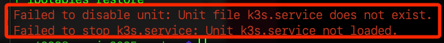

# 刪除

_基於接下來要測試的 Minikube，這裡先介紹解除安裝_

<br>

## 解除安裝

1. 停止並清除 K3s 服務。

    ```bash
    sudo /usr/local/bin/k3s-killall.sh
    sudo systemctl disable k3s
    sudo systemctl stop k3s
    ```

<br>

2. 主節點。

    ```bash
    sudo /usr/local/bin/k3s-uninstall.sh
    ```

<br>

3. 工作節點。

    ```bash
    sudo /usr/local/bin/k3s-agent-uninstall.sh
    ```

<br>

4. 若出現錯誤是正常的，代表這些網路設備可能已經被成功移除或系統服務已經不存在。

    

<br>

5. 手動清理可能遺留的檔案。

    ```bash
    sudo rm -rf /etc/rancher/k3s
    sudo rm -rf /etc/systemd/system/k3s*.service
    sudo rm -rf /etc/systemd/system/k3s.service
    sudo rm -rf /var/lib/rancher/k3s
    sudo rm -rf /var/lib/kubelet
    sudo rm -rf /var/lib/cni
    sudo rm -rf /run/k3s
    sudo rm -rf /usr/local/bin/k3s*
    ```

<br>

6. 檢查服務是否已移除。

    ```bash
    sudo systemctl daemon-reload
    sudo systemctl status k3s
    ```

<br>

7. 重啟系統。

    ```bash
    sudo reboot
    ```

<br>

___

_END_