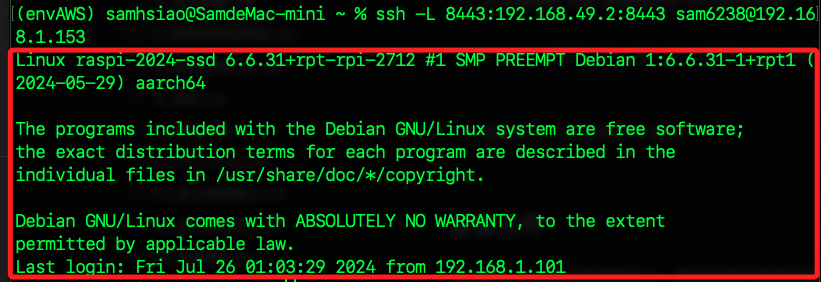

_尚未驗證_

# 集群間的通訊測試

<br>

## 部署目標

1. 將應用程序部署到樹莓派 A 上的 Minikube 集群和樹莓派 B 上的 K3s 集群。

<br>

2. 確保這兩個集群能夠協作運作，進行通信。

<br>

## 樹莓派 A

1. Minikube 集群

<br>

2. IP 地址：192.168.1.153

<br>

3. Kubernetes API IP：192.168.49.2

<br>

## 樹莓派 B

1. K3s 集群

<br>

2. IP 地址：192.168.1.154

<br>

3. Kubernetes API IP：查詢並設置

<br>

## 本機（MacOS）準備工作

1. 在本機開啟 SSH 通道；在此期間，本機可以通過 `localhost:8443` 訪問樹莓派 A 上的 Minikube API 服務。

    ```bash
    ssh -L 8443:192.168.49.2:8443 sam6238@192.168.1.153
    ```

    

<br>

2. 樹莓派 B 可直接使用 IP 訪問。

<br>

3. 建立並進入專案資料夾。

    ```bash
    mkdir -p ~/Desktop/k8s-deployment/minikube ~/Desktop//k8s-deployment/k3s && cd ~/Desktop/k8s-deployment
    ```

    

<br>

4. 添加兩個部署文件，並使用 VSCode 開啟。

    ```bash
    touch minikube/deployment_minikube.yaml k3s/deployment_k3s.yaml && code .
    ```

<br>

## 測試用鏡像

1. 例如可使用網路提供的鏡像 [rossning92/finance](https://hub.docker.com/r/rossning92/finance) 進行測試，這必須考慮兼容的問題，例如在 ARM 架構上運行為 x86 架構編譯的鏡像。

    ```bash
    image: rossning92/finance
    ```

    

<br>

2. 也可以直接使用一個標準的 `Nginx` 鏡像來測試。

    ```bash
    image: nginx:latest
    ```

<br>

## 編輯部署文件

_將應用程序部署到兩個集群中，確保兩者的服務能夠互相通信；特別說明，這裡使用 NodePort 類型的服務，這樣可以通過節點的 IP 地址和特定的端口訪問服務。_

<br>

1. Minikube 部署文件 (`deployment_minikube.yaml`)。

    ```yaml
    apiVersion: apps/v1
    kind: Deployment
    metadata:
      name: myapp-minikube
    spec:
      replicas: 2
      selector:
        matchLabels:
          app: myapp
      template:
        metadata:
          labels:
            app: myapp
        spec:
          containers:
          - name: myapp-container
            image: nginx:latest
            ports:
            - containerPort: 80
    ---
    apiVersion: v1
    kind: Service
    metadata:
      name: myapp-service-minikube
    spec:
      selector:
        app: myapp
      ports:
        - protocol: TCP
          port: 80
          targetPort: 80
      type: NodePort
    ```

<br>

2. K3s 部署文件 (`deployment_k3s.yaml`)。

    ```yaml
    apiVersion: apps/v1
    kind: Deployment
    metadata:
      name: myapp-k3s
    spec:
      replicas: 2
      selector:
        matchLabels:
          app: myapp
      template:
        metadata:
          labels:
            app: myapp
        spec:
          containers:
          - name: myapp-container
            image: nginx:latest
            ports:
            - containerPort: 80
    ---
    apiVersion: v1
    kind: Service
    metadata:
      name: myapp-service-k3s
    spec:
      selector:
        app: myapp
      ports:
        - protocol: TCP
          port: 80
          targetPort: 80
      type: NodePort
    ```

<br>

## 部署到 Minikube

_在本機上運行以下指令來部署應用程序_

<br>

1. 將終端機工作路徑切換到 minikube 專案所在位置。

    ```bash
    cd ~/Desktop/k8s-deployment/minikube
    ```

<br>

2. 設定環境變數，切換上下文到 Minikube。

    ```bash
    export KUBECONFIG=~/.kube/config && kubectl config use-context minikube
    ```

<br>

3. 部署應用程序。

    ```bash
    kubectl apply -f deployment_minikube.yaml
    ```

    

<br>

4. 確認部署。

    ```bash
    kubectl get deployments
    ```

    

<br>

5. 確認服務。

    ```bash
    kubectl get services
    ```

    

<br>

6. 查詢 Minikube 節點的 IP 地址。

    ```bash
    kubectl get nodes -o wide
    ```

<br>

7. 通過 NodePort 訪問服務，使用節點的 IP 地址 192.168.49.2 和分配的 NodePort 30982 來訪問服務。

<br>

8. 若使用 LoadBalancer 時，透過以下指令取得服務的外部 IP 地址。

    ```bash
    kubectl get svc myapp-service-minikube
    ```

<br>

9. 訪問返回的外部 IP 地址和端口；在瀏覽器中打開來檢查服務是否運行正常。

<br>

## 部署到 K3s

1. 將終端機工作路徑切換到 k3s 專案所在位置。

    ```bash
    cd ~/Desktop/k8s-deployment/k3s
    ```

<br>

2. 設定環境變數，切換上下文到 K3s；這裡特別注意，在取回的設定文件中，k3s 預設上下文的名稱是 `default`，所以指令要指定為 `default`。

    ```bash
    export KUBECONFIG=~/.kube/config_k3s && kubectl config use-context default
    ```

<br>

3. 部署應用程序。

    ```bash
    kubectl apply -f deployment_k3s.yaml
    ```

    

<br>

4. 確認部署；特別注意，確認部署的指令對於兩個容器是相同的，所以需要透過切換上下文的方式來進行以確保在檢查的是正確的集群。

    ```bash
    kubectl get deployments
    ```

    

<br>

5. 確認服務。

    ```bash
    kubectl get services
    ```

    

<br>

6. 取得服務的外部 IP 地址。

    ```bash
    kubectl get svc myapp-service-k3s
    ```

<br>

7. 訪問返回的 IP 地址和端口；在瀏覽器中打開來檢查服務是否運行正常。

<br>

## 確認兩個集群間的通信

1. 部署完畢後，可以測試兩個集群之間的通信；在本機運行以下指令，測試從 Minikube 集群訪問 K3s 集群中的服務。

    ```bash
    kubectl run curl --image=radial/busyboxplus:curl -i --tty --rm
    curl myapp-service-k3s.default.svc.cluster.local
    ```

<br>

## 配置持久化

_各項測試都通過時，可將設定寫入文件中以建立持久化設置_

<br>

1. 確保環境變數設置持久化，可將以下內容添加到 `.zshrc` 或 `.bashrc` 文件中。

    ```bash
    # Minikube
    alias minikube-config="export KUBECONFIG=~/.kube/config"

    # K3s
    alias k3s-config="export KUBECONFIG=~/.kube/config_k3s"
    ```

<br>

___

_END_