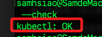

#  安裝 kubectl

<br>

## 資源

_這裡先做說明，可在後續步驟中在實作_

<br>

1. 在本機安裝 [kubctl on MacOS](https://kubernetes.io/docs/tasks/tools/install-kubectl-macos/)。

    ```bash
    curl -LO "https://dl.k8s.io/release/$(curl -L -s https://dl.k8s.io/release/stable.txt)/bin/darwin/arm64/kubectl"
    ```

    

<br>

2. 在樹莓派安裝 [kubctl on Linux](https://kubernetes.io/docs/tasks/tools/install-kubectl-linux/)。

    ```bash
    curl -LO "https://dl.k8s.io/release/$(curl -L -s https://dl.k8s.io/release/stable.txt)/bin/linux/arm64/kubectl"
    ```

    

<br>

<br>

## MacOS 安裝 kubectl

_兩種安裝方式，這是第一種，簡單一點可以使用 Homebrew_

<br>

1. 先切換到下載路徑中；這僅是避免文件分散。

    ```bash
    cd ~/Downloads
    ```

<br>

2. 下載最新版本 [kubctl on MacOS](https://kubernetes.io/docs/tasks/tools/install-kubectl-macos/)。

    ```bash
    curl -LO "https://dl.k8s.io/release/$(curl -L -s https://dl.k8s.io/release/stable.txt)/bin/darwin/arm64/kubectl"
    ```

<br>

3. 【Optional】下載對應版本的 `SHA-256` 校驗檔，用於驗證前面步驟下載的 `kubectl` 二進制文件是否為官方釋出未經篡改的。

    ```bash
    curl -LO "https://dl.k8s.io/release/$(curl -L -s https://dl.k8s.io/release/stable.txt)/bin/darwin/arm64/kubectl.sha256"
    ```

<br>

4. 根據校驗和檔案驗證 kubectl 二進位檔案；輸出 `OK` 代表正確。

    ```bash
    echo "$(cat kubectl.sha256)  kubectl" | shasum -a 256 --check
    ```

    

<br>

5. 使 `kubectl` 二進位檔案可執行。

    ```bash
    chmod +x ./kubectl
    ```

<br>

6. 將 `kubectl` 二進位檔案移到系統上的檔案位置 `/usr/local/bin/kubectl`。

    ```bash
    sudo mv ./kubectl /usr/local/bin/kubectl && sudo chown root: /usr/local/bin/kubectl
    ```

<br>

7. 確認本機安裝的 `kubectl` 客戶端版本。

    ```bash
    kubectl version --client
    ```

    

<br>

8. 安裝並驗證 `kubectl` 後，刪除校驗和檔案。

    ```bash
    rm kubectl.sha256
    ```

<br>

## 樹莓派安裝 kubectl

_若將樹莓派作為客戶端管理外部 `Kubernetes` 叢集，也可安裝 `kubectl`；若僅以 `agent` 身份加入叢集負責跑 `Pod` 則不需安裝；安裝後可直接執行 `kubectl` 命令_

<br>

1. 先切換到下載路徑中；這僅是避免文件分散。

    ```bash
    cd ~/Downloads
    ```

<br>

2. 依據官方指引下載最新版本 [kubctl on Linux](https://kubernetes.io/docs/tasks/tools/install-kubectl-linux/)。

    ```bash
    curl -LO "https://dl.k8s.io/release/$(curl -L -s https://dl.k8s.io/release/stable.txt)/bin/linux/arm64/kubectl"
    ```

<br>

3. 【Optional】下載對應版本的 `SHA-256` 校驗檔，用於驗證前面步驟下載的 `kubectl` 二進制文件是否為官方釋出未經篡改的。

    ```bash
    curl -LO "https://dl.k8s.io/release/$(curl -L -s https://dl.k8s.io/release/stable.txt)/bin/linux/arm64/kubectl.sha256"
    ```

<br>

4. 根據校驗和檔案驗證 kubectl 二進位檔案；輸出 `OK` 代表正確。

    ```bash
    echo "$(cat kubectl.sha256)  kubectl" | sha256sum --check
    ```

    

<br>

5. 安裝 `kubectl`。

    ```bash
    sudo install -o root -g root -m 0755 kubectl /usr/local/bin/kubectl
    ```

<br>

6. 刪除臨時文件。

    ```bash
    rm kubectl.sha256 kubectl
    ```

<br>

7. 測試安裝是否成功。

    ```bash
    kubectl version --client
    ```

    

<br>

___

_END_