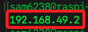

# 安裝 MiniKube

_`MiniKube` 是一個用於本地 `Kubernetes` 集群的工具，它適合在開發環境中使用，以下在 `樹莓派 A` 進行安裝_

<br>

## 安裝 Docker

_因為 `MiniKube` 依賴於 `Docker` 作為容器運行，所以先安裝 `Docker`_

<br>

1. 更新樹莓派系統。

    ```bash
    sudo apt update
    sudo apt upgrade -y
    sudo apt autoremove -y
    ```

<br>

2. 透過查詢版本確認 `Docker` 是否已經安裝。

    ```bash
    docker -v
    ```

<br>

3. 若無版本號表示尚未安裝 `Docker`，運行以下安裝指令；以下指令搭配管道 `|` 直接執行，不留下腳本檔。

    ```bash
    curl -fsSL https://get.docker.com | sudo sh
    ```

<br>

4. 補充說明，若要先下載、再執行並保留安裝腳本，則運行以下指令；參數 `-o` 會把下載內容寫到檔案，不會輸出到標準輸出。

    ```bash
    curl -fsSL https://get.docker.com -o get-docker.sh \
        && sudo sh get-docker.sh
    ```

<br>

## 設定權限

1. 安裝 `Docker` 之後，並不會自動將假 `當前用戶` 加入群組 `docker` 內，所以用戶並不具備權限，運行指令將其加入。

    ```bash
    sudo usermod -aG docker $USER
    ```

<br>

2. 檢查指定使用者所屬的群組；使用 `"$USER"` 或 `"$(whoami)"` 就是指定當前用戶。

    ```bash
    groups "$USER"
    ```

    _或是_

    ```bash
    groups "$(whoami)"
    ```

<br>

3. 若不帶任何參數，`groups` 傳回的是當前用戶在目前 `shell` 的 `有效群組`，也就是登入時被授予的群組；這些是在登入時就決定的，而 `usermod -aG` 修改的是設定文件 `/etc/group`，這並不會自動套用到現有的 `shell`；反之，`groups $USER 或 groups "$(whoami)"` 查的是系統帳號資料庫 `/etc/group` 裡該使用者被列在哪些群組，所以會立刻看到 `docker`。

    ```bash
    groups
    ```

<br>

4. 特別注意，完成安裝 `Docker` 後，必須重啟系統或重啟終端套用變更，否則會出現錯誤。

    ```bash
    sudo reboot
    ```

    

<br>

5. 延續上一點，或是運行以下指令立即套用變更、不需登出。

    ```bash
    newgrp docker
    ```

<br>

## 安裝 MiniKube

1. 下載並安裝 `MiniKube` 的二進制文件。

    ```bash
    curl -Lo minikube https://storage.googleapis.com/minikube/releases/latest/minikube-linux-arm64
    ```

<br>

2. 添加執行權限。

    ```bash
    chmod +x minikube
    ```

<br>

3. 將執行文件搬移到系統路徑 `/usr/local/bin/` 中，之後便可在任何目錄直接運行指令。

    ```bash
    sudo mv minikube /usr/local/bin/
    ```

<br>

4. 使用 `Docker` 作為驅動器啟動 `MiniKube`；無參數時效果與參數 `--driver=docker` 相同，都會在容器中啟動；初次啟動或遇到版本變動時需要一點時間下載鏡像。

    ```bash
    minikube start
    ```

    

<br>

5. 檢查狀態、確認 `MiniKube` 已經成功運行。

    ```bash
    minikube status
    ```

    

<br>

6. 檢查容器 `IP`；這是固定的，任何一台設備運行後都會得到相同的 `192.168.49.2`。

    ```bash
    minikube ip
    ```

    

<br>

## 關於 `橋接 IP`

1. 安裝了 `Minikube` 之後會添加一個橋接 IP `192.168.49.1/24`，這是 `Minikube` 建立的虛擬網路，用於管理 `Kubernetes` 集群內的 `Pod` 和服務之間的通信；`Minikube` 使用這個網路來分配 `K8s` 集群內部的 `IP` 地址，確保內部通信不受外部網路影響；使用 `kubectl` 指令時，`Kubeconfig` 文件中的 `server` 會指向這個網路的 IP 地址，就是前面步驟所查詢到的 `Minikube` 容器的 IP `192.168.49.2`。

<br>

2. 查看 `docker0` 介面；安裝了 `Docker` 之後，會在宿主機上自動建立一個名為 `docker0` 的橋接網路介面，預設的子網是 `172.17.0.0/16`，而橋接介面的 IP 就是該子網的第一個地址 `172.17.0.1`，用來讓所有容器透過這條虛擬橋接網路互相溝通。

    ```bash
    ip -4 addr show docker0
    ```

    _或使用_

    ```bash
    ifconfig docker0
    ```

<br>

3. 延續上一點，也可用 `Docker CLI` 直接顯示預設橋接網路的閘道 `Gateway`，也就是 `172.17.0.1`。

    ```bash
    docker network inspect bridge --format '{{(index .IPAM.Config 0).Gateway}}'
    ```

<br>

___

_END_