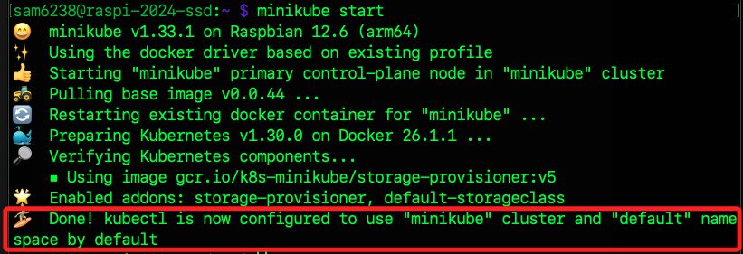
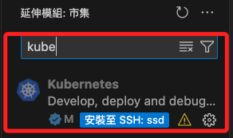
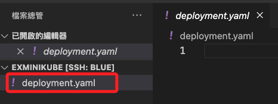

# 部署與訪問

_以下操作在樹莓派進行，必須確認已安裝好 `kubectl` 及 `Minikube`_

<br>

## 啟動服務

1. 連線樹莓派。

    ```bash
    ssh <樹莓派-HOST>
    ```

<br>

2. 確認狀態。

    ```bash
    minikube status
    ```

<br>

3. 若尚未啟動，運行以下指令啟動。

    ```bash
    minikube start
    ```

    

<br>

## 建立專案資料夾

_繼續在終端機中操作_

<br>

1. 建立並進入專案資料夾 `~/Documents/exMinikube`。

    ```bash
    mkdir -p ~/Documents/exMinikube
    cd ~/Documents/exMinikube
    ```

<br>

2. 建立一個 `YAML` 文件 `deployment.yaml`，這是一個自動化腳本，規範應用部署的過程。

    ```bash
    touch deployment.yaml
    ```

<br>

## 使用 VSCode

_相關編輯使用 VSCode 比較方便_

<br>

1. 退出容器；這只是回到樹莓派中。

    ```bash
    exit
    ```

<br>

2. 再次退出，這會退出連線回到本機。

    ```bash
    exit
    ```

<br>

3. 在本機運行以下指令，替換其中 `<樹莓派別名>` 為自己的樹莓派主機別名，這會在樹莓派的專案資料夾中啟動 `VSCode` 遠端連線；以下截圖示範的別名是 `blue`，這個別名設置在本機的 `~/.ssh/config` 文件中。

    ```bash
    code --folder-uri vscode-remote://ssh-remote+<樹莓派別名>/home/sam6238/Documents/exMinikube
    ```

    

<br>

4. 展開 `VSCode` 左側面板的 `延伸模組`，在遠端上也安裝 `Kubernetes` 插件；搜尋到之後點擊 `安裝至 SSH:...` 即可。

    

<br>

6. 安裝插件後，先點擊資料夾中的 `deployment.yaml` 腳本。

    

<br>

7. 輸入關鍵字 `deployment` 的前綴 `depl` 會出現提示，按下 `TAB` 鍵便可自動生成預設文件內容。

    

<br>

8. 預設的應用名稱是 `myapp`，預設內容如下；接下來要進行一些修改。

    ```yaml
    apiVersion: apps/v1
    kind: Deployment
    metadata:
      name: myapp
    spec:
      selector:
        matchLabels:
          app: myapp
      template:
        metadata:
          labels:
            app: myapp
        spec:
          containers:
          - name: myapp
            image: <Image>
            resources:
              limits:
                memory: "128Mi"
                cpu: "500m"
            ports:
            - containerPort: <Port>
    ```

<br>

## 編輯配置文件 `deployment.yaml`

1. 在 `spec:` 內添加 `replicas: 3`，這是指定了連同備用 pod 在內的所有 pod 數量。

    ```yaml
    specs:
      replicas: 3
    ```

<br>

2. `template` 是定義了與 pod 相關的所有訊息，其內的 `containers` 指定了 pod 運行的所有容器；這裡使用前一個步驟所建立的鏡像 `sam6238/myapp-image-arm64`。

    ```yaml
    spec:
      replicas: 3
      selector:
        matchLabels:
          app: myapp
      template:
        metadata:
          labels:
            app: myapp
        spec:
          containers:
          - name: myapp
            image: sam6238/myapp-image-arm64
    ```

<br>

3. 可編輯 `limits` 以設置合理的 `memory` 及 `cpu`；這裡先使用預設的 `128`、`500`。

    ```yaml
    spec:
      replicas: 3
      selector:
        matchLabels:
          app: myapp
      template:
        metadata:
          labels:
            app: myapp
        spec:
          containers:
          - name: myapp
            image: sam6238/myapp-image-arm64
            resources:
              limits:
                memory: "128Mi"
                cpu: "500m"
    ```

<br>

4. 最下方的 `containerPort` 指定了容器對外暴露的端口，本範例鏡像是一個 Web 應用，所以使用 `5001`；特別注意，預設情況下，每個 pod 都有一個 Cluster 內分配的獨立 IP，且 pod 只能與 Cluster 中的其他 pod 進行通信，假如要實現外網訪問，必須使用到另一個組件 `Services`，其中最常用的是 `NodePort`，這個服務可以將應用端口暴露給外網，在 `NodePort` 的基礎上，`Kubernetes` 還提供 `LoadBalancer` 等方式實現負載均衡。

    ```yaml
    spec:
      replicas: 3
      selector:
        matchLabels:
          app: myapp
      template:
        metadata:
          labels:
            app: myapp
        spec:
          containers:
          - name: myapp
            image: sam6238/myapp-image-arm64
            resources:
              limits:
                memory: "128Mi"
                cpu: "500m"
            ports:
            - containerPort: 5001
    ```

<br>

5. 在文件最下方使用三個橫線 `---`，這是 YAML 的語法，然後輸入 `Service`，同樣這將會啟動 VSCode 插件來自動補全基本代碼。

    

    ```yaml
    ---
    apiVersion: v1
    kind: Service
    metadata:
      name: myapp
    spec:
      selector:
        app: myapp
      ports:
      - port: <Port>
        targetPort: <Target Port>
    ```

<br>

6. 在其中的 `selector` 指定應該將 pod 轉發到哪一個 pod 上，就是使用預設的應用程稱 `myapp`。

    ```yaml
    spec:
      selector:
        app: myapp
    ```

<br>

7. 編輯文件，添加一個跟 `selector` 同級的鍵 `type`，也就是使用 `NodePort`。

    ```yaml
    spec:
      selector:
        app: myapp
      type: NodePort
    ```

<br>

8. 最後的兩個 `Port` 都設置為 `5000`，與容器的端口一致。

    ```yaml
    spec:
      selector:
        app: myapp
      type: NodePort
      ports:
      - port: 5001
        targetPort: 5001
    ```

<br>

9. 最下方添加一個 `nodePort` 設置為 `30800`；這部分假如沒顯式設定，Kubernetes 會自動分配。

    ```yaml
    spec:
      selector:
        app: myapp
      type: NodePort
      ports:
      - port: 5000
        targetPort: 5000
        nodePort: 30800
    ```

<br>

## 部署應用

1. 部署文件，指令運行後，Kubernetes 會開始在後台部署應用。

    ```bash
    kubectl apply -f deployment.yaml
    ```

    

<br>

2. 查詢所有 pod 的運行狀態。

    ```bash
    kubectl get pods
    ```

    

<br>

## 錯誤排除

_鏡像文件的架構相容性_

<br>

1. 在前面步驟中，假如輸出的資訊顯示所有 pod 都發生 `CrashLoopBackOff` 狀態，也就是在啟動後崩潰。

    

<br>

2. 先透過指令 `kubectl logs` 查看日誌。 

    ```bash
    kubectl logs myapp-679b64cc8f-f5q4n
    kubectl logs myapp-679b64cc8f-fgj65
    kubectl logs myapp-679b64cc8f-gffml
    ```

<br>

3. 這個訊息表示應用程序的鏡像格式與運行它的架構不匹配，也就是與樹莓派（arm64）架構不符，這時需要改用其他符合規範的鏡像。

    

<br>

## 修正鏡像並重新部署

_若對鏡像進行修改_

<br>

1. 刪除當前的部署和服務；按理說應該是不需要手動進行刪除，Kubernetes 應該會自己去平衡節點。

    ```bash
    kubectl delete deployment myapp && kubectl delete service myapp
    ```

    

<br>

2. 直接重新部署應該就可以了。

    ```bash
    kubectl apply -f deployment.yaml
    ```

    

<br>

## 驗證

1. 列出 Kubernetes 集群中所有的 Deployment 資源。

    ```bash
    kubectl get deployments
    ```

    

<br>

2. 列出 Kubernetes 集群中所有的 Pod 資源；若顯示 `ContainerCreating`，則稍作等待即可。

    ```bash
    kubectl get pods
    ```

    

<br>

3. 完成時會顯示 `Running`。

    

<br>

4. 列出 Kubernetes 集群中所有的 Service 資源。

    ```bash
    kubectl get services
    ```

    

<br>

5. 確認服務在正確的端口上運行，並檢查服務的端點。

    ```bash
    kubectl get endpoints myapp
    ```

<br>

6. 檢查每個 Pod 的詳細訊息。

    ```bash
    kubectl describe pod <pod name>
    ```

<br>

7. 檢查每個 Pod 的日誌。

    ```bash
    kubectl logs <pod name>
    ```

<br>

8. 檢查服務的詳細訊息。

    ```bash
    kubectl describe service myapp
    ```

<br>

9. 確認 NodePort 配置正確，並確保 NodePort 在正確的範圍內（30000-32767）。

    ```bash
    kubectl get svc myapp -o yaml
    ```

<br>

## 在樹莓派中訪問

1. 使用 minikube 專用指令訪問，其中 `myapp` 是專案的名稱。

    ```bash
    minikube service myapp
    ```

    

<br>

2. 這會啟用 minikube 專用的瀏覽器。

    

<br>

## 在樹莓派的容器中訪問

1. 切換。

    ```bash
    minikube ssh
    ```

    

<br>

2. 接通過 Cluster IP 訪問應用，確認應用在容器內部正確運行。

    ```bash
    curl http://10.96.45.233:5001
    ```

    

<br>

___

_END_
