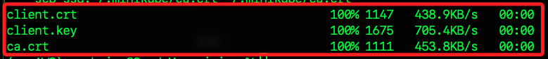

# 與 Minikube 連線

_以下從 `本機` 連線 `樹莓派 A`_

<br>

## 樹莓派 A

_運行 Minikube_

<br>

1. 在 `樹莓派 A` 啟動 `Minikube`；使用參數 `--driver=none` 會直接在 `樹莓派 A` 上運行，而不使用虛擬機；若要使用虛擬網卡可用參數 `--driver=docker`，預設也會在容器中啟動。

    ```bash
    minikube start
    ```

    

<br>

2. 確認 `Minikube` 狀態。

    ```bash
    minikube status
    ```

    

<br>

3. 確認 IP；所有設備會得到相同 IP `192.168.49.2`。

    ```bash
    minikube ip
    ```

    

<br>

## 證書文件

_`樹莓派 A` 上的證書文件_

<br>

1. 檢查並確認證書文件是否存在於 `樹莓派 A`；以下指令分開兩次執行，用以明確觀察證書所在路徑。

    ```bash
    ls ~/.minikube/profiles/minikube/
    ls ~/.minikube/
    ```

    _要確認這三個文件的位置_

    

<br>

2. 確認文件存在後準備進行複製，先在 `本機` 上建立目標目錄；建立之前先刪除可能存在的殘餘資料。

    ```bash
    rm -rf ~/.minikube/profiles/minikube
    mkdir -p ~/.minikube/profiles/minikube
    ```

<br>

3. 先將 `樹莓派 A` 的 `HOST` 存入變數。

    ```bash
    HOST_RASPI=<手動輸入樹莓派-HOST>
    ```

<br>

4. 使用 `scp` 將三個證書文件從 `樹莓派 A` 複製到 `本機`。

    ```bash
    scp $HOST_RASPI:~/.minikube/profiles/minikube/client.crt ~/.minikube/profiles/minikube/client.crt
    scp $HOST_RASPI:~/.minikube/profiles/minikube/client.key ~/.minikube/profiles/minikube/client.key
    scp $HOST_RASPI:~/.minikube/ca.crt ~/.minikube/ca.crt
    ```

    

<br>

5. 再次確認複製工作正確完成。

    ```bash
    ls ~/.minikube/profiles/minikube/client.crt
    ls ~/.minikube/profiles/minikube/client.key
    ls ~/.minikube/ca.crt
    ```

<br>

## 複製 Minikube 配置文件到本機

_從 `樹莓派 A` 將配置文件複製到 `本機` 上_

<br>

1. 在 `樹莓派 A` 檢查所需的設定文件已經存在。

    ```bash
    ls ~/.kube/config
    ```

<br>

2. 在 `本機` 上建立目標目錄；避免殘留文件，先進行刪除。

    ```bash
    rm -rf ~/.kube
    mkdir -p ~/.kube
    ```

<br>

3. 在 `本機` 運行以下指令從 `樹莓派 A` 複製 `Minikube` 的 `kubeconfig` 文件到 `本機`；其中 `HOST_RASPI` 在前面步驟已經存入當前終端視窗，若有重啟，則需重新建立，不再贅述。

    ```bash
    scp $HOST_RASPI:~/.kube/config ~/.kube/config
    ```

    

<br>

4. 在 `本機` 確認複製確實完成。

    ```bash
    ls ~/.kube/config
    ```

<br>

5. 在 `本機` 設置 `Minikube` 環境變數；這是暫時性的，系統重啟便會失效，若要持久生效則需寫入環境變數文件中如 `~/.zshrc`。

    ```bash
    echo "" >> ~/.zshrc
    echo "# MiniKube 練習用" >> ~/.zshrc
    echo "export KUBECONFIG=~/.kube/config" >> ~/.zshrc
    source ~/.zshrc
    ```

<br>

## 編輯設定文件

1. 查看當前使用者在本機的 `家目錄絕對路徑`；在任意路徑查詢即可，前綴就是該路徑。

    ```bash
    pwd
    ```

    

<br>

2. 編輯 `Kubeconfig` 文件 `~/.kube/config`，將其中的路徑指向本機的正確位置；這個文件是由樹莓派複製到本機的，所以當前設定值是在 `樹莓派` 的文件路徑。

    ```bash
    code ~/.kube/config
    ```

<br>

3. 修正其中 `使用者家目錄`，從樹莓派的 `/home/<樹莓派使用者帳號>` 改為本機用戶的家目錄 `/Users/<本機用戶名稱>`；若使用 `VSCode`，使用替換鍵轉換即可；共計 `3` 處。

    

<br>

4. 接著，將其中的 `server` 改為 `localhost:8443`，這將用在後續 `端口轉發` 時的本地端口。

    ```bash
    server: https://localhost:8443
    ```

    

<br>

5. 在終端機運行以下指令開啟通道；特別注意，測試期間不要關閉這個終端視窗；後續會詳細說明。

    ```bash
    ssh -L 8443:192.168.49.2:8443 $HOST_RASPI
    ```

<br>

## 關於開啟通道

_開啟通道也稱為 `SSH 端口轉發`，其工作原理是通過 `SSH 通道` 將本地主機上的指定端口 `8443` 轉發到樹莓派遠的端口 `192.168.49.2:8443`，設定後，本地應用程序可以通過訪問本地端口來訪問遠端樹莓派主機上的服務_

<br>

1. `-L` 設置本地端口轉發的參數，後面接著轉發的設定值，依序是 `本地端口 : 遠程位置及端口`。

<br>

2. `8443`：第一個值是本地端口，第二個值是遠程樹莓派主機的目標 IP 和端口。

<br>

## 繼續連線

_在 `本機` 開啟新的終端機_

<br>

1. 延續之前的操作，確認定義在設定文件 `~/.kube/config` 中的連線名稱是 `minikube`。

    

<br>

2. 在 `本機` 運行指定連線文件的指令 `kubectl config`，並透過參數 `use-context` 指定使用的連線名稱為 `minikube`。

    ```bash
    kubectl config use-context minikube
    ```

    

<br>

3. 連線測試；確認連接是否成功，以下訊息表示 Minikube 集群已經成功運行，節點 `minikube` 處於 Ready 狀態，並且運行了 3 小時 45 分鐘，Kubernetes 的版本是 `v1.30.0`；確認了 Minikube 安裝和配置是正確的，並且節點已經準備好接收和運行工作負載。

    ```bash
    kubectl get nodes
    ```

    

<br>

___

_END_
