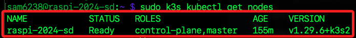

# 本機連線 k3s

_接下來連線本機及 `樹莓派 B`_

<br>

## 運行 k3s 

1. 確認服務狀態。

   ```bash
   sudo systemctl status k3s
   ```

   

<br>

2. 若尚未啟動，運行指令啟動 `k3s` 服務。

   ```bash
   sudo systemctl start k3s
   ```

<br>

3. 設定為 `enable` 使 `k3s` 開機自動啟動。

   ```bash
   sudo systemctl enable k3s
   ```

<br>

4. 列出 `K8s` 集群中的所有節點；當前僅有一個。

   ```bash
   sudo k3s kubectl get nodes
   ```

   

<br>

## 本機連線 k3s

1. 先檢查 `樹莓派 B` 上的 `k3s` 設定文件 `kubeconfig` 是否確實存在。

   ```bash
   ls /etc/rancher/k3s/k3s.yaml
   ```

<br>

2. 在 `本機` 開啟終端，先記錄樹莓派 `HOST`。

   ```bash
   HOST_RASPI=<樹莓派-HOST>
   ```

<br>

3. 建立本地存放路徑 `~/.kube`，假如存在就會跳過。

   ```bash
   mkdir -p ~/.kube
   ```

<br>

4. 在 `本機` 運行以下指令，從 `樹莓派 B` 複製 `k3s` 的 `kubeconfig` 文件到 `本機`；特別注意，這裡與前面略有不同之處在於 `/etc` 文件需要 `root` 權限來讀取，但 `scp` 命令是不支持直接使用 `sudo` 的，所以要透過 `SSH` 通道來實現。

   ```bash
   ssh $HOST_RASPI "sudo cat /etc/rancher/k3s/k3s.yaml" > ~/.kube/config_k3s
   ```

<br>

5. 檢查本機是否正確複製了文件。

   ```bash
   ls ~/.kube/config_k3s
   ```

   

<br>

6. 設置環境變數 `KUBECONFIG`，使 `kubectl` 命令使用指定的 `K8s` 配置文件；也就是要在 `本機` 使用 `kubectl` 連接和操作特定的 `K8s` 集群；特別注意，這是持久化的設定。

   ```bash
   echo "" >> ~/.zshrc
   echo "# K3s 測試" >> ~/.zshrc
   echo "export KUBECONFIG=~/.kube/config_k3s" >> ~/.zshrc
   source ~/.zshrc
   ```

<br>

## 查看樹莓派 IP 設置 

1. 確認 `樹莓派 B` 的 `IP`。

   ```bash
   hostname -I
   ```

   

<br>

2. 在 `本機` 嘗試 `ping` 樹莓派。

   ```bash
   ping <樹莓派-IP>
   ```

<br>

3. 編輯 `本機` 的設定文件 `~/.kube/config_k3s`。

   ```bash
   code ~/.kube/config_k3s
   ```

<br>

4. 因為這個設置文件是從樹莓派設定上複製過來的，所以要修正 `server: https://127.0.0.1:6443` 的 `IP` 為 `樹莓派 B` 的真實 `IP`；端口部分不用變動。

   ```bash
   server: https://<樹莓派-IP>:6443
   ```

   

<br>

5. 在 `本機` 運行以下指令，確認節點連接狀態。

   ```bash
   kubectl get nodes
   ```

   

<br>

___

_END_
