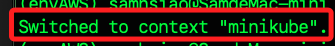

_尚未實作應用_

# 各自部署

_在 `本機` 上部署應用到 `Minikube`_

<br>

## 步驟

1. 設置環境變數 `KUBECONFIG`，指定 `kubectl` 使用特定的配置文件；以下直接進行持久化設定。

   ```bash
   echo "" >> ~/.zshrc
   echo "# K3s 測試" >> ~/.zshrc
   echo "export KUBECONFIG=~/.kube/config" >> ~/.zshrc
   source ~/.zshrc
   ```

<br>

2. 切換目前 `kubectl` 操作的叢集 `上下文` 到 `minikube`；在 `K8s` 中，`上下文` 是用來指定 `kubectl` 操作時應該連接到哪個 `叢集`、`使用者` 以及 `命名空間` 的設定組合。

   ```bash
   kubectl config use-context minikube
   ```

   

<br>

## 進行部署

1. 在文件 `~/Documents` 中建立部署使用的腳本 `deployment.yaml`。

   ```bash
   cd ~/Documents
   nano deployment.yaml
   ```

<br>

2. 貼上以下內容；務必確認 YAML 的縮排格式。

   ```yaml
   apiVersion: apps/v1
   kind: Deployment
   metadata:
     name: nginx-deployment
   spec:
     replicas: 2
     selector:
       matchLabels:
         app: nginx
     template:
       metadata:
         labels:
           app: nginx
       spec:
         containers:
           - name: nginx
             image: nginx:latest
             ports:
               - containerPort: 80
   ---
   apiVersion: v1
   kind: Service
   metadata:
     name: nginx-service
   spec:
     selector:
       app: nginx
     ports:
       - protocol: TCP
         port: 80
         targetPort: 80
   type: NodePort
   ```

<br>

3. 保存腳本然後部署應用。

   ```bash
   kubectl apply -f deployment.yaml
   ```

<br>

3. 確認部署。

   ```bash
   kubectl get deployments
   kubectl get services
   ```

<br>

## 在 MacOS 上部署應用到 K3s

1. 設置環境變數。

   ```bash
   export KUBECONFIG=~/.kube/config_k3s
   ```

<br>

2. 部署應用，可使用同樣的腳本文件。

   ```bash
   kubectl apply -f deployment.yaml
   ```

<br>

3. 確認部署。

   ```bash
   kubectl get deployments
   kubectl get services
   ```

<br>

___

_END_
