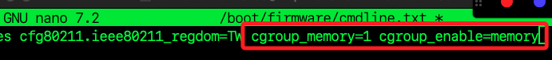
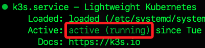
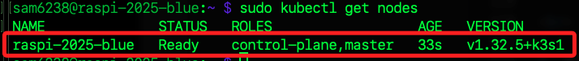
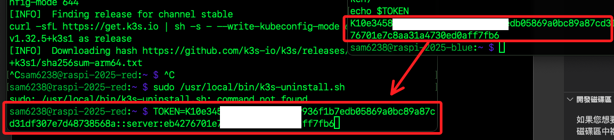
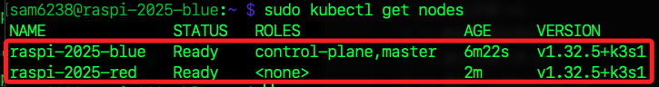
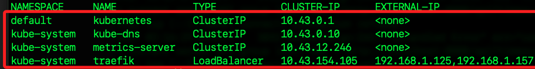

# 實作案例 01

_用 k3s 叢集部署 HTML 靜態網頁並用 ngrok 外網訪問_

<br>

## 準備工作 

_準備兩台設備作為主節點與從節點；以下以操作實例的 IP 作為說明，主節點是 `192.168.1.125`、工作節點是 `192.168.1.157`，實作時使用自己的 IP 進行相關指令_

<br>

1. 在兩節點進行更新並安裝套件；若有其他套件要安裝可添加在其後。

    ```bash
    sudo apt update
    sudo apt install -y curl
    ```

<br>

2. Docker；這步驟會在後面詳細指引。

<br>

## 關閉 swap、確認 cgroup

_K8s 叢集要求關閉 swap 並啟用 cgroup 才能正確管理節點的資源分配與保障 Pod 的穩定運作；雖然 k3s 對於 cgroup 設定比較寬鬆，但建議仍進行設定力求運作穩定_

<br>

1. 立即停用系統所有的 `swap` 區域。

    ```bash
    sudo swapoff -a
    ```

<br>

2. 將 `/etc/fstab` 內啟用 `swap` 的設定行加上註解，避免下次開機時自動啟用。

    ```bash
    sudo sed -i '/ swap / s/^/#/' /etc/fstab
    ```

<br>

3. 在主從節點編輯設定文件啟用 `memory cgroup`。

    ```bash
    sudo nano /boot/firmware/cmdline.txt
    ```

<br>

4. 在最尾端加一空格後貼上。

    ```
    cgroup_memory=1 cgroup_enable=memory
    ```

    

<br>

5. 儲存後重新開機。

    ```bash
    sudo reboot
    ```

<br>

6. 在主、從節點皆安裝 iptables 工具；舊版有時是 `iptables-persistent`，新版常見只要裝 `iptables`。

    ```bash
    sudo apt install -y iptables iptables-persistent
    ```

<br>

## 安裝 k3s

_以下分做兩部分，分別在主節點與從節點進行，這裡先在主節點進行安裝_

<br>

1. 若安裝時因錯誤、失敗而中斷，重新安裝前要先移除殘；若為第一次安裝可略過，執行也無妨，會顯示找不到相關腳本 `command not found`。

    ```bash
    sudo /usr/local/bin/k3s-uninstall.sh
    ```

<br>

2. 執行安裝指令。

    ```bash
    curl -sfL https://get.k3s.io | sh -s - --write-kubeconfig-mode 644
    ```

<br>

3. 驗證服務狀態。

    ```bash
    sudo systemctl status k3s
    ```

    

<br>

4. 查看節點狀態，當前僅有一個主節點。

    ```bash
    sudo kubectl get nodes
    ```

    

<br>

5. 在主節點取得 `Join Token` 並存入變數，後面步驟要用。

    ```bash
    TOKEN=$(sudo cat /var/lib/rancher/k3s/server/node-token)
    echo $TOKEN
    ```

<br>

## 安裝 k3s

_以下使用另一個終端視窗在從節點進行_

<br>

1. 先在終端機中將主節點取得的變數進行儲存。

    ```bash
    TOKEN=<從主節點複製後貼上>
    ```

    

<br>

2. 在工作節點上安裝 k3s，這將會自動帶入變數。

    ```bash
    curl -sfL https://get.k3s.io | K3S_URL=https://192.168.1.125:6443 K3S_TOKEN=$TOKEN sh -
    ```

<br>

## 驗證叢集

_完成以上步驟後_

<br>

1. 在主節點上查看所有節點狀態，正確運行時會看到兩台都 `Ready`。

    ```bash
    kubectl get nodes
    ```

    

<br>

2. 查看所有服務狀態。

    ```bash
    kubectl get svc -A
    ```

    

<br>

## 建立靜態網頁映像檔

_讓整個網站以容器方式在 K3s 叢集內的多個節點上自動部署，進而測試負載平衡功能_

<br>

1. 在所有節點上安裝 Docker。

    ```bash
    sudo apt update
    sudo apt install -y docker.io
    sudo systemctl enable --now docker
    sudo usermod -aG docker $USER
    ```

<br>

2. 登出後重新登入。

    ```bash
    exit
    ```

<br>

3. 驗證 Docker 安裝。

    ```bash
    docker -v
    ```

<br>

4. 在主節點上將 `DockerHub` 帳號存入變數。

    ```bash
    _DockerHub=<填入-DockerHub-帳號>
    ```

<br>

5. 接著在主節點上建立站台文本，運行指令後會提示輸入 DockerHub 帳號、密碼；這部分可在任意節點上製作，這裡是以主節點作爲示範。

    ```bash
    mkdir -p ~/Documents/simple-html && cd ~/Documents/simple-html
    echo '<h1>Hello Raspberry Pi K3s!</h1>' > index.html

    # 建立 Dockerfile
    cat <<EOF > Dockerfile
    FROM nginx:alpine
    COPY index.html /usr/share/nginx/html/index.html
    EOF

    docker build -t $_DockerHub/simple-html:latest .
    docker login
    docker push $_DockerHub/simple-html:latest
    ```

<br>

## 在 k3s 叢集部署網站

_在主節點_

<br>

1. 進入指定目錄後編輯文件，這裡建立在 `~/Documents`。

    ```bash
    cd ~/Documents
    nano simple-html.yaml
    ```

<br>

2. 填入以下內容，其中 `sam6238` 要替換為自己的 DockerHub 帳號；完成後保存、退出，另外要特別注意 `yaml` 的縮排格式是兩個字元。

    ```yaml
    apiVersion: apps/v1
    kind: Deployment
    metadata:
      name: simple-html
    spec:
      replicas: 2
      selector:
        matchLabels:
          app: simple-html
      template:
        metadata:
          labels:
            app: simple-html
        spec:
          containers:
          - name: simple-html
            image: sam6238/simple-html:latest
            ports:
            - containerPort: 80
    ---
    apiVersion: v1
    kind: Service
    metadata:
      name: simple-html-service
    spec:
      type: NodePort
      selector:
        app: simple-html
      ports:
        - port: 80
          targetPort: 80
          nodePort: 30080
    ```

<br>

3. 部署。

    ```bash
    kubectl apply -f simple-html.yaml
    ```

<br>

## 區網測試

1. 在區網內任一台設備訪問以下兩個網址。

    ```bash
    http://192.168.1.125:30080
    http://192.168.1.157:30080
    ```

<br>

## 外網 ngrok 隧道

1. 儲存 Token。

    ```bash
    _Ngrok_Token=<填入-TOKEN>
    ```

<br>

2. 啟動 ngrok。

    ```bash
    wget https://bin.equinox.io/c/bNyj1mQVY4c/ngrok-v3-stable-linux-arm.tgz
    tar -xvzf ngrok-v3-stable-linux-arm.tgz
    sudo mv ngrok /usr/local/bin
    ngrok config add-authtoken $_Ngrok_Token
    ngrok http 30080
    ```

<br>

3. 任意外網訪問。

<br>

##  節點容錯

_k3s 叢集和 kubeadm 流程一樣，主節點斷線時，已運行服務可由 worker 持續維持，只要服務有多副本、副本有分布在各節點_

<br>

1. 進階管理/檢查。

    ```bash
    kubectl get nodes
    kubectl get pods -A
    kubectl describe node <節點名稱>
    ```

<br>

## 負載平衡

_在樹莓派 k3s 集群上使用 k3s 內建的 Service LoadBalancer + MetalLB 實現 `負載平衡`；這是一種將用戶請求或網路流量自動分配到多台伺服器或節點的技術，能提升系統的可靠度、服務的可用性與擴展性；負載平衡不僅避免單點故障，還能確保高流量下服務穩定運作，是現代網站、雲端平台與微服務架構不可或缺的核心技術。_

<br>

1. 在主節點安裝 MetalLBM，最常用的軟體型 LoadBalancer 實現；只要在 k3s 叢集的主節點執行一次，會自動在整個叢集安裝，只要確認主節點正常操作，從節點不用另外操作。

    ```bash
    kubectl apply -f https://raw.githubusercontent.com/metallb/metallb/v0.14.5/config/manifests/metallb-native.yaml
    ```

<br>

2. 在主節點編輯文件

    ```bash
    cd ~/Documents
    nano metal-config.yaml
    ```

<br>

3. 設定 MetalLB IP 區間，設定家中區網的可用 IP，不要跟現有設備衝突

    ```yaml
    apiVersion: metallb.io/v1beta1
    kind: IPAddressPool
    metadata:
    name: my-ip-pool
    namespace: metallb-system
    spec:
    addresses:
    - 192.168.1.240-192.168.1.249
    ---
    apiVersion: metallb.io/v1beta1
    kind: L2Advertisement
    metadata:
    name: my-advertisement
    namespace: metallb-system
    spec:
    interfaces:
        - wlan0
    ```

<br>

4. 在主節點運行

    ```bash
    kubectl apply -f metal-config.yaml
    ```

<br>

5. 修改 `simple-html.yaml`

    ```bash
    nano simple-html.yaml
    ```

<br>

6. 將 `Service type` 設為 LoadBalancer

    ```yaml
    kind: Service
    spec:
    type: LoadBalancer   # <- 關鍵
    ports:
        - port: 80
        targetPort: 80
    selector:
        app: simple-html
    ```

<br>

7. 運行

    ```bash
    kubectl apply -f simple-html.yaml
    ```

<br>

8. 取得服務分配的 LoadBalancer IP，會看到有一組 `EXTERNAL-IP` 是 `192.168.1.240\~249` 之間的區網 IP。

    ```bash
    kubectl get svc -o wide
    ```

<br>

9. 所有請求會自動被 MetalLB 負載分配到所有可用節點，不論用哪台樹莓派的這個 EXTERNAL-IP 去訪問，K3s 會自動將流量送往叢集中的任一 Pod，達到真正的負載平衡。

<br>

## 測試負載平衡

_完成以上 MetalLB 負載平衡的安裝與設定，`simple-html-service` 已顯示 `LoadBalancer` 類型，且已經有 `EXTERNAL-IP`，以下在本機電腦上測試、驗證 K3s 叢集的負載平衡效果_

<br>

1. 用本機電腦瀏覽 EXTERNAL-IP

    ```bash
    http://192.168.1.241:80
    ```

<br>

2. 以下將用 nginx+自動化模板顯示 Pod/Node 資訊，先建立新的 `index.html.template`

    ```bash
    nano index.html.template
    ```

<br>

3. 編輯內容

    ```html
    <h1>Hello Raspberry Pi K3s!</h1>
    <p>Pod Name: $HOSTNAME</p>
    <p>Node Name: $NODE_NAME</p>
    ```

<br>

4. 建立 `Dockerfile`，自動渲染節點資訊，自動把模板換成帶資訊的檔案

    ```bash
    nano Dockerfile
    ```

<br>

5. 編輯

    ```dockerfile
    FROM nginx:alpine
    COPY index.html.template /usr/share/nginx/html/index.html.template
    RUN apk add --no-cache gettext
    # 啟動前用 envsubst 轉換成 index.html
    CMD envsubst < /usr/share/nginx/html/index.html.template > /usr/share/nginx/html/index.html && nginx -g 'daemon off;'
    ```

<br>

6. 修改 Deployment 加入環境變數，`simple-html.yaml` 裡 Deployment 內容，containers 加入

    ```bash
    nano simple-html.yaml
    ```

<br>

7. 修改，這樣 `NODE_NAME` 會帶入目前該 Pod 運行的節點名稱

    ```yaml
    containers:
    - name: simple-html
      image: <dockerhub-帳號>/simple-html:latest
      ports:
      - containerPort: 80
      env:
      - name: NODE_NAME
        valueFrom:
          fieldRef:
          fieldPath: spec.nodeName
    ```

<br>

8. 建置並上傳新的映像檔

    ```bash
    _DockerHub=sam6238
    docker build -t $_DockerHub/simple-html:latest .
    docker push $_DockerHub/simple-html:latest
    ```

<br>

9. 更新叢集服務

    ```bash
    kubectl apply -f simple-html.yaml
    kubectl rollout restart deployment simple-html
    ```

<br>

10. 在不同設備上運行；特別注意，在家中區網中，電腦不保證每次都能正確連線。

    ```bash
    curl -v http://192.168.1.241:80
    ```

<br>

## 特別補充

_家用 WiFi AP 設計本來就不保證 L2 廣播穩定的結果，屬於正常現象_

<br>

1. WiFi 路由器或 Mesh AP 在運作一段時間後，會動態刷新 ARP 快取、切換 WiFi 頻道、進行省電管理，導致原本 `ARP 廣播可達` 的狀態消失或失效，L2 VIP 沒有被正確重新廣播出去，設備之間的 L2 直連就斷線了。

<br>

2. 一開始連得上，通常是 ARP table 剛好同步；但時間一久或設備休眠、路由器自動優化後，VIP ARP 紀錄被清除、無法再次學到，就會無法再連上。

<br>

3. 可重新啟動 K3s 主節點強制重新廣播 VIP。

    ```bash
    sudo systemctl restart k3s
    ```

<br>

___

_END_