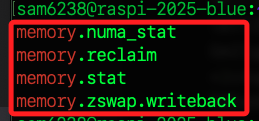
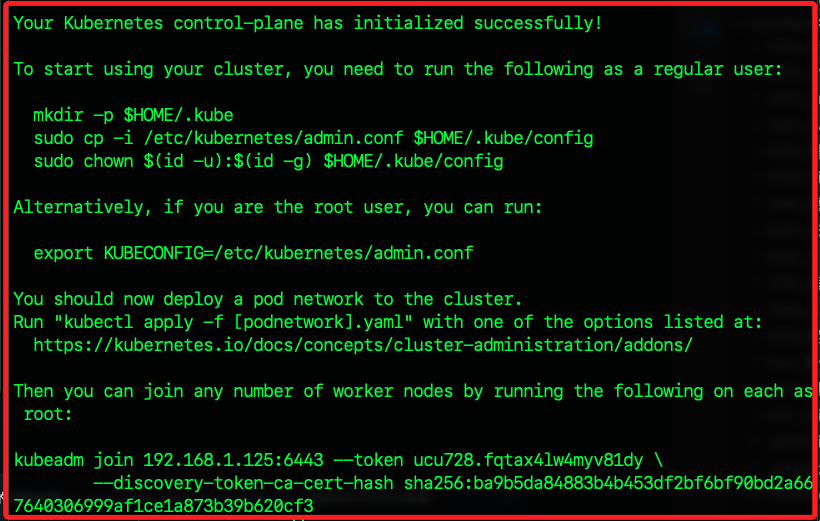
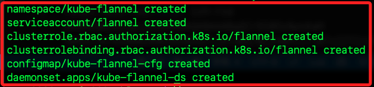
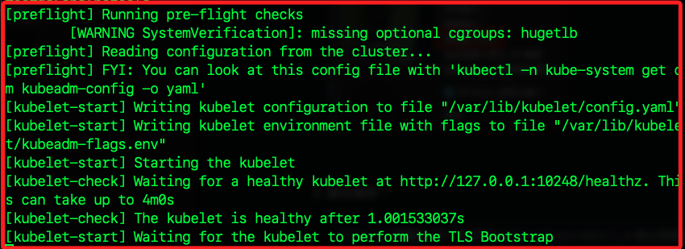
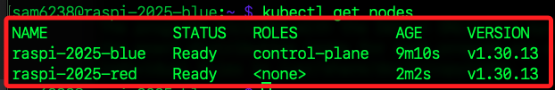
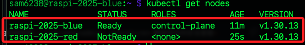
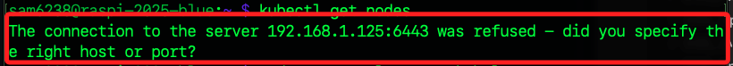

_尚未完成_

# 案例實作 01

_使用兩台樹莓派組建 K8s 叢集、部署 HTML 靜態網頁並用 ngrok 外網訪問_

<br>

## 前置準備

_以下假設主節點 IP 為 `192.168.1.125`、從節點為 `192.168.1.157`_

<br>

1. 兩台皆執行。

```bash
sudo apt update && sudo apt install -y curl apt-transport-https ca-certificates
sudo apt install -y docker.io
sudo systemctl enable --now docker
sudo usermod -aG docker $USER
```

2. 完成後登出再登入，讓 docker 群組生效。

```bash
exit
```

3. 兩台皆安裝初始化叢集工具 `kubeadm`、管理叢集指工具 `kubelet`、執行 pod 與容器的核心元件 `kubectl`，

```bash
sudo curl -fsSL https://pkgs.k8s.io/core:/stable:/v1.30/deb/Release.key | sudo gpg --dearmor -o /etc/apt/keyrings/kubernetes-apt-keyring.gpg
echo "deb [signed-by=/etc/apt/keyrings/kubernetes-apt-keyring.gpg] https://pkgs.k8s.io/core:/stable:/v1.30/deb/ /" | sudo tee /etc/apt/sources.list.d/kubernetes.list
sudo apt update
sudo apt install -y kubelet kubeadm kubectl
sudo apt-mark hold kubelet kubeadm kubectl
```

<br>

## CNI plugins

_Container Network Interface_

<br>

1. 在所有主節點與工作節點執行以下步驟，手動安裝 Kubernetes CNI plugins，並放到系統正確目錄下。

```bash
CNI_VERSION="v1.4.0"
ARCH="arm64"
sudo mkdir -p /opt/cni/bin
wget https://github.com/containernetworking/plugins/releases/download/$CNI_VERSION/cni-plugins-linux-$ARCH-$CNI_VERSION.tgz
sudo tar -xzvf cni-plugins-linux-$ARCH-$CNI_VERSION.tgz -C /opt/cni/bin
sudo mkdir -p /usr/lib/cni
sudo ln -sf /opt/cni/bin/* /usr/lib/cni/
```

2. 下載正確 flannel CNI plugin 執行檔

```bash
cd /opt/cni/bin
sudo wget https://github.com/flannel-io/cni-plugin/releases/download/v1.1.2/flannel-arm64 -O flannel
sudo chmod +x flannel
sudo ln -sf /opt/cni/bin/flannel /usr/lib/cni/flannel
```

3. 下載與設置後，執行以下

```bash
ls -l /usr/lib/cni/flannel
ls -l /opt/cni/bin/flannel
```

4. 安裝後，檢查 /usr/lib/cni 內容

```bash
ls -l /usr/lib/cni
```

5. 重啟 kubelet

```bash
sudo systemctl restart kubelet
```

6. 觀察 Kubernetes pod 狀態

```bash
kubectl get pods -A
```

7. 檢查 Flannel Pod 日誌

```bash
kubectl -n kube-flannel logs <flannel-pod-name>
```

8. 再次檢查 kubelet 日誌

```bash
sudo journalctl -u kubelet | tail -40
```

<br>

## 開啟 memory cgroup 支援

_這是 K8s 必要條件，cgroup v2 memory 指的是 Linux 內每個被控 group可用的 `實體記憶體（RAM）` + `swap` 資源；因為目前系統 Bookworm 預設沒啟用，需手動修改開機參數_

<br>

1. 編輯開機參數

```bash
sudo nano /boot/firmware/cmdline.txt
```

2. 在同一行結尾加上以下設定，以空格分隔即可，不要斷行；操作的技巧是先將游標移動到下一行，使用後退鍵將游標移動到該行最後，然後空白鍵空一格之後貼上內容。

```bash
cgroup_memory=1 cgroup_enable=memory
cgroup_memory=1 cgroup_enable=memory systemd.unified_cgroup_hierarchy=1
```

3. 儲存後重啟

```bash
sudo reboot
```

4. 驗證 `cgroup v2 cgroup memory` 是否啟用；若看到目錄下有 `memory.stat` 這類檔案，代表 `cgroup v2` 的記憶體管理功能已經啟用，可正常支援 Kubernetes。

```bash
ls /sys/fs/cgroup/ | grep memory
```



<br>

## 關閉 swap

_K8s 預設不允許開啟 swap，建議在安裝前就先關閉，因為 kubelet 啟動時會檢查 swap 狀態，預設若有啟用，會直接報錯不允許進行安裝或加入叢集_

<br>

1. 完全停用

```bash
sudo dphys-swapfile swapoff
sudo systemctl disable dphys-swapfile
sudo rm /var/swap
sudo swapoff -a
```

<br>

## 初始化 Kubernetes

1. 在 `主節點` 進行；注意 IP 要正確。

```bash
sudo kubeadm init --apiserver-advertise-address=192.168.1.125 --pod-network-cidr=10.244.0.0/16
```



2. 複製 kubeconfig 設定，在主節點設置 kubectl 權限，讓主節點用 kubectl 控制叢集

```bash
mkdir -p $HOME/.kube
sudo cp -i /etc/kubernetes/admin.conf $HOME/.kube/config
sudo chown $(id -u):$(id -g) $HOME/.kube/config
```

3. 在主節點安裝 flannel 部署 Pod 網路

```bash
kubectl apply -f https://github.com/flannel-io/flannel/releases/latest/download/kube-flannel.yml
```



<br>

## 加入叢集

_從節點_

<br>

1. 複製 `主節點` 初始化完成時在最後提供的 `kubeadm join` 的指令，加上 `sudo` 之後在 `從節點` 運行，使從節點加入主節點所建立的 K8s 叢集；完成後兩台設備可共同管理容器資源，若有多台從節點，在每台從節點皆執行相同指令即可；特別注意，一定要使用 `sudo`。

```bash
sudo kubeadm join 192.168.1.125:6443 --token xxxxx.xxxxxxxx \
--discovery-token-ca-cert-hash sha256:xxxxxxxxxxxxxxxxxxxxxxxxx
```

2. 運行後終端會暫時阻塞顯示如下；完成時，狀態顯示 `healthy`，代表節點已經正常連接到主節點。



3. 若要重新安裝或加入節點，建議先執行一次重置指令，確保環境乾淨再執行 `kubeadm join/init`。

```bash
sudo kubeadm reset
```

<br>

## 驗證叢集

1. 在主節點進行查詢，確認從節點的狀態；正常之下接顯示 `Ready`，代表兩台樹莓派的 K8s 叢集已經架設完成，主從都運作正常，可以開始部署與管理容器化應用。

```bash
kubectl get nodes
```



2. 若出現尚未 `Ready`，可稍作等待或進行必要檢查。



3. 若出現如下的錯誤提示，可嘗試重新在主節點設置 kubectl 權限。



<br>

## 進階檢查

1. 查看所有 Pod 狀態，是否有 Crash、Pending、Error。

```bash
kubectl get pods -A
```

2. 查看指定節點詳細狀況

```bash
kubectl describe node raspi-2025-blue
kubectl describe node raspi-2025-red
```

3. 查看事件

```bash
kubectl get events -A --sort-by=.metadata.creationTimestamp | tail -30
```

4. 查看關鍵系統元件的 log，以 control-plane 節點為例

```bash
sudo journalctl -u kubelet | tail -40
kubectl -n kube-system logs -l component=kube-apiserver
```

<br>

## 完整重新加入叢集

1. 在從節點執行

```bash
sudo kubeadm reset -f
sudo systemctl restart kubelet
```

2. 回到主節點產生一組新的 join 指令

```bash
sudo kubeadm token create --print-join-command
```

3. 複製新產生的 join 指令，到從節點執行

```bash
sudo kubeadm join 192.168.1.125:6443 --token xxxx --discovery-token-ca-cert-hash sha256:xxxxxxxxxx
```

<br>

## 建立簡易靜態網頁

_Docker 鏡像檔_

<br>

1. 在任一台節點建立站台資料夾，建議在主節點

```bash
mkdir ~/simple-html && cd ~/simple-html
echo '<h1>Hello Raspberry Pi K8s!</h1>' > index.html
```

2. 建立 Dockerfile

```bash
nano Dockerfile
```

3. 內容如下

```bash
# Dockerfile
FROM nginx:alpine
COPY index.html /usr/share/nginx/html/index.html
```

<br>

## dockerhub

_需帳號_

1. 建置鏡像檔

```bash
docker build -t <dockerhub-帳號>/simple-html:latest .
```

2. docker login

```bash
docker login
```

3. 推到 Docker Hub

```bash
docker push <dockerhub-帳號>/simple-html:latest
```

4. 在其他節點或 worker 測試拉取

```bash
docker pull sam6238/simple-html:latest
```

<br>

## 在 K8s 叢集部署網站

_主節點_

<br>

1. 建立 Deployment 與 Service，檔名如 `simple-html.yaml`

```bash
nano simple-html.yaml
```

2. 編輯如下

```yaml
apiVersion: apps/v1
kind: Deployment
metadata:
  name: simple-html
spec:
  replicas: 2
  selector:
    matchLabels:
      app: simple-html
  template:
    metadata:
      labels:
        app: simple-html
    spec:
      containers:
      - name: simple-html
        image: <dockerhub-帳號>/simple-html:latest
        ports:
        - containerPort: 80

apiVersion: v1
kind: Service
metadata:
  name: simple-html-service
spec:
  type: NodePort
  selector:
    app: simple-html
  ports:
    - port: 80
      targetPort: 80
      nodePort: 30080
```

3. 套用部署

```bash
kubectl apply -f simple-html.yaml
```

4. 若失敗時要刪除舊的 Deployment 和失敗 Pod，刪除後重新 `kubectl apply`。

```bash
kubectl delete deployment simple-html
kubectl delete pod -l app=simple-html
```

<br>

## 區網測試訪問

可在任一樹莓派直接訪問，都可看到同一個頁面，實際流量會由 K8s 自動分配。

* [http://192.168.1.125:30080](http://192.168.1.125:30080)

* [http://192.168.1.157:30080](http://192.168.1.157:30080)

<br>

## 外網訪問

_用 ngrok_

<br>

1. 在任一台樹莓派上安裝 ngrok

```bash
wget https://bin.equinox.io/c/bNyj1mQVY4c/ngrok-v3-stable-linux-arm.tgz
tar -xvzf ngrok-v3-stable-linux-arm.tgz
sudo mv ngrok /usr/local/bin
ngrok config add-authtoken <你的ngrok token>
```

2. 啟動 ngrok http 隧道

```bash
ngrok http 30080
```

<br>

## 測試節點關機容錯

1. 先關閉從節點（worker, 192.168.1.157），用 ngrok 公開網址、或 [http://192.168.1.125:30080](http://192.168.1.125:30080) 訪問，網站應該還能正常顯示。

2. 接著關閉主節點（master, 192.168.1.125），測試時 worker 應已 join 成功且服務正在運行

3. 網站原本在 worker 節點運作的 container 會繼續運行，但若 ngrok 開在主節點會斷線，這時可將 ngrok 開在 worker（192.168.1.157:30080）。

4. 注意：主節點斷電時無法進行 K8s 管理操作（不能擴縮容、不能新部署等），但現有服務仍在 worker 節點維持。

<br>

## 總結

1. K8s 可分散運行網站，節點故障有容錯，但主節點關機後管理功能暫停。

2. 用 ngrok 快速讓外網測試，不論主/從都可設定。

3. 若要高可用 master（HA），需多台 master 節點，這已超出基礎樹莓派測試範圍。

<br>

___

_未完_
