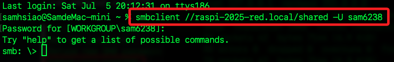

# 在樹莓派架設小型的 NAS

<br>

## 步驟

1. 更新所有系統軟體。

    ```bash
    sudo apt update && sudo apt upgrade -y
    ```

<br>

2. 安裝 Samba；如果只作為伺服器，可不用安裝 `smbclient`。

    ```bash
    sudo apt install samba samba-common-bin smbclient -y
    ```

    

<br>

3. 建立 `共享文件夾`；並將文件夾權限設定為 `777`。

    ```bash
    mkdir ~/shared && chmod 777 ~/shared
    ```

<br>

4. 編輯 `Samba` 設定檔，新增 `共享文件夾` 的設定。

    ```bash
    sudo nano /etc/samba/smb.conf
    ```

<br>

5. 在文件的最下方加入以下內容，並替換其中 `<使用者帳號>` 為自己的帳號；這些設定允許用戶在共享資料夾 `shared` 中進行讀寫；特別注意，`[Shared]` 中的 `path` 要將路徑展開，使用 `~/` 會出錯。

    ```bash
    [Shared]
    path = /home/<使用者帳號>/shared
    writeable=Yes
    create mask=0777
    directory mask=0777
    public=no

    [global]
    min protocol = SMB2
    max protocol = SMB3
    ```

<br>

6. 為 `Samba` 設置一組帳號密碼，替換其中 `<使用自己的帳號>`；接著會提示需要輸入兩次密碼。

    ```bash
    sudo smbpasswd -a <使用自己的帳號>
    ```

    

<br>

7. 重啟 `Samba` 服務以使配置生效。

    ```bash
    sudo systemctl restart smbd
    ```

<br>

## 連線測試

1. 從本機連線樹莓派進行測試；會提示輸入密碼。

    ```bash
    smbclient //<樹莓派-IP-或-Hostname>/shared -U <使用者帳號>
    ```

    

<br>

## 格式化 USB 隨身碟

_插入 USB 隨身碟到樹莓派進行演示_

<br>

1. 先查看。

    ```bash
    lsblk
    ```

    

<br>

2. 依據查詢結果卸載 USB 隨身碟現有掛載點，假如有兩個就卸載兩個。

    ```bash
    sudo umount /dev/sda1
    sudo umount /dev/sda2
    ```

<br>

3. 使用 fdisk 清除並重建分割表；以下的 `sda` 依據查詢到的磁區名稱進行替換，這裡是 `sda`。

    ```bash
    sudo fdisk /dev/sda
    ```

<br>

## 建立磁區

_依照以下操作順序，示範建立一個新的單一分割區_

<br>

1. 建立新的空的 DOS 分割表。

    ```bash
    o
    ```

<br>

2. 刪除所有舊的分割區，可重複按幾次直到清除；看到 `No partition is defined yet!` 表示磁碟已經沒有任何可刪除的分割區。

    ```bash
    d
    ```

    

<br>

3. 建立新的分割區。

    ```bash
    n
    ```

<br>

4. 選擇主分割區（primary）。

    ```bash
    p
    ```

<br>

5. 分割區號為 1；或按下 `ENTER` 使用預設值。

    ```bash
    1
    ```

<br>

6. 然後按下兩次 `ENTER` 設置起始位置 `First sector` 與結束位置 `Last sector`，也就是整顆磁碟。

    ```bash
    Enter
    ```

<br>

7. 若看到以下提示，輸入 `y` 即可；這表示建立的 `/dev/sda1` 分割區上原本就有 `ext4` 的格式資訊，所以確認是否要清除這個舊的 ext4 signature，避免造成衝突。

    

<br>

8. 寫入更動並離開。

    ```bash
    w
    ```

    

<br>

## 格式化

_建立好新的分區後需要格式化，也就是在該分區上建立一個檔案系統，否則系統無法使用該分區來存取檔案_

<br>

1. 再次查詢。

    ```bash
    lsblk
    ```

    

<br>

2. 將 `/dev/sda1` 格式化為 `ext4`。

    ```bash
    sudo mkfs.ext4 /dev/sda1
    ```

    

<br>

3. 查詢並紀錄 `UUID`，之後步驟設定需要使用。

    ```bash
    sudo blkid /dev/sda1
    ```

    

<br>

## 設定外接硬碟

_如果要使用 USB 硬碟作為主要存儲設備_

<br>

1. 在次查看系統。

    ```bash
    lsblk
    ```

<br>

2. 為了自動掛載硬碟，首先編輯 `fstab` 文件；務必確認完成再繼續。

    ```bash
    sudo nano /etc/fstab
    ```

<br>

3. 添加掛載點，其中 `sda1` 依據前面步驟查詢結果輸入；總之，這部分要根據自己的硬碟設備和文件系統類型調整；最後一個參數 `0` 表示系統開機時不檢查磁碟錯誤。

    ```bash
    UUID=<貼上之前查詢到的-UUID> /mnt/nas ext4 defaults 0 0
    ```

<br>

4. 先手動建立這個掛載點資料夾。

    ```bash
    sudo mkdir -p /mnt/nas
    ```

<br>

5. 手動掛載硬碟。

    ```bash
    sudo mount -a
    ```

<br>

6. 假如看到如下提示可以忽略，只是說 `/etc/fstab` 不需要 `systemctl daemon-reload`，因為 `mount -a` 會直接依據 `fstab` 最新內容執行。

    

<br>

7. 確認是否掛載成功。

    ```bash
    df -h | grep /mnt/nas
    ```

<br>

8. 若沒看到，可進一步執行以下指令來檢查

    ```bash
    mount | grep /mnt/nas
    ```

<br>

## 從其他設備訪問 NAS

1. 在 Windows 上，打開 `檔案總管` 並在地址欄中輸入 `\\<Raspberry Pi 的 IP>\Shared`，然後按下 `Enter`；系統會要求輸入用戶名和密碼。

<br>

2. 在 macOS 上，進入 Finder 後選擇 `連接到伺服器`。

    

<br>

3. 輸入 `smb://<樹莓派-IP>`；其中 IP 也可以使用 `Hostname`，若要指定連線到某個資料夾如 `/shared`，可直接加在位址之後。

    

<br>

4. 點擊連線。

    

<br>

5. 修改名稱並輸入密碼。

    

<br>

6. 選擇要連線的磁區，然後點擊 `好`。

    

<br>

## 設定開機自動掛載硬碟

_如果將外接硬碟用作存儲空間，要確保在每次開機時能自動掛載；_

<br>

1. 使用以下命令來查看系統中所有磁碟的 UUID。

    ```bash
    lsblk -f
    ```

<br>

2. 將看到類似於以下的輸出，其中 `sda1` 是外接硬碟分區，對應的 `UUID` 會顯示在其旁邊。

    ```bash
    NAME        FSTYPE LABEL UUID                                 MOUNTPOINT
    sda         ext4         xxxxxxxx-xxxx-xxxx-xxxx-xxxxxxxxxxxx 
    └─sda1      ext4         xxxxxxxx-xxxx-xxxx-xxxx-xxxxxxxxxxxx /mnt/nas
    ```

<br>

3. 取得硬碟的 UUID 後，編輯 `/etc/fstab` 文件。

    ```bash
    sudo nano /etc/fstab
    ```

<br>

4. 在文件末尾添加自動掛載配置，使用剛剛查到的 UUID 更改 `UUID=XXXXXXXX`；保存 `Ctrl+O` 並退出 `Ctrl+X`。

    ```bash
    UUID=xxxxxxxx-xxxx-xxxx-xxxx-xxxxxxxxxxxx /mnt/nas ext4 defaults,auto,users,rw,nofail 0 0
    ```

<br>

5. 測試是否可以正確掛載；這將掛載 `fstab` 中定義的所有分區，如果沒有錯誤訊息，表示掛載成功。

    ```bash
    sudo mount -a
    ```

<br>

6. 確認硬碟是否已經成功掛載到 `/mnt/nas`，在輸出中會看到 `/mnt/nas` 的掛載訊息。

    ```bash
    df -h
    ```

<br>

___

_END_