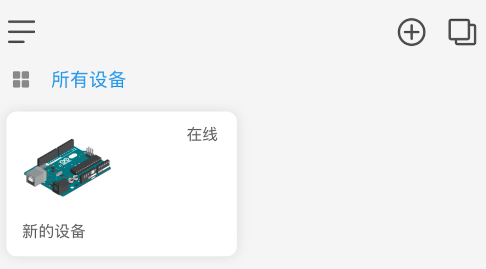
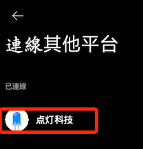

# 操作紀錄

_先簡單紀錄，可參考點燈科技官方 [Github](https://github.com/blinker-iot)_

<br>

## 準備工作

_可在本機運行，服務器會將本機識別為一台物聯網設備_

<br>

1. 建立並啟動虛擬環境，命名為 `envBlinker`。

    ```bash
    mkdir -p ~/Documents/PythonVenvs
    cd ~/Documents/PythonVenvs
    python -m venv envBlinker
    cd envBlinker/bin
    VENV_PATH="$(pwd)/activate"
    echo "source $VENV_PATH" >> ~/.bashrc
    source ~/.bashrc
    ```

<br>

2. 在 [官網載點](https://diandeng.tech/dev) 下載套件，這會解壓縮為資料夾 `blinker-py`。

    ```bash
    cd ~/Downloads
    git clone https://github.com/blinker-iot/blinker-py
    ```

<br>

3. 進入 `blinker-py` 目錄。

    ```bash
    cd blinker-py
    ```

<br>

4. 安裝 Blinker SDK 及相依套件。

    ```bash
    python setup.py install
    pip install -r requirements.txt
    ```

<br>

5. 調整專案資料夾權限，確保當前使用者擁有讀寫權限。

    ```bash
    chown -R $(whoami) .
    chmod -R u+w .
    ```

<br>

6. 透過 pip 指令再次安裝專案。

    ```bash
    pip install .
    ```

<br>

## 下載手機端

1. 取得並複製設備密鑰 `Secret Key`。

    

<br>

## 建立腳本

_在終端機中進行_

<br>

1. 添加腳本 `ex01.py`。

    ```bash
    nano ex01.py
    ```

<br>

2. 貼上代碼，並更改其中的密鑰。

    ```python
    from blinker import Device

    async def ready_func():
        print(device.data_reader.get())


    device = Device("<填入密鑰>", ready_func=ready_func)

    if __name__ == '__main__':
        device.run()
    ```

<br>

3. 在終端機運行，若自訂其他腳本名稱記得更換。

    ```bash
    python ex01.py
    ```

<br>

4. 可在手機端應用看見設備已經新增。

    

<br>

## 米家

1. 進入米家 App，查看 `我的` 中的 `連線其他平台`，加入 `点灯科技`。

    

<br>

2. 只不過同步裝置不成功。

<br>

___

_待續_