# 建立 AWS EC2

_透過 AWS 的 AMI 訂閱快速安裝 OpenVPN Access Server_

<br>

## 建立 `Key Pairs`

_這裡僅是將建立步驟獨立出來，因為這個 Key 是可以沿用的，無需每次都重建，若是初次建立則在建立 EC2 步驟中進行即可_

<br>

1. 登入控制台。

<br>

2. 建立一個 `Key Pairs` 備用。

   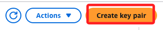

<br>

3. 任意命名如 `MyKey0122`，然後點擊 `Create key pair`；完成後會自動下載到本地。

   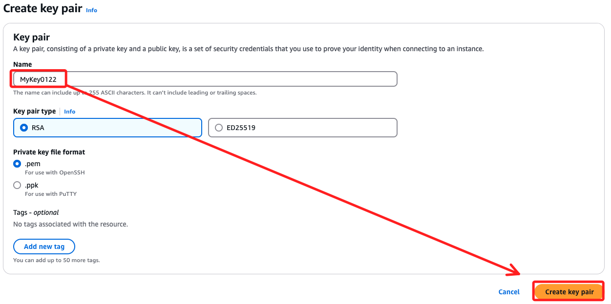

<br>

## 進入 EC2

1. 建立 EC2 實例。

   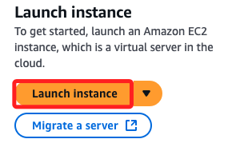

<br>

2. 點擊 `Browse more AMIs`。

   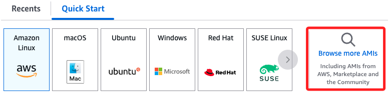

<br>

3. 切換到 `AWS Marketplace AMIs` 頁籤，在上方搜尋欄中輸入 `openvpn`，點擊 `ENTER` 之後，選取第一個搜尋結果。

   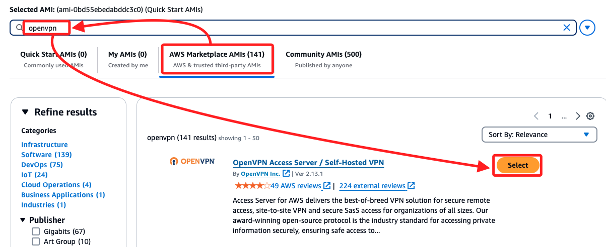

<br>

4. 點擊右下角 `Subscribe now`。

   

<br>

5. 切換 `Instance type` 為免費的 `t2.micro`。

   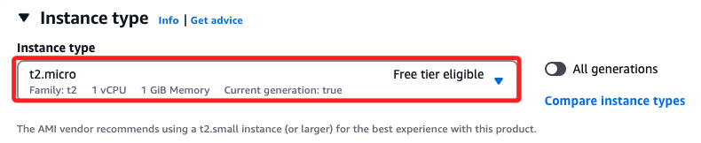

<br>

6. `Key pair` 選取前面建立好的 `MyKey0122`。

   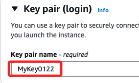

<br>

7. 其他使用預設，點擊右下角 `Launch instance`。

   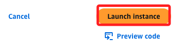

<br>

8. 回到列表，若有多個實例，選取正確的實例之後，點擊上方 `connect`。

   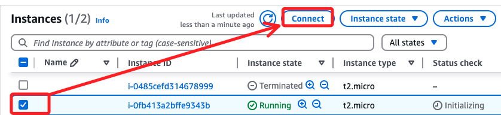

<br>

9. 先停留在這一頁，後續將使用 SSH 連線。

   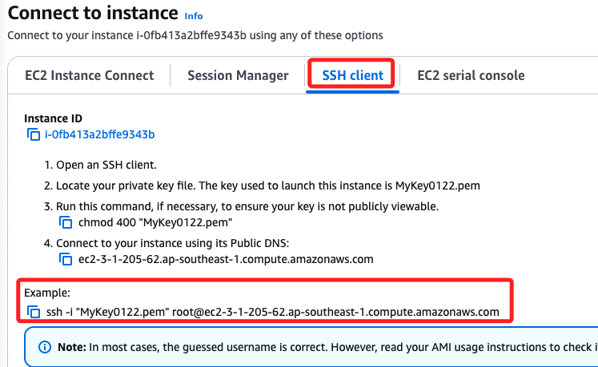

<br>

## 修改憑證權限

1. 使用終端機進入本機下載路徑中。

   ```bash
   cd ~/Downloads
   ```

<br>

2. 依規定，修改 .pem 文件的權限為 400。

   ```bash
   chmod 400 MyKey0122.pem
   ``` 

<br>

3. 複製前面步驟提供的連線指令。

   ```bash
   ssh -i "MyKey0122.pem" root@ec2-3-1-205-62.ap-southeast-1.compute.amazonaws.com
   ```

<br>

4. 連線後會看到提示先輸入 `yes`，接著繼續提示要更改使用者名稱為 `openvpnas`。

   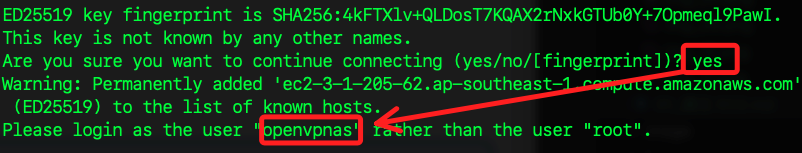

<br>

5. 重新連線。

   ```bash
   ssh -i "MyKey0122.pem" openvpnas@ec2-3-1-205-62.ap-southeast-1.compute.amazonaws.com
   ```

<br>

## 開始設定

1. 第一個先輸入 `yes`。

   

<br>

2. 接下來全部選項都按下 `ENTER` 使用預設值，直到看到設定密碼的提示。

   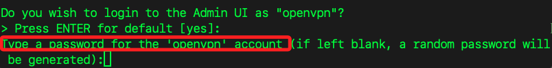

<br>

3. 依規定需輸入一個大小字母及一個符號，例如 `Xxx-0000`；需要輸入兩次，過程中看不到自己的輸入。

   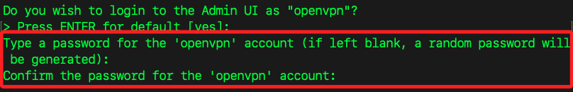

<br>

4. 下一個提示依舊按下 `ENTER` 使用預設；至此完成初步設定。

   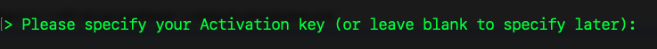

<br>

## 登入管理介面

1. 複製網址進行訪問。

   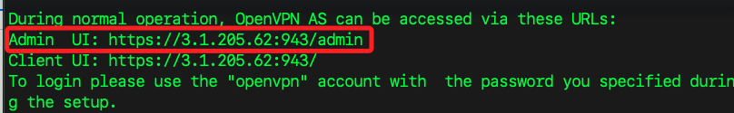

<br>

2. 展開 `進階`。

   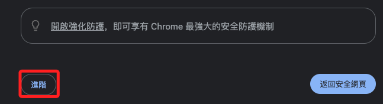

<br>

3. 接著點擊繼續前往指定的網址。

   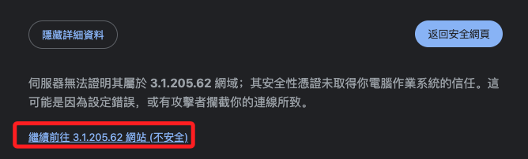

<br>

4. 帳號為 `openvpn`，密碼就是前面步驟自訂的密碼，然後點擊 `Sign in`。

   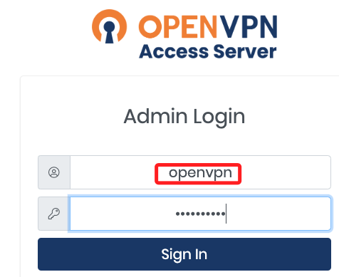

<br>

5. 接著點擊 `Agree`。

   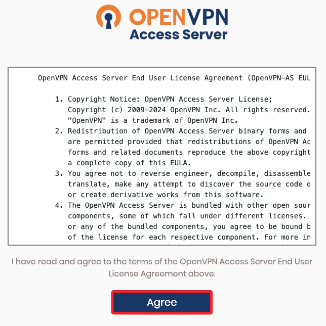

<br>

6. 左側切換到 `VPN Settings`。

   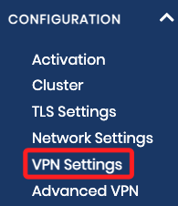

<br>

7. 在 `Routing` 區塊將第一個按鈕切換到 `Yes`。

   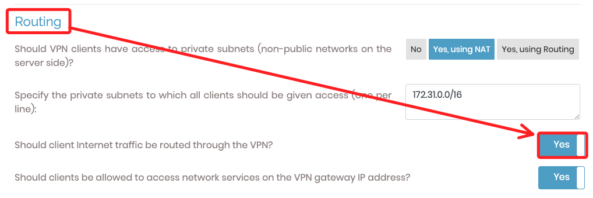

<br>

8. 滑動到最下方點擊 `Save Settings`。

   

<br>

9. 接著點擊最上方的 `Update Running Server`。

   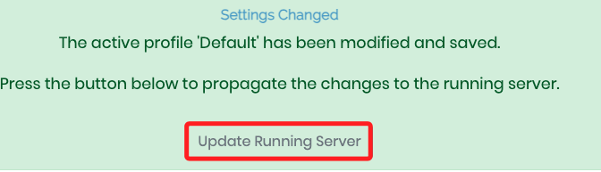

<br>

## 訪問客戶端

1. 複製並訪問客戶端網址。

   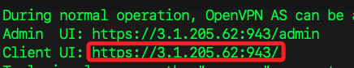

<br>

2. 輸入相同的帳號密碼之後 `Sign in`。

   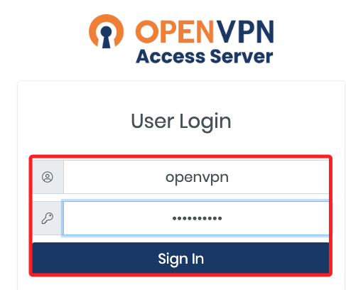

<br>

3. 使用蘋果電腦系統，所以點擊 `Apple` 圖標，點擊後會自動下載桌面應用。

   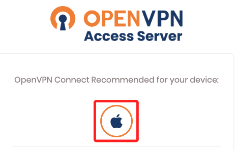

<br>

4. 下載完成點擊開啟，並點擊對應的系統。

   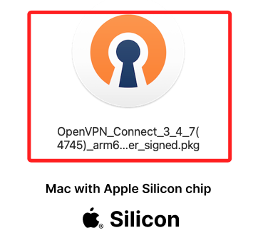

<br>

## 回到客戶端網頁

1. 點擊下方 `Profiles Management`。

   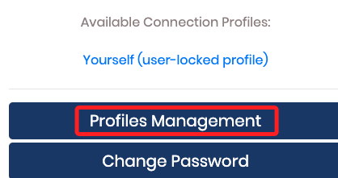

<br>

2. 點擊 `Create` 就會下載 `.ovpn` 文件。

   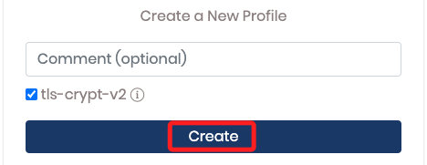

<br>

3. 點擊 `Browse` 選取下載的 `.ovpn` 文件。

   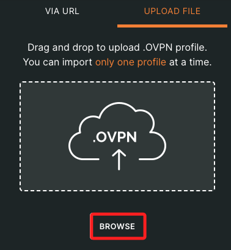

<br>

4. 輸入密碼後點擊 `Connect`。

   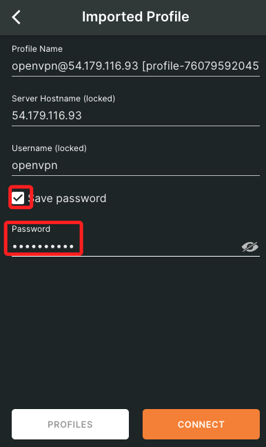

<br>

5. 完成連線伺服器。

   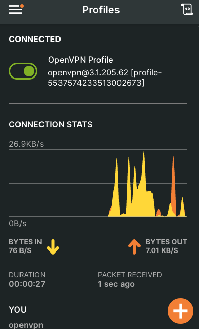

<br>

6. 訪問 [TunnelBear](https://www.tunnelbear.com/whats-my-ip)。

   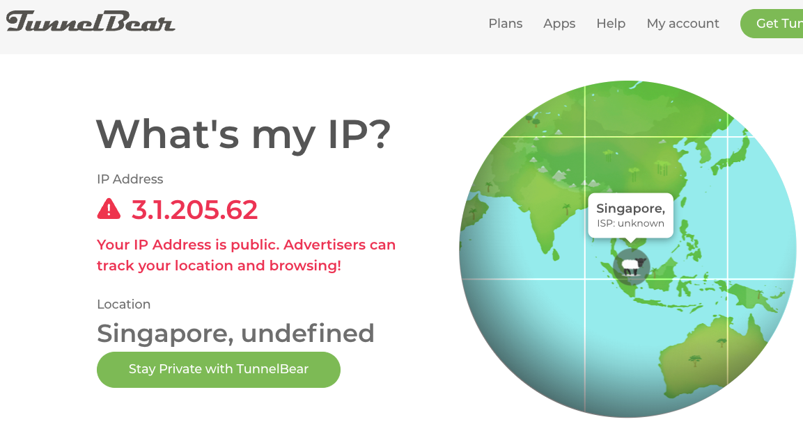

<br>

___

_接續下一單元_