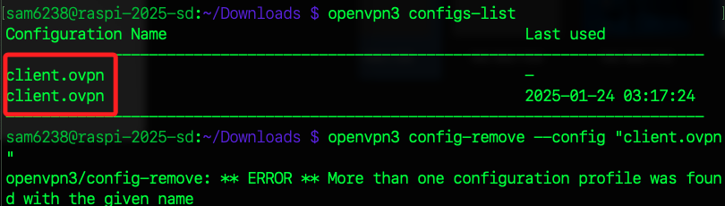

# 樹莓派

_[參考](https://openvpn.net/as-docs/tutorials/tutorial--connect-with-linux.html#tutorial--connect-to-access-server-with-linux)，以下是使用 `OpenVPN 3 Linux` 客戶端_

<br>

## 安裝 OpenVPN 3 Linux

_這是一個較新的架構，允許非特權使用者啟動和管理 VPN 連線，並基於 D-Bus 提供更安全的操作模式。_

<br>

1. 確認系統支援並安裝必要套件。

    ```bash
    sudo apt update && sudo apt install apt-transport-https curl -y
    ```

<br>

2. 下載 OpenVPN 的簽名金鑰並配置倉庫。

    ```bash
    sudo mkdir -p /etc/apt/keyrings
    curl -sSfL https://packages.openvpn.net/packages-repo.gpg | sudo tee /etc/apt/keyrings/openvpn.asc
    echo "deb [signed-by=/etc/apt/keyrings/openvpn.asc] https://packages.openvpn.net/openvpn3/debian bookworm main" | sudo tee /etc/apt/sources.list.d/openvpn3.list
    ```

<br>

3. 更新倉庫並安裝 OpenVPN 3。

    ```bash
    sudo apt update && sudo apt install openvpn3 -y && sudo apt autoremove -y
    ```

<br>

## 傳送 `.ovpn` 配置文件

_進入本機終端機_

<br>

1. 查詢前面步驟下載的 `.ovpn` 文件。

    ```bash
    cd ~/Downloads && ls *.ovpn
    ```

<br>

2. 從本機將伺服器提供的配置檔案 `.ovpn` 傳送到樹莓派，同時更名為 `client.ovpn`；特別注意，要替換以下指令中的樹莓派名稱或 IP，若需指定文件，則將 `*.ovpn` 改為正確名稱。

    ```bash
    scp *.ovpn <樹莓派名稱或 IP>:~/Downloads/client.ovpn
    ```

    

<br>

## 導入 `.ovpn` 配置文件

_回到樹莓派_

<br>

1. 切換到文件所在路徑。

    ```bash
    cd ~/Downloads
    ```

<br>

2. 導入配置檔案，`--persistent` 參數確保配置在系統重新啟動後仍然可用。

    ```bash
    openvpn3 config-import --config client.ovpn --persistent
    ```

    

<br>

3. 查看已導入的配置檔案。

    ```bash
    openvpn3 configs-list
    ```

    

<br>

## 如需刪除配置

_樹莓派中的舊配置_

<br>

1. 查看 CLI 可用的指令。

    ```bash
    openvpn3 -h
    ```

<br>

2. 刪除目標配置，看到提示時透過鍵盤輸入大寫的 `YES` 表示確認刪除。

    ```bash
    openvpn3 config-remove --config "client.ovpn"
    ```

<br>

3. 確認刪除後，重新列出配置以檢查是否已移除。

    ```bash
    openvpn3 configs-list
    ```

<br>

## 多個同名設定

1. 如有同名設定，將無法直接刪除。

    

<br>

2. 列出並取得 UUID。

    ```bash
    openvpn3 configs-list --verbose
    ```

<br>

3. 透過指定 `path` 進行刪除。

    ```bash
    openvpn3 config-remove --path /net/openvpn/v3/configuration/c7372fa8xd2e1x4f24x93aex5aa0dd1fd836
    openvpn3 config-remove --path /net/openvpn/v3/configuration/e3a17024xa48cx4174xb8bcxdcf46dbd7ff6
    ```

<br>

4. 同樣要輸入大寫 `YES` 代表同意。

    

<br>

## 啟動 VPN 連線

1. 使用導入的配置檔案啟動 VPN，輸入帳號 `openvon` 以及自訂密碼後完成連線。

    ```bash
    openvpn3 session-start --config client.ovpn
    ```

    

<br>

2. 確認連線是否啟動。

    ```bash
    openvpn3 sessions-list
    ```

    

<br>

3. 如需停止 VPN 連線。

    ```bash
    openvpn3 session-manage --config client.ovpn --disconnect
    ```

<br>

4. 在樹莓派訪問 `https://whatismyipaddress.com/`。

    

<br>

## 驗證

1. 驗證是否成功連接到伺服器。

    ```bash
    curl ifconfig.me
    ```

<br>

2. 查看日誌。

    ```bash
    sudo journalctl -u openvpn3
    ```

<br>

## 重啟服務

_若重啟 EC2_

<br>

1. 檢查當前連線。

    ```bash
    openvpn3 sessions-list
    ```

<br>

2. 依據查詢的 `Path` 終止無效連線。

    ```bash
    openvpn3 session-manage --session-path /net/openvpn/v3/sessions/320037ecsf4fes445asb897sb77e10b8504e --disconnect
    ```

<br>

3. 重啟連線

    ```bash
    openvpn3 session-start --config client.ovpn
    ```

<br>

___

_接續下一單元，建立熱點，讓連入的設備也完成翻牆_
