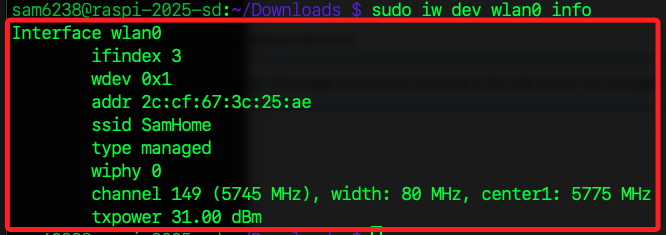
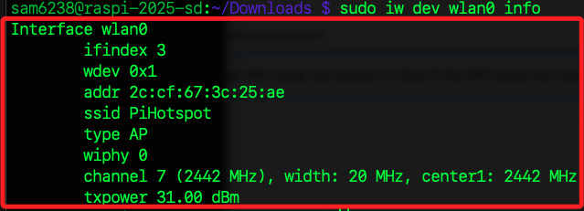

# 將樹莓派設置為一個 Wi-Fi 熱點

## 安裝必要的軟體

1. 安裝 `hostapd` 和 `dnsmasq`，這兩個工具用於設置 Wi-Fi 熱點和管理 DHCP：

```bash
sudo apt update && sudo apt install hostapd dnsmasq -y
```

2. 啟用 `hostapd`

```bash
sudo systemctl unmask hostapd
sudo systemctl enable hostapd
```

## 配置靜態 IP

_基於 NetworkManager_

1. 檢查服務使否啟動

```bash
systemctl status NetworkManager
```

1. 找到 `wlan0` 的連線設定檔案，會列出與無線網卡（`wlan0`）相關的設定檔。

```bash
sudo ls /etc/NetworkManager/system-connections/
```

2. 編輯該檔案

```bash
sudo nano /etc/NetworkManager/system-connections/preconfigured.nmconnection
```

3. 在 `[ipv4]` 區塊設定靜態 IP，確保 `method=manual`，並設置靜態 IP 地址和 DNS。

```bash
[ipv4]
method=manual
address1=192.168.4.1/24,192.168.4.1
dns=8.8.8.8;8.8.4.4;
```

## 設定

1. 查詢 WIFI 的連線名稱，依據結果就是 `preconfigured`。

```bash
nmcli connection show
```


2. 儲存後重新啟用該連線

```bash
sudo nmcli connection reload
sudo nmcli connection up preconfigured
```

## 避免自動連線

1. 停止 wpa_supplicant，並防止其自動啟動

```bash
sudo systemctl stop wpa_supplicant
sudo systemctl disable wpa_supplicant
```

## 配置 DNS 和 DHCP

1. 編輯 `dnsmasq.conf` 文件

```bash
sudo nano /etc/dnsmasq.conf
```

2. 新增以下內容

```bash
interface=wlan0
dhcp-range=192.168.4.2,192.168.4.20,255.255.255.0,24h
```

3. 儲存後啟動 `dnsmasq`

```bash
sudo systemctl restart dnsmasq
sudo systemctl enable dnsmasq
```

## 啟用 IP 轉發

1. 編輯 `sysctl.conf`

```bash
sudo nano /etc/sysctl.conf
```

2. 添加或解除註解，保存退出。

```bash
net.ipv4.ip_forward=1
```

3. 使設定立即生效

```bash
sudo sysctl -p
```


## 配置 iptables 規則

1. 安裝 iptables。

```bash
sudo apt update && sudo apt install iptables -y
```

2. 建立 /etc/iptables 目錄

```bash
sudo mkdir -p /etc/iptables
```


3. 新增轉發規則，將熱點流量轉發到 VPN

```bash
sudo iptables -t nat -A POSTROUTING -o tun0 -j MASQUERADE
sudo iptables -A FORWARD -i wlan0 -o tun0 -j ACCEPT
sudo iptables -A FORWARD -i tun0 -o wlan0 -j ACCEPT
```


4. 儲存規則

    ```bash
    sudo sh -c "iptables-save > /etc/iptables/rules.v4"
    ```

## 設定

1. 建立

```bash
sudo mkdir -p /etc/network/interfaces.d/
```

2. 編輯 /etc/network/interfaces.d/wlan0

```bash
sudo nano /etc/network/interfaces.d/wlan0
```

3. 加入

```bash
auto wlan0
iface wlan0 inet static
    address 192.168.4.1
    netmask 255.255.255.0
```

4. 重啟網卡

```bash
sudo ip link set wlan0 down
sudo ip link set wlan0 up
```

5. 檢查網卡狀態

```bash
ip addr show wlan0
```

6. 使用 nmcli 工具管理網卡

```bash
sudo nmcli device disconnect wlan0
sudo nmcli device connect wlan0
```

7. 確保 nmcli 設置已正確，檢查目前的連線狀態
```bash
nmcli device status
```

8. 重啟服務

```bash
sudo systemctl restart dnsmasq
sudo systemctl restart hostapd
```

## 啟用 Wi-Fi 熱點

1. 編輯 Hostapd 配置，`hostapd` 的配置方法與舊版相同，創建或編輯 `/etc/hostapd/hostapd.conf`

```bash
sudo nano /etc/hostapd/hostapd.conf
```

2. 內容如下，命名為 `PiHotspot`，密碼為 `11223344`。

```bash
interface=wlan0
driver=nl80211
ssid=PiHotspot
hw_mode=g
channel=11
wmm_enabled=0
macaddr_acl=0
auth_algs=1
ignore_broadcast_ssid=0
wpa=2
wpa_passphrase=11223344
wpa_key_mgmt=WPA-PSK
rsn_pairwise=CCMP
```

## 啟用 Hostapd

1. 確保 `hostapd` 指定使用該配置檔案

```bash
sudo nano /etc/default/hostapd
```

2. 加入以下內容。

```bash
DAEMON_CONF="/etc/hostapd/hostapd.conf"
```

3. 啟用並啟動服務

```bash
sudo systemctl start hostapd
sudo systemctl enable hostapd
```

4. 重啟

```bash
sudo systemctl restart hostapd
```

## 檢查模式

1. 檢查熱點是否已啟用；從輸出的資訊來看，wlan0 目前的模式為 managed，這表示網卡目前是作為客戶端（連接其他 Wi-Fi 熱點）工作，而不是作為 AP（Access Point，無線接入點）來運作。。

```bash
sudo iw dev wlan0 info
```



2. 先停用當前連接的 Wi-Fi

```bash
sudo nmcli dev disconnect wlan0
```

3. 嘗試重新啟動 hostapd 並設置網卡進入 AP 模式

```bash
sudo systemctl restart hostapd
```

4. 檢查熱點是否成功啟用

```bash
sudo iw dev wlan0 info
```



2. 查看日誌以排查問題

```bash
sudo journalctl -u hostapd
sudo journalctl -u dnsmasq
```

## 測試與排查

1. 在其他設備搜尋並連接到樹莓派的 Wi-Fi 熱點。

