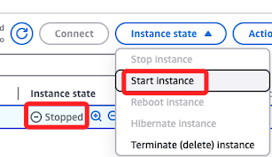
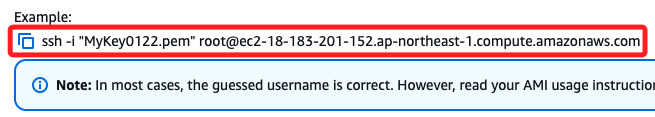
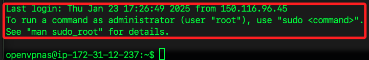
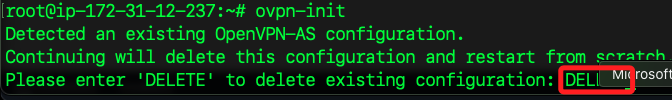
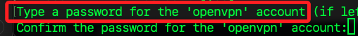
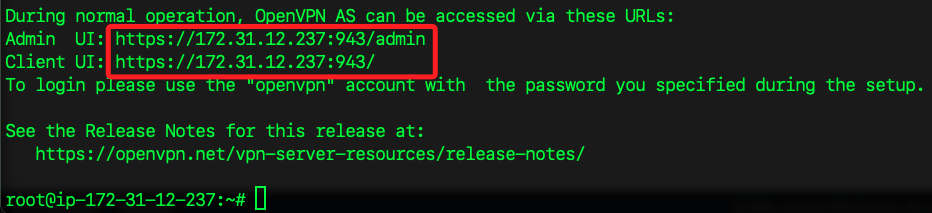
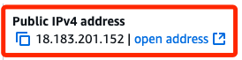
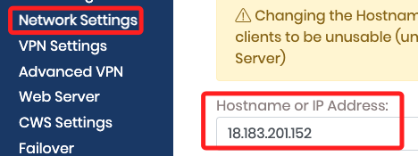
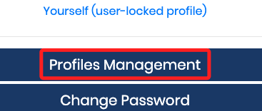
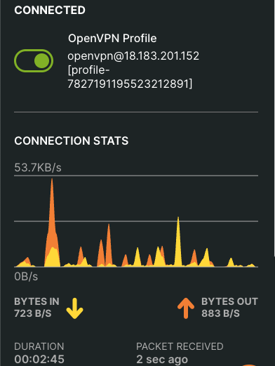

# 重啟 EC2

<br>

## 步驟

1. 重啟。

    

<br>

2. 進入本機終端機。

    ```bash
    cd ~/Downloads && ls *.ovpn && rm -f *.ovpn && ls *.pem
    ```

<br>

3. 點擊 `Connect`。

<br>

4. 複製連線指令，並將 `root` 改為 `openvpnas`。

    

<br>

5. 連線後沒有像第一次登入時自動進入設定頁面。

    

<br>

## 根據指示操作

1. 切換。

    ```bash
    sudo -i
    ```

<br>

2. 安裝。

    ```bash
    ovpn-init
    ```

<br>

3. 輸入 `DELETE`；接下來就跟原本的設定一樣，不再贅述。

    

<br>

4. 直到出現設定密碼的時候，再次輸入要設定的密碼。

    

<br>

5. 到這特別注意，此時提供的鏈接是使用私有 IP，這樣是無法開啟網址的。

    

<br>

6. 需自行替換為公有 IP。

    

<br>

7. 登入管理帳號，手動將預設的 IP Address 改為公有 IP。

    

<br>

8. 登入客戶端，下載新的 Profile。

    

<br>

8. 先使用 `OpenVPN Connect` 測試連線。

    

<br>

___

_END_
