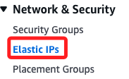
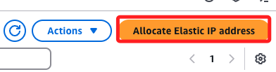
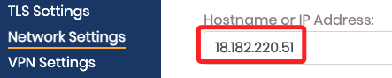
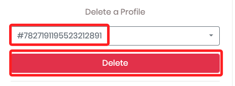

# 設定 Elastic IPs

<br>

## 步驟

1. 進入。

    

<br>

2. 分配。

    

<br>

_其餘步驟暫時略過_

<br>

## 重新登入 OpenVPN

1. 使用新的 IP 登入管理介面，自行更改 IP 部分即可。

    ```bash
    https://18.182.220.51:943/admin/
    ```

<br>

2. 修改 IP Address。

    

<br>

3. 接著使用新 IP 登入客戶端。

    ```bash
    https://18.182.220.51:943/
    ```

<br>

4. 同樣先根據引導刪除舊的 Profile，然後 Create 新的 Profile；特別注意，過程中有可能會掉線，重新登下即可。

    

<br>

___

_END_