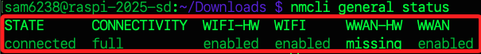
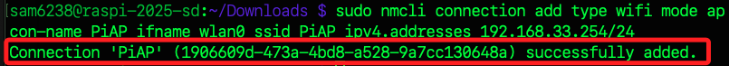
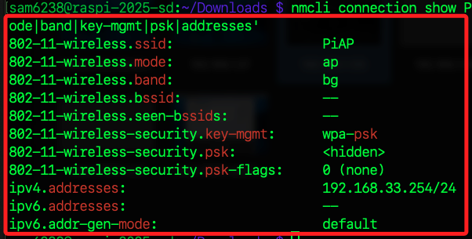
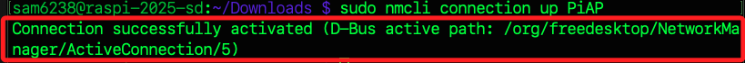
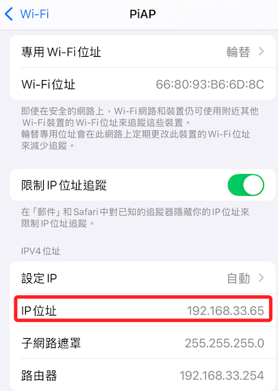
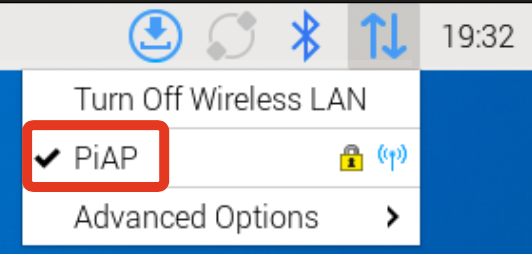
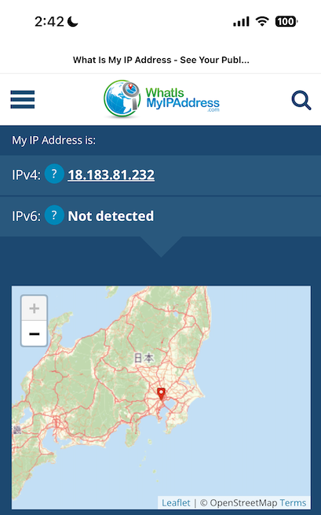

# 樹莓派熱點設置

<br>

## 步驟

1. 更新樹莓派。

    ```bash
    sudo apt update && sudo apt upgrade -y
    ```

<br>

2. 安裝必需套件；`network-manager` 用於管理網絡連接的套件，`iptables-persistent` 用於保存和持久化 iptables 規則，確保系統重啟後仍然保留配置。

    ```bash
    sudo apt install network-manager iptables-persistent -y
    ```

<br>

## 檢查和啟用 WiFi 硬體

1. 檢查 WiFi 硬體狀態。

    ```bash
    nmcli general status
    ```

    

<br>

2. 若未啟用 WiFi，使用以下指令開啟。

    ```bash
    sudo nmcli radio wifi on
    ```

<br>

## 建立 WiFi AP 配置

1. 建立 AP 名稱為 `PiAP` 並設定靜態 IP。

    ```bash
    sudo nmcli connection add type wifi mode ap con-name PiAP ifname wlan0 ssid PiAP ipv4.addresses 192.168.33.254/24
    ```

    

<br>

2. 修改頻譜和加密方式。

    ```bash
    sudo nmcli connection modify PiAP 802-11-wireless.band bg
    sudo nmcli connection modify PiAP 802-11-wireless-security.key-mgmt wpa-psk
    sudo nmcli connection modify PiAP 802-11-wireless-security.psk "11223344"
    sudo nmcli connection modify PiAP ipv4.method shared
    ```

<br>

3. 確認配置是否正確。

    ```bash
    nmcli connection show PiAP
    ```

<br>

4. 篩選重要資訊。

    ```bash
    nmcli connection show PiAP | grep -E 'ssid|mode|band|key-mgmt|psk|addresses'
    ```

    

<br>

## 啟動 AP

1. 啟動 AP；若在 SSH 中無法運行，可嘗試使用樹莓派內終端機運行指令。

    ```bash
    sudo nmcli connection up PiAP
    ```

    

<br>

2. 此時已可連線，可查看手機連線後分配到的 IP。

    

<br>

3. 確認 IP 資訊。

    ```bash
    ip addr show wlan0
    ```

<br>

4. 查看連線模式。

    ```bash
    iw dev wlan0 info
    ```

<br>

5. 樹莓派網路會顯示為自己 AP 的名稱。

    

<br>

## 手機翻牆

1. 假如樹莓派已經翻牆，分享熱點之後，連線進入的手機也翻牆完成，可訪問 [tunnelbear](https://www.tunnelbear.com/whats-my-ip) 查看。

    

<br>

2. 或訪問 [whatismyipaddress](https://whatismyipaddress.com/) 可查看國家。



## 配置 IP 轉發

1. 檢查 `ip_forward` 狀態，如果 IP 轉發功能已經啟用，會回傳 `1`。

    ```bash
    cat /proc/sys/net/ipv4/ip_forward
    ```

<br>

2. 假如不是 `1`，透過指令啟用 IP 轉發功能。

    ```bash
    sudo sysctl -w net.ipv4.ip_forward=1
    ```

<br>

3. 確保永久啟用，無論當前查詢是否已回傳 `1`，可進行編輯設定。

    ```bash
    sudo nano /etc/sysctl.conf
    ```

<br>

4. 在莫行添加以下內容，或找到預設內容並取消註解。

    ```bash
    net.ipv4.ip_forward=1
    ```

<br>

5. 保存並使生效。

    ```bash
    sudo sysctl -p
    ```

<br>

## 配置防火牆 NAT

_配置 NAT 的目的是實現 `網絡位址轉換`，將連接到熱點的設備的私有 IP 地址轉換成樹莓派的公共 IP 地址，從而通過樹莓派的另一個網絡接口訪問互聯網。_

<br>

1. 添加 NAT 規則。

    ```bash
    sudo iptables -t nat -A POSTROUTING -o eth0 -j MASQUERADE
    sudo iptables -A FORWARD -i wlan0 -o eth0 -j ACCEPT
    sudo iptables -A FORWARD -i eth0 -o wlan0 -m state --state RELATED,ESTABLISHED -j ACCEPT
    ```

<br>

2. 保存規則。

    ```bash
    sudo netfilter-persistent save
    sudo netfilter-persistent reload
    ```

<br>

3. 驗證規則是否正確。

    ```bash
    sudo iptables-save | grep -i masquerade
    ```

<br>

4. 列出當前規則。

    ```bash
    sudo iptables -t nat -L --line-numbers
    sudo iptables -L FORWARD --line-numbers
    ```

<br>

5. 刪除規則，從大行號開始刪，不然原本的行號會向前遞補。

    ```bash
    sudo iptables -t nat -D POSTROUTING <行號>
    sudo iptables -D FORWARD <行號>
    ```

<br>

## 配置 NetworkManager

1. 編輯配置文件。

    ```bash
    sudo nano /etc/NetworkManager/NetworkManager.conf
    ```

<br>

2. 確保內容如下。

    ```ini
    [main]
    plugins=ifupdown,keyfile

    [ifupdown]
    managed=false

    [device]
    wifi.scan-rand-mac-address=no
    ```

<br>

3. 若有修正，需重啟 NetworkManager。

    ```bash
    sudo systemctl restart NetworkManager
    ```

<br>

## 測試和驗證

1. 使用手機或其他設備搜索 WiFi SSID `PiAP`。

<br>

2. 輸入密碼 `11223344` 進行連接。

<br>

3. 測試是否可以通過 WiFi 訪問互聯網。

<br>

## 排錯檢查

_部分指令在前面已提及_

<br>

1. 檢查 AP 狀態。

    ```bash
    nmcli connection show PiAP
    ```

<br>

2. 篩選重要資訊。

    ```bash
    nmcli connection show PiAP | grep -E 'ssid|mode|band|key-mgmt|psk|addresses'
    ```

<br>

3. 檢查防火牆規則。

    ```bash
    sudo iptables-save | grep -i masquerade
    ```

<br>

4. 檢查日誌，添加參數 `-n` 可指定日誌筆數。

    ```bash
    sudo journalctl -u NetworkManager -n 20
    ```

<br>

5. 特別注意，在新版系統中，使用 `NetworkManager` 管理熱點和 `DHCP` 功能，所以 `dnsmasq` 是沒有啟動的。

    ```bash
    sudo systemctl status dnsmasq
    ```

    


<br>

___

_END_