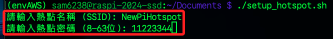
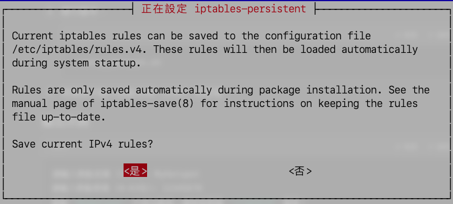

# 一鍵腳本

_使用腳本快速建立熱點_

<br>

## 腳本

_連線樹莓派_

1. 登入 `Documents` 並建立腳本 `setup_hotspot.sh`。

    ```bash
    cd ~/Documents && sudo nano setup_hotspot.sh
    ```

<br>

2. 編輯內容如下。

    ```bash
    #!/bin/bash

    # 提示輸入熱點名稱和密碼
    read -p "請輸入熱點名稱 (SSID): " SSID
    read -p "請輸入熱點密碼 (8-63位): " PASSWORD

    # 更新系統並安裝必要套件
    sudo apt update && sudo apt upgrade -y
    sudo apt install -y network-manager iptables-persistent

    # 確保 WiFi 硬體已啟用
    sudo nmcli radio wifi on

    # 刪除可能的重複連線配置
    sudo nmcli connection delete id "$SSID" &>/dev/null

    # 建立 WiFi AP 配置
    sudo nmcli connection add type wifi mode ap con-name "$SSID" ifname wlan0 ssid "$SSID" ipv4.addresses 192.168.33.254/24
    sudo nmcli connection modify "$SSID" 802-11-wireless.band bg
    sudo nmcli connection modify "$SSID" 802-11-wireless-security.key-mgmt wpa-psk
    sudo nmcli connection modify "$SSID" 802-11-wireless-security.psk "$PASSWORD"
    sudo nmcli connection modify "$SSID" ipv4.method shared

    # 啟動熱點
    sudo nmcli connection up "$SSID"

    # 配置 IP 轉發
    if [[ $(cat /proc/sys/net/ipv4/ip_forward) -ne 1 ]]; then
        sudo sysctl -w net.ipv4.ip_forward=1
    fi
    sudo sed -i '/net.ipv4.ip_forward/d' /etc/sysctl.conf
    echo "net.ipv4.ip_forward=1" | sudo tee -a /etc/sysctl.conf
    sudo sysctl -p

    # 配置防火牆 NAT
    sudo iptables -t nat -D POSTROUTING -o eth0 -j MASQUERADE &>/dev/null
    sudo iptables -t nat -A POSTROUTING -o eth0 -j MASQUERADE
    sudo iptables -D FORWARD -i wlan0 -o eth0 -j ACCEPT &>/dev/null
    sudo iptables -A FORWARD -i wlan0 -o eth0 -j ACCEPT
    sudo iptables -D FORWARD -i eth0 -o wlan0 -m state --state RELATED,ESTABLISHED -j ACCEPT &>/dev/null
    sudo iptables -A FORWARD -i eth0 -o wlan0 -m state --state RELATED,ESTABLISHED -j ACCEPT
    sudo netfilter-persistent save
    sudo netfilter-persistent reload

    # 檢查並修復 /etc/resolv.conf
    if ! grep -q "nameserver" /etc/resolv.conf; then
        echo "nameserver 8.8.8.8" | sudo tee /etc/resolv.conf
        echo "nameserver 8.8.4.4" | sudo tee -a /etc/resolv.conf
    fi

    # 重啟 NetworkManager 確保配置生效
    sudo systemctl restart NetworkManager

    echo "熱點 '$SSID' 已成功啟用，請使用密碼 '$PASSWORD' 連接！"
    ```

<br>

## 運行腳本

1. 賦予執行權限

    ```bash
    sudo chmod +x setup_hotspot.sh
    ```

<br>

2. 運行腳本

    ```bash
    ./setup_hotspot.sh
    ```

<br>

3. 根據提示輸入熱點名稱如 `NewPiHotspot` 和密碼；腳本涉及許多安裝，需一段時間。

    

<br>

4. 第一個需要手動的部分是設定 `iptables`，按下兩次 `ENTER` 即可。

    

<br>

___

_END_