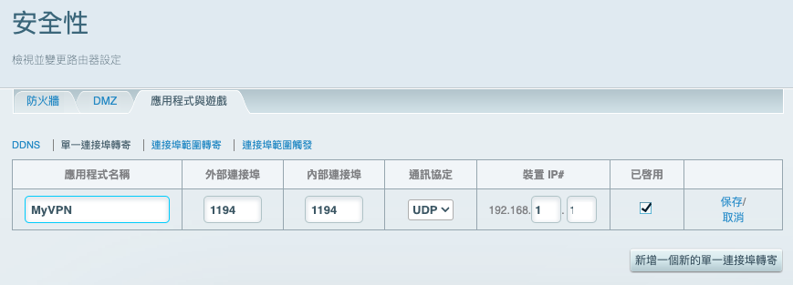

# 路由器轉發

_為了讓設備能夠訪問 VPN，需要設定路由器將 VPN 流量導向樹莓派，特別注意，這裡設定的是有線網路 `eth0` 的 `IP`_

<br>

1. 登入路由器管理界面，我使用的是 Linksys。

    ```bash
    192.168.1.1
    ```

<br>

2. 進入 `安全性` > `應用程式與遊戲` > `單一連接埠轉寄`。

<br>

3. 新增一個新的 `單一連接埠轉寄`。

<br>

4. 自訂名稱如 `MyVPN`，外部埠設定為 `1194`、內部埠設定為 `1194`，協議選取 `UDP`，內部 IP 地址就是樹莓派的內網 IP 如 `192.168.1.x`。

    

<br>

5. 設定完成後套用規則。

    

<br>

6. 完成後會顯示 `無法連線至路由器`，可不予理會。

    

<br>

___

_接續下一單元_
