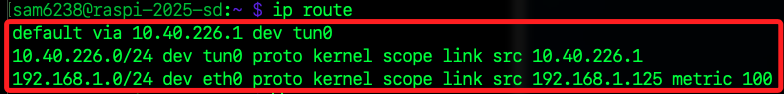

# 內建 VPN

_樹莓派內建了 VPN 工具_

<br>

## 步驟說明

1. 在樹莓派系統中預設了 VPN 功能。

    

<br>

2. 假如展開後無選項可選，可先安裝 `network-manager-openvpn` 和`network-manager-openvpn-gnome`，用於支援OpenVPN連線。

    ```bash
    sudo apt install network-manager-openvpn network-manager-openvpn-gnome -y
    ```

<br>

3. 安裝完成後，重啟網絡管理服務。

    ```bash
    sudo systemctl restart NetworkManager
    ```

<br>

4. 選擇導入設定文件。

    

<br>

5. 選取設定文件。

    

<br>

6. 先切換到 `IPv6 Settings` 頁籤，下拉選單選取 `Disabled`。

    

<br>

7. 切換到 `VPN` 頁籤，`Type` 選取 `Password`，然後手動輸入 `User name` 及 `Password`，然後點擊 `Save`。

    

<br>

8. 點擊選取所設定的 VPN。

    

<br>

## 查詢與設置

1. 查看路由表是否有通過 VPN 隧道的路由條目

    ```bash
    ip route
    ```

    

<br>

2. 保留一個預設路由（例如通過 eth0），刪除多餘的路由。

    ```bash
    sudo ip route del default via 192.168.1.1 dev wlan0
    sudo ip route del default via 192.168.1.1 dev eth0
    ```

<br>

3. 如果需要將所有流量通過 VPN 隧道，添加一條預設路由。

    ```bash
    sudo ip route add default via 10.40.226.1 dev tun0
    ```

<br>

4. 確保只有一條有效的預設路由指向 VPN 隧道 `tun0`，內部網段為 `10.40.226.0/24`。

    ```bash
    ip route
    ```

    

<br>

5. 保留通過 eth0 的本地網段路由，刪除通過 wlan0 的路由。

    ```bash
    sudo ip route del 192.168.1.0/24 dev wlan0
    ```

    

<br>

6. 確保 /etc/resolv.conf 文件中有正確的 DNS 伺服器。

    ```bash
    sudo nano /etc/resolv.conf
    ```

<br>

7. 添加以下內容。

    ```bash
    nameserver 9.9.9.9
    nameserver 8.8.8.8
    ```

<br>

___

_接續下一單元_