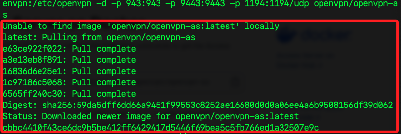
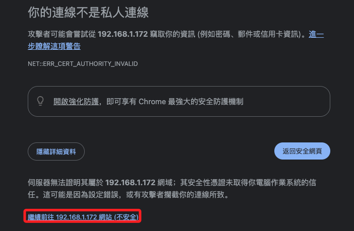

# 安裝 OpenVPN Access Server

_在樹莓派透過 Docker 安裝，參考 [官方說明](https://as-portal.openvpn.com/instructions/docker/installation)_

<br>

## 使用 Docker 安裝

_因為官方不支援樹莓派系統安裝，所以使用容器_

<br>

1. 安裝 Docker。

    ```bash
    sudo apt update && sudo apt install -y docker.io && sudo systemctl enable --now docker
    ```

<br>

2. 運行 OpenVPN Access Server Docker 鏡像，為該容器指定名稱為 `openvpn-as`，並加入參數 `-d` 以分離模式在後台運行容器。

    ```bash
    sudo docker run --name openvpn-as -v /etc/openvpn:/etc/openvpn -d -p 943:943 -p 9443:9443 -p 1194:1194/udp openvpn/openvpn-as
    ```

    

<br>

## 操作容器

_如有必要刪除重建也是相同步驟_

<br>

1. 列出所有容器，包括已停止的容器。

    ```bash
    sudo docker ps -a
    ```

<br>

2. 如果已經存在或是重複，可先停止然後刪除容器。

    ```bash
    sudo docker stop openvpn-as
    sudo docker rm openvpn-as
    ```

<br>

3. 建立或重建容器。

    ```bash
    sudo docker run -d \
        --name openvpn-as \
        --restart always \
        --cap-add=NET_ADMIN \
        --cap-add=NET_RAW \
        --privileged \
        -v /run:/run \
        -p 943:943 \
        -p 9443:9443 \
        -p 1194:1194/udp \
        openvpn/openvpn-as
    ```

<br>

4. 再次確認容器狀態。

    ```bash
    sudo docker ps
    ```

    

<br>

## 操作容器

1. 進入 openvpn-as 容器。

    ```bash
    sudo docker exec -it openvpn-as bash
    ```

    

<br>

2. 建立使用者 `openvpn` 及密碼 `Sam-112233`。

    ```bash
    cd /usr/local/openvpn_as/scripts && ./sacli --user openvpn --new_pass "Sam-112233" SetLocalPassword
    ```

    

<br>

3. 將該使用者 `openvpn` 設置為 `管理員 superuser`。

    ```bash
    cd /usr/local/openvpn_as/scripts
    ./sacli --user openvpn --key type --value admin UserPropPut
    ./sacli --user openvpn --key prop_superuser --value true UserPropPut
    ./sacli start
    ```

<br>

4. 退出容器。

    ```bash
    exit
    ```

<br>

5. 檢查用戶的屬性是否正確設置。

    ```bash
    sudo docker exec -it openvpn-as bash -c "/usr/local/openvpn_as/scripts/sacli --user sam6238 UserPropGet"
    ```

<br>

6. 重新啟動 OpenVPN Access Server。

    ```bash
    sudo docker exec -it openvpn-as bash -c "/usr/local/openvpn_as/scripts/sacli start"
    ```

<br>

7. 若需要可在宿主機上重新啟動容器。

    ```bash
    sudo docker restart openvpn-as
    ```

<br>

8. 使用指令驗證用戶屬性。

    ```bash
    sudo docker exec -it openvpn-as bash -c "/usr/local/openvpn_as/scripts/sacli --user sam6238 UserPropGet"
    ```

<br>

9. 查看日誌。

    ```bash
    sudo docker logs openvpn-as
    ```

<br>

## 訪問伺服器

1. 確認樹莓派 IP。

    ```bash
    PI_IP=$(hostname -I | awk '{print $1}') && echo "https://$PI_IP:943/admin"
    ```

<br>

2. 訪問輸出的網址。

    

<br>
