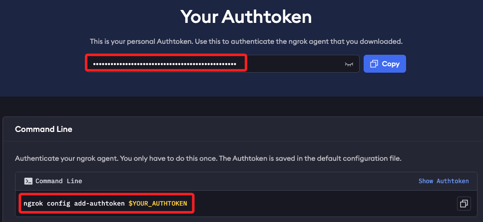
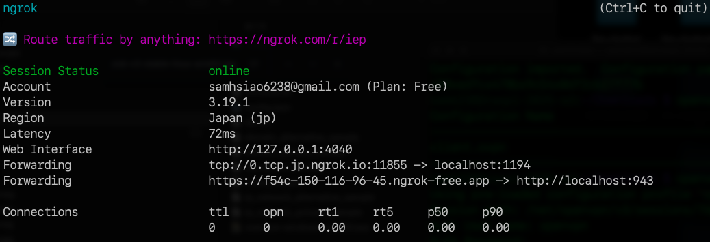

# 部署伺服器 

_使用 Ngrok 將 VPN 伺服器公開到互聯網_

<br>

## 設置 Ngrok

1. 安裝 Ngrok。

    ```bash
    wget https://bin.equinox.io/c/bNyj1mQVY4c/ngrok-v3-stable-linux-arm64.tgz
    tar -xvzf ngrok-v3-stable-linux-arm64.tgz
    sudo mv ngrok /usr/local/bin
    ```

<br>

2. 註冊一個 [Ngrok 帳戶](https://ngrok.com/)，登錄後取得身份驗證令牌。

    

<br>

3. 在樹莓派添加令牌。

    ```bash
    ngrok config add-authtoken <自己的-ngrok-令牌>
    ```

<br>

4. 編輯。

    ```bash
    sudo nano ~/.config/ngrok/ngrok.yml
    ```

<br>

5. 預設已經有以下內容。

    ```bash
    version: "3"
    agent:
        authtoken: xxxxxxxxxxxxxxxxxxxxxxxxxxxxxxxxxxxxxxxxxxx
    ```

<br>

6. 添加以下內容；特別注意，`proto` 表達的是 ngrok 隧道所使用的 `協議類型`，`addr` 表達的是本地網址，也可以簡寫端口號，假如要使用 `https`，必須明確指定完整 HTTPS 地址；TCP 適合需要直接轉發任意如 VPN、SSH、RDP 的 TCP 協議。

    ```bash
    version: "3"
    agent:
        authtoken: xxxxxxxxxxxxxxxxxxxxxxxxxxxxxxxxxxxxxxxxxxx
    # 添加以下內容
    tunnels:
    openvpn-admin:
        proto: http
        addr: https://localhost:943
    openvpn-vpn:
        proto: tcp
        addr: 1194
    ```

<br>

7. 運行。

    ```bash
    ngrok start --all
    ```

<br>

## 輸出說明

1. 畫面顯示。

    

<br>

2. `tcp://0.tcp.jp.ngrok.io:15693 -> localhost:1194` 表示將外部請求轉發到本地的 OpenVPN Server，該服務運行在樹莓派上，使用 1194 端口。

<br>

3. `https://5df9-150-116-96-45.ngrok-free.app -> http://localhost:943` 表示將外部請求轉發到本地的 OpenVPN 管理界面，該界面運行在 943 端口。

<br>

___

_END_