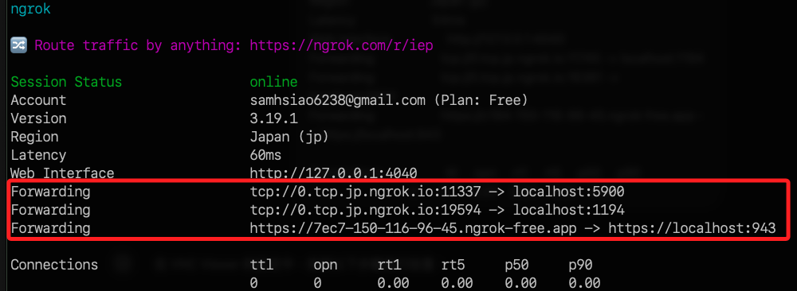
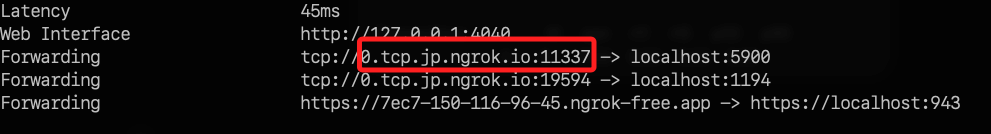
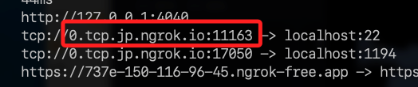

## Ngrok 多通道

_補充說明使用 Ngrok 開啟 VNC 通道_

<br>

## Ngrok 設定

1. 編輯。

    ```bash
    sudo nano ~/.config/ngrok/ngrok.yml
    ```

<br>

2. 內容如下，特別注意不可加入註解，另外，同時最多開啟三個隧道，以下寫四個是便於參考語法使用。

    ```bash
    version: "3"
    agent:
        authtoken: 2hTyuBo6MsTDMP8EO7TlnAHST03_26EkSKab6rbqhrd6JpwyW
    tunnels:
        openvpn-admin:
            proto: http
            addr: https://localhost:943
        openvpn-vpn:
            proto: tcp
            addr: 1194
        vnc-tunnel:
            proto: tcp
            addr: 5900
        ssh:
            proto: tcp
            addr: 22
    ```

<br>

3. 運行。

    ```bash
    ngrok start --all
    ```

    

<br>

## VNC 連線

1. VNC Server 設定為 `0.tcp.jp.ngrok.io:xxxxx`，特別注意這要用 `5900` 轉發的網址，並且不包含 `tcp://` 前綴。

    

<br>

## SSH 連線

1. 語法。

    ```bash
    ssh <用戶名>@0.tcp.jp.ngrok.io -p <ngrok 端口號>
    ```

<br>

2. 實作。

    ```bash
    ssh sam6238@0.tcp.jp.ngrok.io -p 11163
    ```

    

<br>

___

_END_