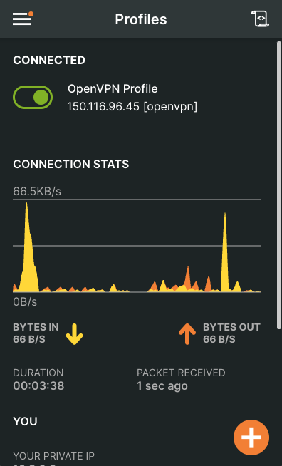
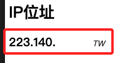
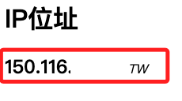

# 直裝 Sertver

_[參考](https://medium.com/@ivanzhd/setting-up-openvpn-access-server-on-a-raspberry-pi-a-quick-guide-54a12ee8b41f)_

<br>

## 伺服器端指引

1. 安裝必要工具，更新系統並安裝 OpenVPN 與 curl。

    ```bash
    sudo apt update && sudo apt install curl openvpn -y
    ```

<br>

2. 切換路徑。

    ```bash
    cd ~/Downloads
    ```

<br>

3. 下載 OpenVPN 安裝腳本。

    ```bash
    curl -O https://raw.githubusercontent.com/galih-prasetyo/ngrok-openvpn/main/openvpn-install.sh
    ```

<br>

4. 變更權限。

    ```bash
    chmod +x openvpn-install.sh
    ```

<br>

5. 執行腳本。

    ```bash
    sudo ./openvpn-install.sh
    ```

<br>

## 設置說明

_該腳本已預設好設定，除以下有特別說明部分，其餘皆按下 `ENTER` 使用預設值即可_

<br>

1. 預設為 UDP，因後續將使用 ngrok，這裏設定為 TCP；補充說明，UDP 是無連接協議，相比於 TCP，它的頭部開銷較少，傳輸速度更快，因為要通過 ngrok 或需要穿越防火牆的環境，ngrok 更加支持 TCP 隧道轉發，所以選 TCP。

    

<br>

2. 提示 `Enter PEM pass phrase`，輸入一組密碼兩次，這裡我使用 `sam112233`，似乎不能使用特殊字元。

    

<br>

3. 輸入前面步驟自設的密碼兩次。

    

<br>

4. 輸入客戶端名稱，依慣例輸入 `openvpn`。

    

<br>

5. 使用預設值 `1` 不需要密碼保護，如果選擇 `2`，則需要在每次使用此 `.ovpn` 文件時輸入密碼。

    

<br>

6. 再次輸入自訂密碼一次。

    

<br>

7. 完成設定。

    

<br>

8. 可查看家目錄中的設定文件 `openvpn.ovpn`。

    ```bash
    cat ~/openvpn.ovpn
    ```

<br>

## 安裝 Ngrok

_略，請參考前面筆記說明_

<br>

1. 切換到 `~/Downloads` 下載並安裝 Ngrok，同時移動到 `/usr/local/bin` 以便全域使用。

    ```bash
    cd ~/Downloads
    wget https://bin.equinox.io/c/bNyj1mQVY4c/ngrok-v3-stable-linux-arm64.tgz
    tar -xvzf ngrok-v3-stable-linux-arm64.tgz
    sudo mv ngrok /usr/local/bin
    ```

<br>

2. 在樹莓派添加令牌，會自動添加設定檔案到家目錄 `/home/sam6238/.config/ngrok/ngrok.yml` 中。

    ```bash
    ngrok config add-authtoken <自己的-ngrok-令牌>
    ```

    

<br>

3. 編輯自動生成的設定檔案。

    ```bash
    sudo nano ~/.config/ngrok/ngrok.yml
    ```

<br>

4. 預設已經有以下內容。

    ```bash
    version: "3"
    agent:
        authtoken: xxxxxxxxxxxxxxxxxxxxxxxxxxxxxxxxxxxxxxxxxxx
    ```

<br>

5. 添加以下內容。

    ```yaml
    # 添加以下內容
    openvpn-admin:
        proto: http
        addr: https://localhost:943
    openvpn-vpn:
        proto: tcp
        addr: 1194
    ```

<br>

6. 確保 ngrok 二進制文件位於 `/usr/local/bin/ngrok` 並具有執行權限。

    ```bash
    sudo chmod +x /usr/local/bin/ngrok
    ```

<br>

7. 運行。

    ```bash
    ngrok start --all
    ```

<br>

## 客戶端配置指引

1. 下載生成的 `.ovpn` 文件。

<br>

2. 配置路由器，裝置 IP 改為 OpenVPN 伺服器的 IP，使用 `TCP`。

    

<br>

3. 使用 OpenVPN 客戶端。

    

<br>

## 排查

1. 確保伺服器未啟用防火牆，或者允許 1194 端口的流量。

    ```bash
    sudo ufw allow 1194/tcp
    ```

<br>

2. 查看 OpenVPN 日誌。

    ```bash
    sudo cat /var/log/openvpn.log
    ```

<br>

## 測試 VPN

_電腦先連接手機熱點，並且關閉客戶端連線_

<br>

1. [查看當前設備 IP](https://www.whatismyip.com.tw/tw/)。

    

<br>

2. 啟動客戶端後再次查詢，顯示的會是伺服器端的 IP，翻牆成功。

    

<br>

___

_END_