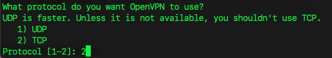
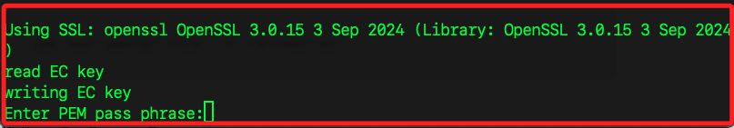
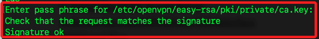
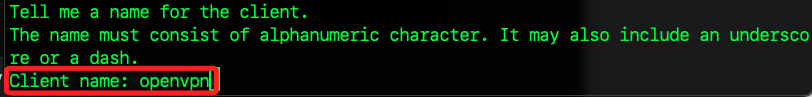
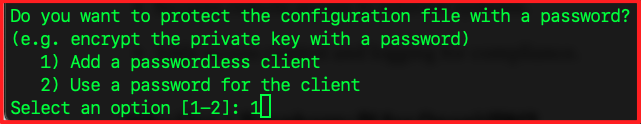
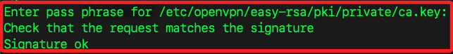
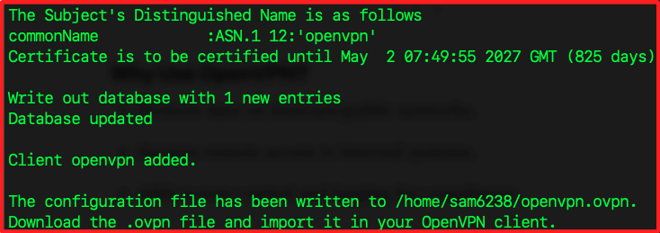
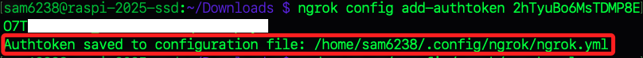

# 直裝 Sertver

_[參考](https://medium.com/@ivanzhd/setting-up-openvpn-access-server-on-a-raspberry-pi-a-quick-guide-54a12ee8b41f)_

<br>

## 伺服器端指引

1. 安裝必要工具，更新系統並安裝 OpenVPN 與 curl。

```bash
sudo apt update && sudo apt install curl openvpn -y
```

2. 切換路徑。

```bash
cd ~/Downloads
```

3. 下載 OpenVPN 安裝腳本。

```bash
curl -O https://raw.githubusercontent.com/galih-prasetyo/ngrok-openvpn/main/openvpn-install.sh
```

4. 變更權限。

```bash
chmod +x openvpn-install.sh
```

5. 執行腳本。

```bash
sudo ./openvpn-install.sh
```

## 設置說明

_該腳本已預設好設定，除以下有特別說明部分，其餘皆按下 `ENTER` 使用預設值即可_

1. 預設為 UDP，因後續將使用 ngrok，這裏設定為 TCP；補充說明，UDP 是無連接協議，相比於 TCP，它的頭部開銷較少，傳輸速度更快，因為要通過 ngrok 或需要穿越防火牆的環境，ngrok 更加支持 TCP 隧道轉發，所以選 TCP。



2. 提示 `Enter PEM pass phrase`，輸入一組密碼兩次，這裡我使用 `sam112233`，似乎不能使用特殊字元。



3. 輸入前面步驟自設的密碼兩次。



4. 輸入客戶端名稱，依慣例輸入 `openvpn`。



5. 使用預設值 `1` 不需要密碼保護，如果選擇 `2`，則需要在每次使用此 `.ovpn` 文件時輸入密碼。



6. 再次輸入自訂密碼一次。



7. 完成設定。



8. 可查看家目錄中的設定文件 `openvpn.ovpn`。

```bash
cat ~/openvpn.ovpn
```

## 安裝 Ngrok

_略，請參考前面筆記說明_

1. 切換到 `~/Downloads` 下載並安裝 Ngrok，同時移動到 `/usr/local/bin` 以便全域使用。

```bash
cd ~/Downloads
wget https://bin.equinox.io/c/bNyj1mQVY4c/ngrok-v3-stable-linux-arm64.tgz
tar -xvzf ngrok-v3-stable-linux-arm64.tgz
sudo mv ngrok /usr/local/bin
```

2. 在樹莓派添加令牌，會自動添加設定檔案到家目錄 `/home/sam6238/.config/ngrok/ngrok.yml` 中。

```bash
ngrok config add-authtoken <自己的-ngrok-令牌>
```



3. 編輯自動生成的設定檔案。

```bash
sudo nano ~/.config/ngrok/ngrok.yml
```

4. 預設已經有以下內容。

```bash
version: "3"
agent:
    authtoken: 2hTyuBo6MsTDMP8EO7TlnAHST03_26EkSKab6rbqhrd6JpwyW
```

```yaml
authtoken: <YOUR_NGROK_AUTHTOKEN>
tunnels:
    openvpn:
        addr: 1194
        proto: tcp
```

   - 測試 Ngrok 隧道是否正常啟動：
     ```bash
     ngrok start --all --config /home/pi/.ngrok2/ngrok.yml
     ```

1. 設置 Ngrok 為服務：
   - 建立 systemd 服務文件 `/etc/systemd/system/ngrok.service`：
     ```ini
     [Unit]
     Description=Ngrok VPN Service
     After=network.target

     [Service]
     ExecStart=/usr/local/bin/ngrok start --all --config /home/pi/.ngrok2/ngrok.yml
     Restart=on-failure
     User=pi

     [Install]
     WantedBy=multi-user.target
     ```

   - 啟動並驗證 Ngrok：
     ```bash
     sudo systemctl enable ngrok.service
     sudo systemctl start ngrok.service
     sudo systemctl status ngrok.service
     ```

2. 確認 Ngrok 隧道地址：
   - 執行以下指令來查看隧道：
     ```bash
     ngrok status
     ```
   - 記錄類似 `tcp://0.tcp.jp.ngrok.io:15092` 的隧道地址與端口。


### 客戶端配置指引：

1. 下載生成的 `.ovpn` 文件：
   - 使用 Filezilla 或其他工具將伺服器端生成的 `.ovpn` 文件下載到客戶端設備。

2. 修改 `.ovpn` 文件：
   - 打開 `.ovpn` 文件，找到類似以下的行：
     ```bash
     remote 192.168.1.125 1194 tcp
     ```
   - 修改為 Ngrok 隧道地址，例如：
     ```bash
     remote 0.tcp.jp.ngrok.io 15092 tcp
     ```

3. 導入到 OpenVPN 客戶端：
   - 將修改後的 `.ovpn` 文件導入到 OpenVPN 客戶端中，然後嘗試連接。


### 可能的問題排查：

1. 檢查 Ngrok 隧道狀態：
   - 確保 Ngrok 隧道正在運行且使用的端口與 `.ovpn` 文件一致。

2. 檢查防火牆：
   - 確保伺服器未啟用防火牆，或者允許 1194 端口的流量：
     ```bash
     sudo ufw allow 1194/tcp
     ```

3. 查看 OpenVPN 日誌：
   - 如果連線失敗，檢查 OpenVPN 日誌以確定問題：
     ```bash
     sudo cat /var/log/openvpn.log
     ```


這樣的設置應該能正確配置 OpenVPN 與 Ngrok 並實現連接。如果仍然遇到問題，請提供具體錯誤訊息進一步排查。