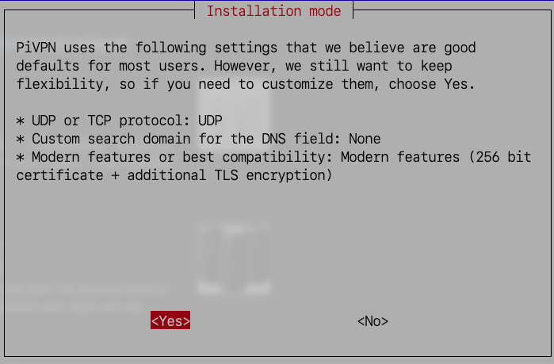
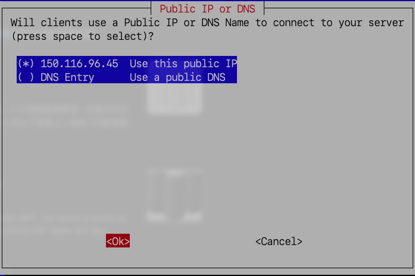
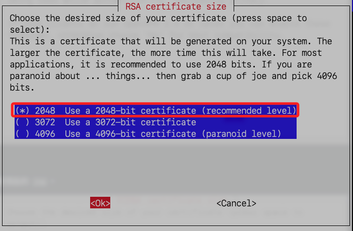
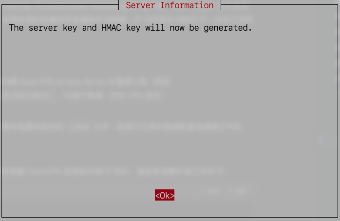

# 安裝 OpenVPN

_使用樹莓派作為 VPN 伺服器_

<br>

## 安裝步驟

_在樹莓派上安裝 `PiVPN`_

<br>

1. 更新樹莓派系統。

   ```bash
   sudo apt update && sudo apt upgrade -y && sudo apt autoremove -y
   ```

<br>

2. 下載 `PiVPN` 提供的雲端腳本，完成後會自動進入安裝程序。

   ```bash
   curl -L https://install.pivpn.io | bash
   ```

<br>

## PiVPN 設定步驟

_按照指示進行設定_

<br>

1. 點擊 `OK`；提示接下來的步驟會將樹莓派轉變為 `OpenVPN` 或 `WireGuard` 伺服器。

   

<br>

2. 點擊 `OK`；這步驟提示在後續步驟中將需要使用靜態 IP。

   

<br>

3. 選擇 `No`；若選擇 `YES` 會強制將所有 `IPv6` 流量通過 `VPN` 隧道以防止流量洩漏；這裡先禁用。

   

<br>

4. 使用預設的選項 `eth0`，這是 `有線網路`，然後點擊 `OK`。

   

<br>

5. 選擇 `Yes` 以使用 `DHCP 保留功能` 來分配固定 IP 地址，並提供了當前的網路設置資訊。

   

<br>

6. 選擇 `Ok`。

   

<br>

7. 選擇 `sam6238`。

   

<br>

8. 選擇 `OpenVPN` 作為 VPN 協議，接的點擊 `Ok`。

   

<br>

9. 選擇 `Yes`；預設值已經針對安全性和性能進行最佳化，適合現代網路設備和 VPN 用途。

   

<br>

## 繼續設定

1. 選擇 `UDP` 作為 `VPN` 連線協議的選項。

   

<br>

2. 配置 VPN 埠號，使用預設的 `1194`。

   

<br>

3. 點擊 `Yes` 進行確認。

   

<br>

## DNS 供應商

_關於選項可參考說明_

<br>

1. 選擇 `Quad9`。

   

<br>

2. 設定 `No`，不用設定搜尋主機。

   

<br>

3. 點擊 `OK`，因為已經擁有靜態 IP 所以可直接設定。

   

<br>

4. 先設定為 `No`；如果確定所有設備都運行的是 `OpenVPN 2.4` 或更新版本，可直接選擇 `Yes`；如果不確定或有老舊設備需要支援，可以先選擇 `No`。

   

<br>

5. 選預設的 `256`。

   

<br>

6. 通知系統即將生成伺服器的金鑰和 HMAC 驗證金鑰，用於加密和驗證 VPN 連線的安全性。

   

<br>

7. 是否要在設備上生成 `Diffie-Hellman (DH)` 參數，用於加密交換密鑰的協議，建議選擇 `Yes`，使用預定義參數以節省時間並保持高效。

   

<br>

8. 點擊 `Yes`。

   

<br>

## 完成階段工作

1. 會提示接下來的指令。

   

<br>

2. 重啟。


<br>

3. 確認。

   

<br>

___

_END_