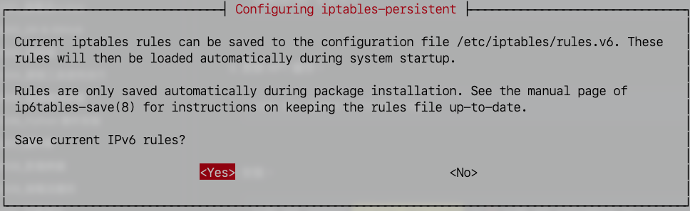
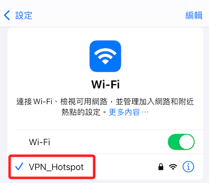

# 建立熱點

_將樹莓派作為 VPN 熱點；分別設置  `/etc/hostapd/hostapd.conf` 與 `/etc/default/hostapd` 兩個文件_

<br>

## 安裝套件

_`hostapd` 和 `dnsmasq`_

<br>

1. 先更新樹莓派。

    ```bash
    sudo apt update && sudo apt upgrade -y && sudo apt autoremove -y
    ```

<br>

2. 安裝並配置 `hostapd` 和 `dnsmasq` 以啟用 `Wi-Fi` 熱點功能。

    ```bash
    sudo apt install hostapd dnsmasq -y
    ```

<br>

3. 編輯配置文件 `hostapd.conf` 設置 `Wi-Fi`，預設無內容；這是主配置文件，用於設置 `HostAPD` 的詳細參數。

    ```bash
    sudo nano /etc/hostapd/hostapd.conf
    ```

<br>

4. 設置如下；選擇驅動程式 `nl80211`，這是大多數樹莓派 Wi-Fi 模組的適用驅動，自訂熱點名稱 `ssid=VPN_Hotspot`，`hw_mode=g` 表示設置 Wi-Fi 模式為 2.4GHz，`channel=6` 為 `Wi-Fi` 頻道為 `6`，可自行調整以避免干擾。`wpa=2` 啟用 WPA2 加密，設置熱點密碼 `wpa_passphrase=<輸入自訂密碼>`，至少 8 位。

    ```bash
    # 使用有線網路
    interface=wlan0
    # 選擇驅動程式
    driver=nl80211
    # 熱點名稱
    ssid=VPN_Hotspot
    # Wi-Fi 模式為 2.4GHz
    hw_mode=g
    # Wi-Fi 頻道為 `6`
    channel=6
    # 提供流量優先級，特別是對語音和視頻流量
    wmm_enabled=1
    macaddr_acl=0
    auth_algs=1
    ignore_broadcast_ssid=0
    # 啟用 WPA2 加密
    wpa=2
    # 熱點密碼
    wpa_passphrase=sam112233
    wpa_key_mgmt=WPA-PSK
    rsn_pairwise=CCMP
    ```

<br>

## 編輯 `hostapd`

_用於控制 `HostAPD` 的啟動行為_

<br>

1. 打開 `/etc/default/hostapd` 文件進行編輯；預設內容全部都是註解的。

    ```bash
    sudo nano /etc/default/hostapd
    ```

<br>

2. 添加以下內容，這是設定系統在啟動 `Hostapd` 服務時，會使用 `/etc/hostapd/hostapd.conf` 文件作為其主要的配置檔案。

    ```bash
    DAEMON_CONF="/etc/hostapd/hostapd.conf"
    ```

<br>

## 配置 `dnsmasq.conf`

_這是 `dnsmasq` 的配置文件，用於設置 `DNS` 和 `DHCP` 服務，也就是為 `Wi-Fi` 熱點提供 `DHCP` 功能，讓連接到熱點的設備能自動獲得 IP 地址並接入網路。_

<br>

1. 先備份原有的 `dnsmasq.conf` 文件，然後進行編輯；特別說明，預設的內容全部都被註解。

    ```bash
    sudo mv /etc/dnsmasq.conf /etc/dnsmasq.conf.bak
    ```

<br>

2. 編輯新的 `dnsmasq.conf` 文件。

    ```bash
    sudo nano /etc/dnsmasq.conf
    ```

<br>

3. 寫入以下內容。

    ```bash
    # 使用有線網路
    interface=wlan0
    # DHCP 地址範圍和租期
    dhcp-range=192.168.50.10,192.168.50.50,12h
    # 設定預設網關
    dhcp-option=3,192.168.50.1
    ```

<br>

4. 假如要翻牆例如 `中國大陸`，可添加以下設定。

    ```bash
    # 設定 DNS 伺服器
    dhcp-option=6,114.114.114.114,223.5.5.5
    # 自訂域名解析
    address=/myrouter.local/192.168.50.1
    ```

<br>

## 配置網路接口

1. 確保樹莓派的 `Wi-Fi` 接口有固定 IP 地址，需配置網路接口。

    ```bash
    sudo nano /etc/dhcpcd.conf
    ```

<br>

2. 添加以下內容；如果你的目的是翻牆到中國，DNS 順序可以優先使用中國 DNS。

    ```bash
    # 對無線網卡設定靜態 IP
    interface wlan0
    static ip_address=192.168.50.1/24
    # 表示樹莓派自己作為路由器，對於熱點是正確的設定
    static routers=192.168.50.1
    # 定義 DNS 伺服器列表
    # 使用 Google DNS（8.8.8.8）
    # 以及中國的阿里 DNS（223.5.5.5）
    static domain_name_servers=223.5.5.5 114.114.114.114 8.8.8.8
    ```

<br>

3. 解除 `hostapd` 的屏蔽狀態。

    ```bash
    sudo systemctl unmask hostapd
    ```

    

<br>

4. 啟用 `hostapd` 服務，確保其在啟動時自動運行

    ```bash
    sudo systemctl enable hostapd
    ```

    

<br>

5. 啟動 hostapd。

    ```bash
    sudo systemctl start hostapd
    ```

<br>

6. 確認服務狀態。

    ```bash
    sudo systemctl status hostapd
    ```

    

<br>

7. 重新啟動相關服務，啟動 Wi-Fi 熱點。

    ```bash
    sudo systemctl restart dnsmasq
    sudo systemctl restart hostapd
    ```

<br>

## 檢查

1. 檢查熱點是否廣播中。

    ```bash
    iw dev wlan0 scan | grep SSID
    ```

<br>

2. 出現 `command failed` 才是正確的。

    

<br>

3. 檢查 hostapd 的日誌是否顯示熱點成功啟用。

    ```bash
    sudo journalctl -u hostapd
    ```

<br>

4. 摘錄內容如下。

    ```bash
    # `hostapd.service` 未啟動，因為 `/etc/hostapd/hostapd.conf` 文件不存在或為空
    # 該文件是 hostapd 的核心配置文件
    raspi-2025-sd systemd[1]: hostapd.service - Access point and authentication server for Wi-Fi and Ethernet was skipped because of an unmet condition check (ConditionFileNotEmpty=/etc/hostapd/hostapd.conf).

    # 系統嘗試啟動 hostapd.service，用於設置 Wi-Fi 接入點及身份驗證服務
    raspi-2025-sd systemd[1]: Starting hostapd.service - Access point and authentication server for Wi-Fi and Ethernet...

    # Wi-Fi 接口（wlan0）狀態從 "未初始化"（UNINITIALIZED）變為 "啟用"（ENABLED）
    raspi-2025-sd hostapd[2371]: wlan0: interface state UNINITIALIZED->ENABLED

    # Wi-Fi 接入點（Access Point, AP）已啟動並運行
    raspi-2025-sd hostapd[2371]: wlan0: AP-ENABLED

    # 說明：hostapd.service成功啟動，Wi-Fi 接入點運行正常
    raspi-2025-sd systemd[1]: Started hostapd.service - Access point and authentication server for Wi-Fi and Ethernet.

    # 系統嘗試停止 hostapd.service
    raspi-2025-sd systemd[1]: Stopping hostapd.service - Access point and authentication server for Wi-Fi and Ethernet...

    # hostapd.service已成功停止
    raspi-2025-sd systemd[1]: hostapd.service: Deactivated successfully.

    # hostapd.service被標記為已停止
    raspi-2025-sd systemd[1]: Stopped hostapd.service - Access point and authentication server for Wi-Fi and Ethernet.

    # 系統再次嘗試啟動 hostapd.service
    raspi-2025-sd systemd[1]: Starting hostapd.service - Access point and authentication server for Wi-Fi and Ethernet...

    # Wi-Fi 接口（wlan0）狀態再次從 "未初始化"（UNINITIALIZED）變為 "啟用"（ENABLED）
    raspi-2025-sd hostapd[2410]: wlan0: interface state UNINITIALIZED->ENABLED

    # Wi-Fi 接入點（AP）再次啟動成功
    raspi-2025-sd hostapd[2410]: wlan0: AP-ENABLED

    # hostapd.service再次成功啟動，並運行正常
    raspi-2025-sd systemd[1]: Started hostapd.service - Access point and authentication server for Wi-Fi and Ethernet.
    ```

<br>

5. 確認網卡 wlan0 狀態是否支持啟動熱點；結果顯示當前網卡模式為 `managed`，表示它正在連接其他無線網絡，並非作為熱點使用。

    ```bash
    iw dev wlan0 info
    ```

    

<br>

6. 如果需要作為熱點使用，需將模式切換為 AP。

    ```bash
    sudo ip link set wlan0 down
    sudo iw dev wlan0 set type __ap
    sudo ip link set wlan0 up
    ```

<br>

## 停止可能干擾網卡的服務

1. 為了讓 `hostapd` 能正確控制網卡，停止可能干擾網卡的服務。

    ```bash
    sudo systemctl stop NetworkManager
    sudo systemctl stop wpa_supplicant
    ```

<br>

2. 手動將網卡設置為 Master 模式（AP 模式）。

    ```bash
    sudo ip link set wlan0 down
    sudo iw dev wlan0 set type __ap
    sudo ip link set wlan0 up
    ```

<br>

## 重啟服務

1. 重新啟動 hostapd；重啟之後，手機應可自動顯示熱點。

    ```bash
    sudo systemctl restart hostapd
    ```

    

<br>

2. 再次檢查 `wlan0` 的模式是否正確切換為 `Master`。

    ```bash
    iwconfig wlan0
    ```

    

<br>

3. 確保網卡不再自動連接其他 Wi-Fi，確認沒有設定 WiFi 連線；原則上這是之前步驟寫入的內容，除非異動過，不然是不會自動加入其他 Wi-Fi 連線資訊。

    ```bash
    sudo nano /etc/dhcpcd.conf
    ```

    

<br>

## 安裝 dhcpcd

_dhcpcd5 是一個 DHCP 客戶端守護程序，負責為設備自動取得 IP 地址、網關和 DNS 伺服器配置；在樹莓派作為 Wi-Fi 熱點時，dhcpcd5 通常用於協調網卡的靜態 IP 和 DHCP 地址分配，它與 dnsmasq 和 hostapd 組合使用，可以實現完整的熱點功能。_

<br>

1. 更新並且安裝。

    ```bash
    sudo apt update && sudo apt install dhcpcd5 -y
    ```

<br>

2. 特別注意，安裝到 `67%` 的時候，需按下 `ENTER` 以繼續安裝。

    

<br>

3. 啟動服務。

    ```bash
    sudo systemctl enable dhcpcd
    sudo systemctl start dhcpcd
    ```

<br>

4. 檢查 dhcpcd 狀態。

    ```bash
    sudo systemctl status dhcpcd
    ```

    

<br>

## 轉發流量到互聯網

_樹莓派將來自 Wi-Fi 熱點（`wlan0`）的流量轉發到有線網卡（`eth0`）_

<br>

1. 檢查是否啟用了 IP 轉發，正確會顯示 `1`，如果輸出為 `0`，表示未啟用。

    ```bash
    cat /proc/sys/net/ipv4/ip_forward
    ```

    

<br>

2. 如未啟用，可運行以下指令臨時啟用 IP 轉發。

    ```bash
    sudo sysctl -w net.ipv4.ip_forward=1
    ```

<br>

3. 這時熱點才可以完成連線。

    

<br>

## 連線測試

_此時還未能連上網路_

<br>

## 永久啟用 IP 轉發

1. 編輯 `/etc/sysctl.conf`。

    ```bash
    sudo nano /etc/sysctl.conf
    ```

<br>

2. 在最末行添加以下內容。

    ```bash
    net.ipv4.ip_forward=1
    ```

<br>

3. 保存後執行以下命令應用配置。

    ```bash
    sudo sysctl -p
    ```

    

<br>

## 安裝 `iptables-persistent` 工具

_該工具允許持久化保存 `iptables` 規則到文件中，系統重啟後會自動加載，避免規則因重啟而丟失。_

<br>

1. 安裝之前先更新 DNS 配置。

    ```bash
    sudo nano /etc/resolv.conf
    ```

<br>

2. 添加以下內容。

    ```bash
    nameserver 8.8.8.8
    nameserver 8.8.4.4
    ```

<br>

3. 重新啟動。

    ```bash
    sudo systemctl restart NetworkManager
    ```

<br>

4. 更新 APT 緩存。

    ```bash
    sudo apt update --fix-missing
    ```

<br>

5. 安裝。

    ```bash
    sudo apt install iptables-persistent -y && sudo apt autoremove -y
    ```

<br>

6. 提示是否將當前的 `iptables 規則` 保存到 `/etc/iptables/rules.v4` 配置文件中，點擊 `Yes`，重啟系統時會自動應用這些規則。

    

<br>

7. 同樣保存 IPv6 規則。

    

<br>

## 查看規則

1. 查看。

    ```bash
    cat /etc/iptables/rules.v4
    cat /etc/iptables/rules.v6
    ```

<br>

2. 若有修改 `iptables` 規則，可運行以下指令保存 NAT 規則。

    ```bash
    sudo netfilter-persistent save
    ```

    

<br>

3. 設定系統重啟時自動載入保存的規則。

    ```bash
    sudo netfilter-persistent reload
    ```

    

<br>

## 防火牆 NAT 規則

_即使已經啟用 IP 轉發，但若缺少 `NAT（網路地址轉換）規則`，會導致 Wi-Fi 熱點無法訪問外部網絡_

<br>

1. 查看當前 NAT 配置。

    ```bash
    sudo iptables -t nat -L -v
    ```

    

<br>

2. 其中 `POSTROUTING` 規則處理流出本機的封包，對其進行 NAT 處理，將來自 `10.46.73.0/24` 的封包進行來源地址偽裝後發送；特別注意，這個偽裝 IP 在安裝時是會變動的。

    

<br>

3. 添加 NAT 規則，將 `Wi-Fi 熱點（wlan0）` 流量通過 `有線網卡（eth0）` 進行 `NAT`；這可將樹莓派作為熱點，讓其他設備透過樹莓派翻牆進入中國大陸。

    ```bash
    sudo iptables -t nat -A POSTROUTING -o eth0 -s 192.168.50.0/24 -j MASQUERADE
    ```

<br>

4. 確保 Wi-Fi 熱點與有線網卡之間的流量可以正確轉發。

    ```bash
    sudo iptables -A FORWARD -i wlan0 -o eth0 -m state --state RELATED,ESTABLISHED -j ACCEPT
    sudo iptables -A FORWARD -i eth0 -o wlan0 -j ACCEPT
    ```

<br>

## 手動儲存

_僅作說明供必要時使用，可不用操作_

<br>

1. 手動保存當前規則。

    ```bash
    sudo sh -c "iptables-save > /etc/iptables.rules"
    ```

<br>

2. 編輯文件載入規則到 `/etc/rc.local`。

    ```bash
    sudo nano /etc/rc.local
    ```

<br>

3. 在 `exit 0` 之前添加，保存後退出。

    ```bash
    iptables-restore < /etc/iptables.rules
    ```

<br>

## 重啟與測試

1. 重啟相關服務。

    ```bash
    sudo systemctl restart dnsmasq
    sudo systemctl restart hostapd
    ```

<br>

2. 使用手機連線熱點。

    

<br>

3. 訪問 [ifconfig](https://ifconfig.me)。

<br>

## 排除當前無法連線問題

1. 查看路由表。

    ```bash
    ip route
    ```

<br>

2. 刪除額外的預設路由，保留 eth0 作為本地網關。

    ```bash
    sudo ip route del default via 192.168.50.1 dev wlan0
    sudo ip route del default via 192.168.1.1 dev eth0
    ```

<br>

3. 設置 VPN 隧道為預設路由，指定 VPN 隧道（例如 tun0）處理所有外部流量。

    ```bash
    sudo ip route add default via 10.23.16.1 dev tun0
    ```

<br>

4. 保持本地內網的通道可用，添加針對本地網絡的路由條目，確保內部流量（如 LAN 設備）仍然能通過本地網關。

    ```bash
    sudo ip route add 192.168.1.0/24 dev eth0
    sudo ip route add 192.168.50.0/24 dev wlan0
    ```

<br>

5. 再次檢查路由表。

    ```bash
    ip route
    ```

<br>

6. 查詢狀態。

    ```bash
    sudo systemctl status openvpn
    ```

<br>

7. 這代表服務已啟動但未在持續運行。

    

<br>

8. 取得 OpenVPN 的詳細日誌，確認問題原因。

    ```bash
    sudo journalctl -u openvpn --no-pager
    ```

<br>

9. 確認 TUN 設備是否已啟用。

    ```bash
    ls /dev/net/tun
    ```

<br>

10. 如果設備不存在，啟用 TUN 模塊。

    ```bash
    sudo modprobe tun
    ```

<br>

11. 確認網絡設置。

    ```bash
    ip route
    cat /etc/resolv.conf
    ```

<br>

12. 手動運行 OpenVPN，並提供詳細日誌。

    ```bash
    sudo openvpn --config /home/sam6238/ovpns/robot-vacuum.ovpn
    ```

<br>

## 安裝 ufw

1. 刪除現有的 tun0 預設路由（VPN 路由）

    ```bash
    sudo ip route del default via 10.23.16.1 dev tun0
    ```

<br>

2. 確保通過 eth0 使用本地網關來上網。

    ```bash
    sudo ip route add default via 192.168.1.1 dev eth0
    ```

<br>

3. 安裝套件。

    ```bash
    sudo apt update && sudo apt install ufw -y
    ```

<br>

4. 啟用 UFW 並允許 SSH（避免鎖住自己的連線）。

    ```bash
    sudo ufw allow ssh
    ```

<br>

5. 允許 OpenVPN 使用的 UDP 1194 埠。

    ```bash
    sudo ufw allow 1194/udp
    ```

<br>

6. 啟用防火牆。

    ```bash
    sudo ufw enable
    ```

<br>

7. 驗證防火牆規則。

    ```bash
    sudo ufw status verbose
    ```

<br>

## 恢復翻牆路由

1. 刪除本地預設路由。 

    ```bash
    sudo ip route del default via 192.168.1.1 dev eth0
    ```

<br>

2. 設置 VPN 預設路由。

    ```bash
    sudo ip route add default via 10.23.16.1 dev tun0
    ```

<br>

3. 檢查路由表是否正確，確認流量經過 VPN。

    ```bash
    ip route
    ```

<br>

4. 重啟。

    ```bash
    sudo openvpn --config ~/ovpns/robot-vacuum.ovpn
    ```

<br>

5. 手動修改 /etc/resolv.conf。

    ```bash
    sudo nano /etc/resolv.conf
    ```

<br>

6. 改寫如下。

    ```bash
    nameserver 9.9.9.9
    nameserver 149.112.112.112
    ```

<br>

7. 禁止 DHCP 改寫。

    ```bash
    sudo chattr +i /etc/resolv.conf
    ```

<br>

8. 之後需要重新改寫再解鎖。

    ```bash
    sudo chattr -i /etc/resolv.conf
    ```

<br>

9. 重啟服務確保 OpenVPN 正常工作。

    ```bash
    sudo systemctl restart openvpn
    sudo systemctl status openvpn
    ```

<br>

10. 驗證。

    ```bash
    nslookup ifconfig.me
    curl ifconfig.me
    ```

<br>

## 清理

1. 刪除多餘的預設路由。

    ```bash
    sudo ip route del default via 192.168.1.1 dev eth0
    sudo ip route add default via 10.23.16.1 dev tun0
    ```

<br>

2. 如果需要保留本地網路連線（如內網流量），則需要為內網 IP 添加明確路由。

    ```bash
    sudo ip route add 192.168.1.0/24 dev eth0
    sudo ip route add 192.168.50.0/24 dev wlan0
    ```

<br>

___

_接續下一單元_