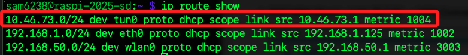
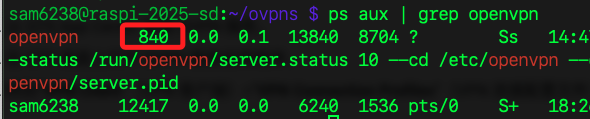

# 取得有效的網關地址

<br>

## 取得有效的網關地址

_VPN 的網關地址通常是由 VPN 伺服器提供的，當 OpenVPN 連線成功後，VPN 伺服器會將路由和網關資訊推送到客戶端，可通過以下方式取得網關地址_

<br>

1. 使用 `ip route` 命令

    ```bash
    ip route show
    ```

    

<br>

2. 找到 `tun0` 的路由，通常會有一行類似於，`src` 表示本地 VPN IP，`dev tun0` 表示 VPN 接口；如果該範圍是 VPN 伺服器分配的，`10.46.73.1` 通常是網關地址。

    ```text
    10.46.73.0/24 dev tun0 proto dhcp scope link src 10.46.73.1
    ```

<br>

3. 應改用此地址正確的網關地址。

    ```bash
    sudo ip route add default via 10.46.73.1 dev tun0
    ```

<br>

4. 編輯。

    ```bash
    sudo nano ~/ovpns/robot-vacuum.ovpn
    ```

<br>

5. 確保 .ovpn 文件中包含以下指令，來強制 VPN 接管所有流量。

    ```bash
    redirect-gateway def1
    ```

<br>

6. 查看。

    ```bash
    ip route show
    ```

<br>

## 重啟服務

1. 查找運行中的 OpenVPN 進程

    ```bash
    ps aux | grep openvpn
    ```

    

<br>

2. 終止進程

    ```bash
    sudo kill 840
    ```

<br>

3. 使用 pkill直接關閉所有 OpenVPN 進程。

    ```bash
    sudo pkill openvpn
    ```

<br>

4. 啟動服務。

    ```bash
    sudo systemctl start openvpn
    ```

<br>

5. 執行以下命令重新啟動

    ```bash
    sudo openvpn --config ~/ovpns/robot-vacuum.ovpn
    ```

<br>

## 檢查 OpenVPN 日誌

1. 檢查日誌

    ```bash
    sudo journalctl -u openvpn
    ```

<br>

## 查詢 `resolv.conf`

1. 檢查 DNS 配置

    ```bash
    cat /etc/resolv.conf
    ```

<br>

2. 檢查網關。

    ```bash
    ip route show
    ```

<br>

3. 重啟 OpenVPN

    ```bash
    sudo systemctl restart openvpn
    sudo journalctl -u openvpn
    ```

<br>

___

_END_