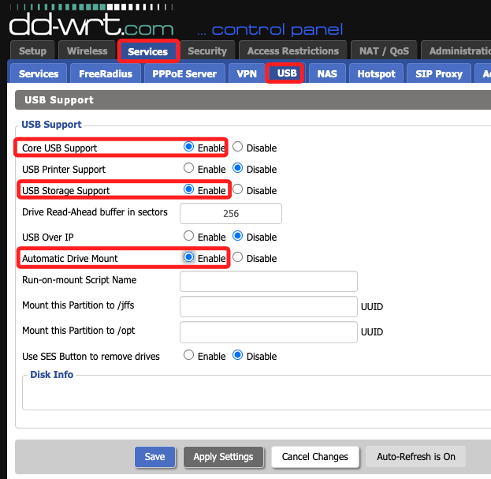
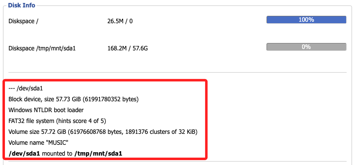
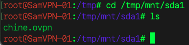
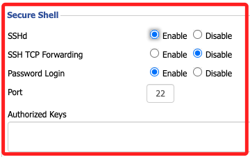
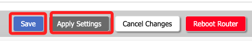
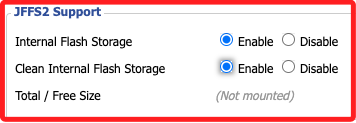

# 其他設定

<br>

## 開啟 USB

1. 步驟。

    

<br>

2. 掛載後插入 USB，顯示如下，路徑為 `/tmp/mnt/sda1`。

    

<br>

3. 若透過 SSH 連線後，可使用指令查看 USB 內容。

    ```bash
    cd /tmp/mnt/sda1 && ls
    ```

    

<br>

## 開啟 SSH

1. 進入 Services 中的 Services。

    

<br>

2. 開啟。

    

<br>

3. 記得儲存後套用，若無法連線，可 `Reboot Router`。

    

<br>

4. 連線時使用要使用 `root` 帳號。

<br>

## 啟用 JFFS2

_JFFS2 是路由器 Flash 上的持久化區域，可以存放 `.ovpn` 檔案_

<br>

1. 進入 `Administration` → `Management`，找到 `JFFS2 Support`，選擇 `Enable`；同時在彈出的 `Clean Internal Flash Storage` 選擇 `Enable`；第二個 `Clean Internal Flash Storage` 只需執行一次，下次開機會發現已經恢復 Disable，這是正確的。

    

<br>

2. 點擊 `Save` → `Apply Settings` 後重啟路由器 `Reboot Router`；其餘關於 `JFFS2` 操作會在後續說明。

<br>

___

_持續補充_