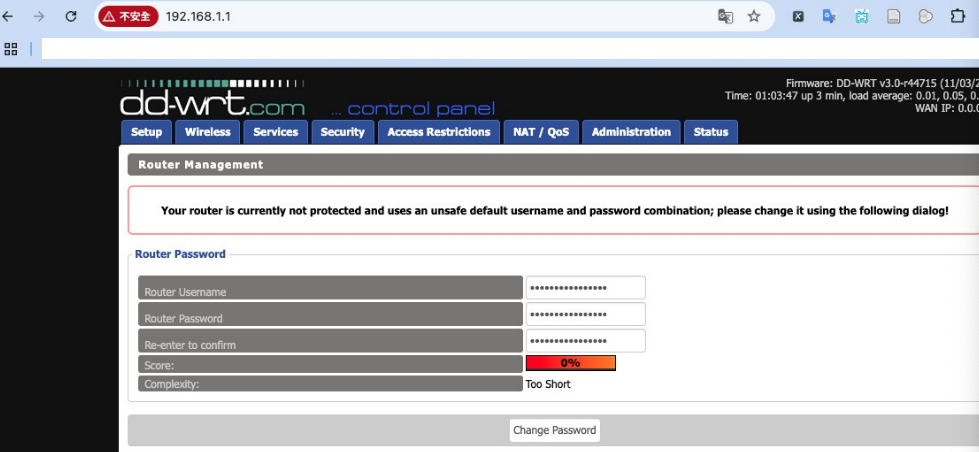

# 步驟

 

1. 網路線接在 Lan，拔掉電源線或關閉開關，將針插入 `RESET` 孔，通電後靜待動，訪問 `192.168.0.1`，選取刷機韌體；若不確定 IP，可使用 `Debookee` 查詢。

    

 

2. 點擊 `Upload` 之後靜待上傳完成。

    

 

3. 上傳完成後，網址會失效。

    

 

4. 重新訪問 `192.168.1.1`。

    

 

5. 其餘步驟請參考 `01-1_重置並更新路由器`。

 

___

_END_