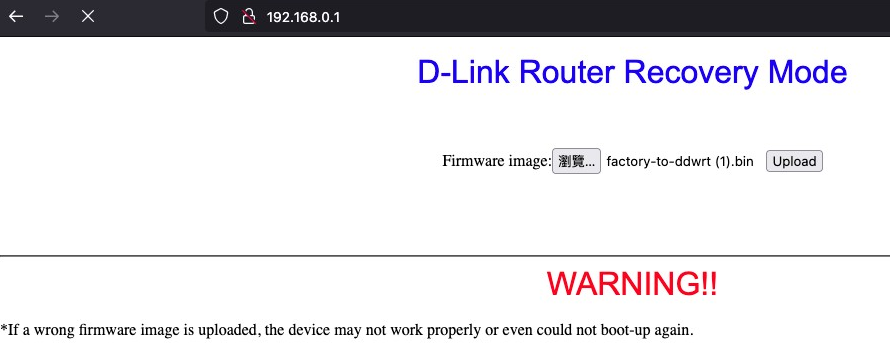

# 重置 DIR890L

_必須使用恢復模式進行更新_

 

## 恢復模式

1. 網路線接在路由器的 Lan 埠，拔掉電源線或關閉開關，將針插入背後的 `RESET` 孔，接著開啟或插入電源，通電後靜待起動完成，訪問 `192.168.0.1`，此時依照畫面按鈕選取刷機韌體；若不確定 IP，可使用 `Debookee` 查詢。

    

 

2. 點擊 `Upload` 之後靜待上傳完成。

    

 

3. 上傳完成後，網址會失效。

    

 

4. 重新訪問 `192.168.1.1`。

    

 

5. 其餘步驟請參考 `01-1_重置並更新路由器`。

 

___

_END_