# 設定 VPN 伺服器

_設備使用 `Buffalo WZR-HP-G450H`，首先刷機安裝 `DD-WRT`，接著設置 OpenVPN 伺服器。_

 

## 重置路由器

1. 將數據機直接連線到電腦，背面 `ROUTER` 開關切換到 `OFF`。

 

2. 拔掉電源，按住機底 `RESET` 孔後插入電源，持續 `30` 秒後放開，這將使設備恢復至出廠狀態。

 

3. 搜尋 SSID _疑似_ 為 `BUFFALO` 的設備進行連線，帳號預設為 `root`，密碼預設可嘗試使用空白或是 `password`；我也還不確定。

 

4. 連線後訪問 `192.168.11.1`，帳號為 `root`，密碼空白即可登入系統。

    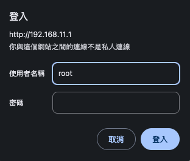

 

5. 設定新的帳號密碼，這裡我先將帳號設置為 `sam6238`，密碼暫時設置為 `sam112233`，重新登入後會顯示在畫面中。

    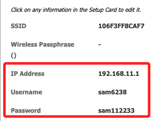

 

6. 將相關名稱改為 `SamVPN-0X`；這裡是編號第三的設備，所以是 `03`。

    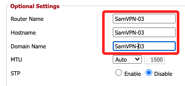

 

7. 切換到 Wireless 頁籤，點擊子頁籤 `Basic Settings`，將 SSID 也設置為 `SamVPN-0X`。

    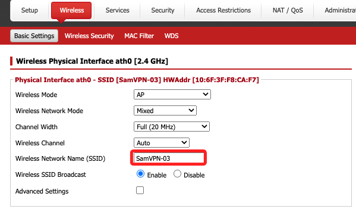

 

## 使用有線

1. 關閉本機無線網路，使用網路線，一端連接本機網路孔、一端連接路由器 LAN 孔；接著搜尋區網設備，確認路由重置後的 IP。

    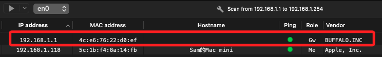

 

2. 使用 Google Chrome 訪問 `192.168.1.1` 假如無法連上。

    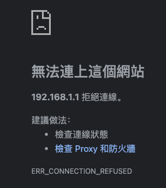

 

3. 嘗試使用 Safari。

    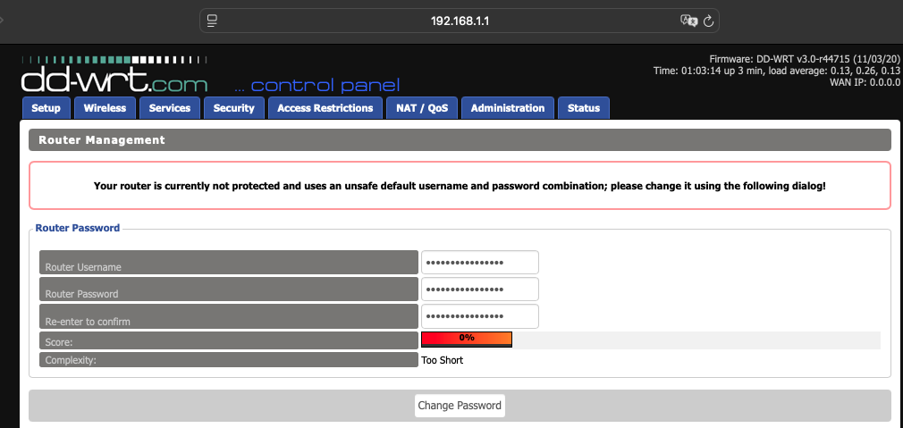

 

4. 變更名稱密碼後會展開設定畫面；特別注意，避免使用特殊字元。

    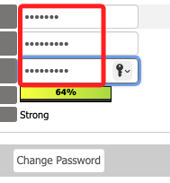

 

5. 更改 Routr IP 為 `192.168.11.1`。

    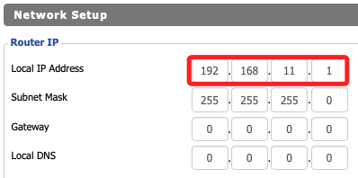

 

6. 更改 SSID；至此可重啟路由器。

    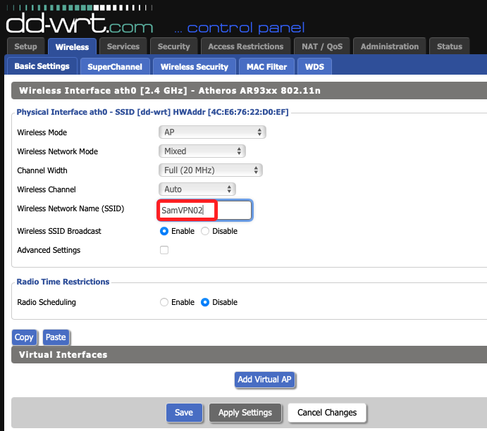

 

7. 修改本機 TCP/IP，IP 改為 `192.168.11.2`，路由改為 `192.168.11.1`。

    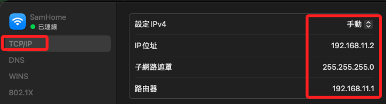

 

## 下載 WRT

1. 訪問 [官網](https://dd-wrt.com/)，點擊上方 `DOWNLOADS` 頁籤。

    

 

2. 直接輸入 `Buffalo` 的設備型號 `WZR-HP-G450H`。

    

 

3. 點擊進入會顯示可下載項目，分別下載兩個檔案備用。

    

 

## 更新系統

_若還未刷機到 WRT_

 

1. 切換到 `管理組態`，接著點擊 `更新` 頁籤。

    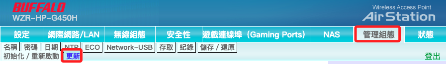

 

2. 若尚未刷新，先安裝 `Factory Flash`。

    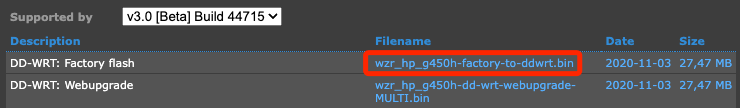

 

3. 等待完成。

    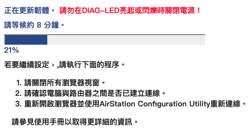

 

4. 重新連線，SSID 自動命名為 `dd-wrt`。

 

## WRT 更新

1. 切換到 `Administration` -> `Firmware Upgrade`，選擇檔案並點擊下方 `Upgrading`。

    

 

2. 系統會倒數 `300` 秒。

    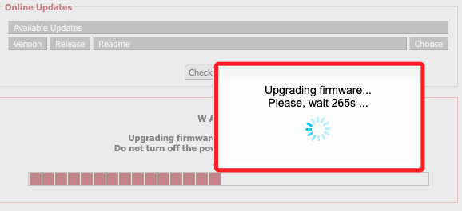

 

___

_END_