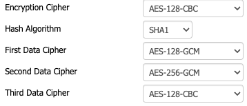
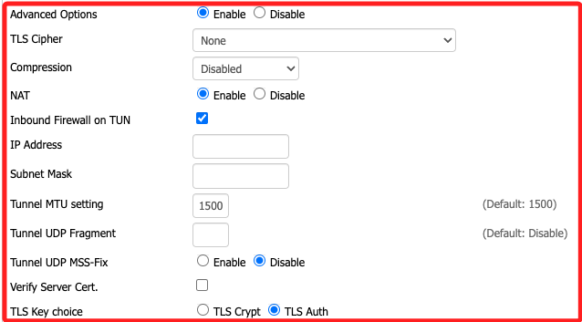

# 設定 OpenVPN 伺服器

<br>

## 啟用 OpenVPN Server

1. 在 `Services` → `VPN`。

<br>

2. `OpenVPN Server/Daemon` → `Enable`

<br>

3. `CVE-2019-14899 Mitigation` → `Enable`

<br>

4. `Start Type` → `WAN Up`；確保 VPN 在網路啟動時自動啟動。

<br>

5. `Inbound Firewall on TUN` → 打勾 ✅，確保 TUN 介面流量可通過。

    

<br>

## OpenVPN 運行模式

1. 在設定中的 `Config as` 決定 OpenVPN 的運行模式。

    

<br>

2. `Daemon`，`守護程序` 表示讓路由器作為 VPN 客戶端，透過 VPN 連接到遠端的 OpenVPN 伺服器。

<br>

3. `Server`，讓路由器作為 VPN 伺服器，允許其他設備透過 VPN 連線到這台路由器，以存取內部網路或透過路由器的網路上網；在這設置為伺服器，點擊後會展開選項。

<br>

4. `Server mode` → `Router (TUN)`，使用 `TUN` 模式確保 VPN 是路由模式。

<br>

5. Network → `10.8.0.0`；通常使用 `10.8.0.0/24` 作為 OpenVPN 內部網路範圍，確保 VPN 用戶不會與內部網路 IP 衝突。

<br>

6. Netmask → `255.255.255.0`，這代表 OpenVPN 使用 `10.8.0.0/24` 作為 VPN 內部網路，請保持預設值。

<br>

7. Port → `1194`，這是 UDP 預設的 OpenVPN 端口。

<br>

8. Tunnel Protocol → `UDP`；建議使用 `UDP`，若有防火牆限制可改 `TCP`，若使用 TCP，可能會增加連線延遲，但某些網路環境如公司防火牆可能只允許 TCP。

<br>

## 加密協定

1. Encryption Cipher → `AES-256-CBC`；這是高安全性加密。

<br>

2. Hash Algorithm → `SHA256`；這是高安全性。

<br>

3. 這三個選項按預設即可，這是決定 OpenVPN 數據通道使用的加密演算法，在 OpenVPN 2.5 以後，建議使用 data-ciphers 來指定加密方式，以提高相容性和安全性。

    

<br>

4. Advanced Options → `Disable`；先關閉進階設定。

<br>

## CA 憑證與金鑰

_開啟 .ovpn 文件_

<br>

1. `Public Server Cert` 將 `<cert> ... </cert>` 的內容貼上；當 `Public Server Cert` 設置為 `Disable` 代表客戶端不需要手動驗證。

<br>

2. `CA Cert` 填入 `<ca> ... </ca>`。

<br>

3. `Private Server Key` 填入 `<key> ... </key>`。

<br>

## 設定 TLS

1. TLS Key Choice → `TLS Auth`，選擇 TLS Auth

<br>

2. TLS Key，填入 `ta.key`

    ```bash
    sudo cat ta.key
    ```

<br>

3. 填入以下內容。

    ```bash
    --BEGIN OpenVPN Static Key V1--
    (TLS 密鑰內容)
    --END OpenVPN Static Key V1--
    ```

<br>

4. Certificate Revoke List，留空，若有需要可填入 `crl.pem`。

<br>

## 允許 VPN 連線流量

_設定防火牆；確保 VPN 連線的流量可以通過 DD-WRT 路由器，執行以下防火牆設定_

<br>

1. 進入 DD-WRT 管理頁面，`Administration` → `Commands`

<br>

2. 貼上命令。

    ```bash
    iptables -I INPUT -p udp --dport 1194 -j ACCEPT
    iptables -I FORWARD -s 10.8.0.0/24 -j ACCEPT
    iptables -t nat -A POSTROUTING -s 10.8.0.0/24 -o br0 -j MASQUERADE
    ```

<br>

3. 點擊 Save Firewall；儲存防火牆規則。

<br>

4. 重啟路由器

    

<br>

## 路由器 SSH

1. 進入 Services。

    

<br>

2. 開啟 SSH 後點擊下方 `Save`。

    

<br>

3. 進入 「Administration → Commands」，添加 `iptables -I INPUT -p tcp --dport 22 -j ACCEPT`，特別注意，也要將原本的複製進去。

    ```bash
    iptables -I INPUT -p tcp --dport 22 -j ACCEPT
    ```

    

<br>

4. 透過 SSH 連線路由器，接著輸入自訂的密碼 `sam112233`，特別注意，`Username` 雖然顯示可以修改，但使用 SSH 登入必須是使用 `root` 登入。

    ```bash
    ssh root@192.168.11.1
    ```

<br>

5. 若透過終端機設定，則運行相同指令。 

    ```bash
    iptables -I INPUT -p udp --dport 1194 -j ACCEPT
    iptables -I FORWARD -s 10.8.0.0/24 -j ACCEPT
    iptables -t nat -A POSTROUTING -s 10.8.0.0/24 -o br0 -j MASQUERADE
    ```

<br>

6. 無論使用哪種方式，接下來檢查規則是否已生效。

<br>

    ```bash
    iptables -L
    ```

<br>

## 查看

1. 顯示所有 DD-WRT 內部儲存的設定。

    ```bash
    nvram show
    ```

<br>

2. 檢查 OpenVPN 伺服器是否啟用

    ```bash
    nvram get openvpn_enable
    ```

<br>

3. 查看 OpenVPN 伺服器埠號

    ```bash
    nvram get openvpn_port
    ```

<br>

___

_END_
