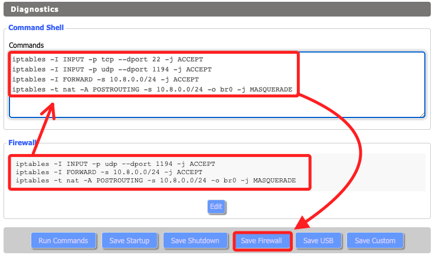

# 設定 OpenVPN 客戶端

<br>

## 啟用 OpenVPN

1. 在 `Services` → `VPN`。

<br>

2. `OpenVPN Client` → `Enable`

<br>

3. `CVE-2019-14899 Mitigation` → `Enable`

<br>

4. `Server IP/Name` 填入 `219.100.37.18`；這是設置在 `.ovpn` 文件中的 `remote`。

<br>

5. `Port` → `443`。

<br>

## 憑證設置

1. Tunnel Device 選擇 `TUN`。

<br>

2. Tunnel Protocol 選擇 `TCP`。

<br>

3. 其他加密設置。

    

<br>

4. User Pass Authentication `Disable`

<br>

5. dvanced Options `Enable` 會展開設置。

    

<br>

## CA 憑證與金鑰

_開啟 .ovpn 文件_

<br>

1. `CA Cert` 填入 `<ca> ... </ca>`。

<br>

2. `Public Server Cert` 將 `<cert> ... </cert>` 的內容貼上；當 `Public Server Cert` 設置為 `Disable` 代表客戶端不需要手動驗證。

<br>

3. `Private Server Key` 填入 `<key> ... </key>`。

<br>

## 允許 VPN 連線流量

_設定防火牆；確保 VPN 連線的流量可以通過 DD-WRT 路由器，執行以下防火牆設定_

<br>

1. 切換頁籤 `Administration` → `Commands`

<br>

2. 貼上命令。

    ```bash
    iptables -I INPUT -p udp --dport 1194 -j ACCEPT
    iptables -I FORWARD -s 10.8.0.0/24 -j ACCEPT
    iptables -t nat -A POSTROUTING -s 10.8.0.0/24 -o br0 -j MASQUERADE
    ```

<br>

3. 點擊 `Save Firewall` 儲存防火牆規則。

<br>

4. 切換到 `Management` 頁籤並滑動到最下方，點擊 `Reboot Router` 重啟路由器。

    

<br>

5. 等候重啟。

    

<br>

6. 手動重新連線並開啟主控台。

    

<br>

## 路由器 SSH

1. 進入 Services。

    

<br>

2. 開啟 SSH 後點擊下方 `Save`。

    

<br>

3. 進入 `Administration → Commands`，添加 `iptables -I INPUT -p tcp --dport 22 -j ACCEPT`，特別注意，也要將原本的複製進去。

    ```bash
    iptables -I INPUT -p tcp --dport 22 -j ACCEPT
    ```

    

<br>

4. 再次重啟，同樣再次連線網路 `SamVPN-03` 後進入主控台。

<br>

5. 透過 SSH 連線路由器，接著輸入自訂的密碼 `sam112233`，特別注意，`Username` 雖然顯示可以修改，但使用 SSH 登入必須是使用 `root` 登入。

    ```bash
    ssh root@192.168.11.1
    ```

    

<br>

7. 檢查規則是否已生效。

<br>

    ```bash
    iptables -L
    ```

<br>

## 查看

_篩選前面的檢查指令_

<br>

1. 顯示所有 DD-WRT 內部儲存的設定。

    ```bash
    nvram show
    ```

<br>

2. 檢查 OpenVPN 伺服器是否啟用

    ```bash
    nvram get openvpn_enable
    ```

<br>

3. 查看 OpenVPN 伺服器埠號

    ```bash
    nvram get openvpn_port
    ```

<br>

___

_END_
