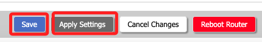

# 其他設定

 

## 開啟 USB

1. 步驟。

    

 

2. 掛載後插入 USB，顯示如下，路徑為 `/tmp/mnt/sda1`。

    

 

## 開啟 SSH

1. 進入 Services 中的 Services。

    

 

2. 開啟。

    

 

3. 記得儲存後套用，若無法連線，可 `Reboot Router`。

    

 

4. 連線時使用要使用 `root` 帳號。

 

___

_持續補充_