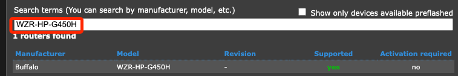
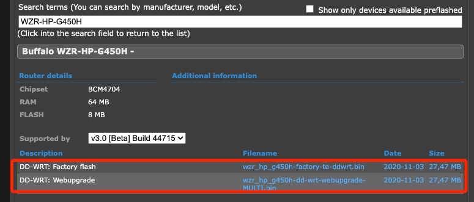

# 設定 VPN 伺服器

_設備使用 `Buffalo WZR-HP-G450H`，首先刷機安裝 `DD-WRT`，接著設置 OpenVPN 伺服器。_

<br>

## 準備工作

1. 將數據機直接連線到電腦，背面 `ROUTER` 開關切換到 `ON`。

<br>

2. 長按機底 RESET 孔 `30` 秒將設備恢復至出廠狀態。

3. 搜尋 SSID 前綴為 `BUFFALO` 的設備進行連線，密碼可以填入 `password`；也可能是沒密碼。

4. 連線後訪問 `192.168.11.1`，帳號為 `root`，密碼空白即可登入系統。

## dd-wrt

1. 訪問 [官網](https://dd-wrt.com/)，點擊上方 `DOWNLOADS` 頁籤。

    

<br>

2. 直接輸入 `Buffalo` 的設備型號 `WZR-HP-G450H`。

    

<br>

3. 點擊進入會顯示可下載項目。

    

<br>

## 設定 OpenVPN 伺服器

1. 啟用 OpenVPN Server，在 `Services` → `VPN`。

2. `OpenVPN Server/Daemon` → `Enable`

3. `CVE-2019-14899 Mitigation` → `Enable`

4. `Start Type` → `WAN Up`；確保 VPN 在網路啟動時自動啟動。

5. `Inbound Firewall on TUN` → 打勾 ✅，確保 TUN 介面流量可通過。

## 伺服器基本設定

1. `Config as` → `Server`，打勾 ✅ 啟用伺服器模式。

2. `Server mode` → `Router (TUN)`，打勾 ✅ 使用 `TUN` 模式，確保 VPN 是路由模式。

3. Network → `10.8.0.0`

4. Netmask → `255.255.255.0`，這代表 OpenVPN 使用 `10.8.0.0/24` 作為 VPN 內部網路，請保持預設值。

5. Port → `1194`（UDP 預設 OpenVPN 連線埠）

6. Tunnel Protocol → `UDP`；建議使用 `UDP`，若有防火牆限制可改 `TCP`，若使用 TCP，可能會增加連線延遲，但某些網路環境如公司防火牆可能只允許 TCP。

7. Encryption Cipher → `AES-256-CBC`；這是高安全性加密。

8. Hash Algorithm → `SHA256`；這是高安全性。


## 設定加密協定

1. First Data Cipher → `AES-128-GCM`

2. Second Data Cipher → `AES-256-GCM`

3. Third Data Cipher → `AES-128-CBC`

4. Advanced Options → `Disable`；先關閉進階設定。

5. Public Server Cert → `Disable`；這樣客戶端不需要手動驗證。

## CA 憑證與金鑰

_這些欄位需要填入 OpenVPN 伺服器憑證；如果還沒有，可在 Linux 或 Mac 上使用 EasyRSA 或 OpenVPN 工具來產生憑證_

1. 產生憑證，以下指令是在 Linux、macOS 或樹莓派執行。

```bash
cd /etc/openvpn/
sudo openvpn --genkey secret ta.key
```

2. 顯示憑證內容。

```bash
sudo cat ta.key
```

## 填入憑證

1. CA Cert，CA 憑證貼上 `ca.crt` 內容。

```bash
-----BEGIN OpenVPN Static Key V1-----
# 中間部分省略
-----END OpenVPN Static Key V1-----

```

## 安裝 EasyRSA

1. 在樹莓派 OpenVPN 伺服器上執行以下指令，EasyRSA 是 OpenVPN 官方推薦的工具，用於生成 SSL 憑證。

```bash
sudo apt update && sudo apt install easy-rsa -y
```

2. 手動建立 EasyRSA 目錄。

```bash
mkdir -p ~/easy-rsa
cd ~/easy-rsa
cp -r /usr/share/easy-rsa/* .
cd ~/easy-rsa
```

3. 初始化。

```bash
./easyrsa init-pki
```

4. 執行以下指令來建立 CA。

```bash
./easyrsa build-ca
```

5. 輸入 CA 的名稱，例如 `OpenVPN-CA`，要輸入兩次。

```bash
OpenVPN-CA
```

6. 接著提示輸出 PEM 密碼，與前步驟相同密碼 `OpenVPN-CA`。

```bash
OpenVPN-CA
```

7. 輸入憑證識別資訊 `Common Name (eg: your user, host, or server name) [Easy-RSA CA]:`。

```bash
OpenVPN-CA
```

8. 確認憑證是否存在。

```bash
ls -l pki/ca.crt pki/private/ca.key
```

## 建立 OpenVPN 伺服器憑證

1. 建立 伺服器憑證 (server.crt) 和金鑰 (server.key)。

```bash
./easyrsa gen-req server nopass
```

2. 提示輸入 Common Name `Common Name (eg: your user, host, or server name) [server]:`。

```bash
OpenVPN-Server
```

3. 確認生成的伺服器憑證請求 (server.req) 和私鑰 (server.key)。

```bash
ls -l pki/reqs/server.req pki/private/server.key
```

## 使用 CA 簽署伺服器憑證

1. 用 CA (ca.crt) 簽署伺服器憑證 (server.crt)，會提示輸入 `yes` 繼續。

```bash
./easyrsa sign-req server server
```

2. 要求輸入 PEM pass phrase。

```bash
OpenVPN-CA
```

3. 確認伺服器憑證 (server.crt) 已建立。

```bash
ls -l pki/issued/server.crt
```

## 產生 Diffie-Hellman (dh.pem) 金鑰

1. 這是 OpenVPN 需要的金鑰，用來加密 TLS 流量，這步驟相對耗時。

```bash
./easyrsa gen-dh
```

2. 確認檔案是否存在。

```bash
ls -l ~/easy-rsa/pki/dh.pem
```

## 複製憑證與金鑰到 OpenVPN 目錄

1. 確保 OpenVPN 伺服器能正確讀取這些檔案

```bash
sudo cp ~/easy-rsa/pki/ca.crt /etc/openvpn/
sudo cp ~/easy-rsa/pki/issued/server.crt /etc/openvpn/
sudo cp ~/easy-rsa/pki/private/server.key /etc/openvpn/
sudo cp ~/easy-rsa/pki/dh.pem /etc/openvpn/
```

2. 確認。

```bash
ls -l /etc/openvpn/
```

## 繼續編輯路由器

1. `Private Server Key` 貼上 `server.key` 內容。

```bash
sudo cat server.key
```

2. 貼上內容。

```bash
--BEGIN PRIVATE KEY--
(私鑰內容)
--END PRIVATE KEY--
```

3. DH PEM → `Enable`，啟用 DH 金鑰，貼上 `dh.pem`。

```bash
sudo cat dh.pem
```

4. 貼上。

```bash
--BEGIN DH PARAMETERS--
(DH 參數內容)
--END DH PARAMETERS--
```

## 設定 TLS

1. TLS Key Choice → `TLS Auth`，選擇 TLS Auth

2. TLS Key，填入 `ta.key`

```bash
sudo cat ta.key
```

```bash
--BEGIN OpenVPN Static Key V1--
(TLS 密鑰內容)
--END OpenVPN Static Key V1--
```

3. Certificate Revoke List，留空，若有需要可填入 `crl.pem`。

## 允許 VPN 連線流量

_設定防火牆；確保 VPN 連線的流量可以通過 DD-WRT 路由器，執行以下防火牆設定_

1. 進入 DD-WRT 管理頁面，`Administration` → `Commands`

2. 貼上命令。

```bash
iptables -I INPUT -p udp --dport 1194 -j ACCEPT
iptables -I FORWARD -s 10.8.0.0/24 -j ACCEPT
iptables -t nat -A POSTROUTING -s 10.8.0.0/24 -o br0 -j MASQUERADE
```

3. 點擊 Save Firewall；儲存防火牆規則。

4. 重啟路由器


## 路由器 SSH

1. 進入 Services。


2. 開啟 SSH 後點擊下方 `Save`。


3. 進入 「Administration → Commands」，添加 `iptables -I INPUT -p tcp --dport 22 -j ACCEPT`，特別注意，也要將原本的複製進去。

```bash
iptables -I INPUT -p tcp --dport 22 -j ACCEPT
```


4. 透過 SSH 連線路由器，接著輸入自訂的密碼 `sam112233`，特別注意，`Username` 雖然顯示可以修改，但使用 SSH 登入必須是使用 `root` 登入。

```bash
ssh root@192.168.11.1
```

6. 若透過終端機設定，則運行相同指令。 

```bash
iptables -I INPUT -p udp --dport 1194 -j ACCEPT
iptables -I FORWARD -s 10.8.0.0/24 -j ACCEPT
iptables -t nat -A POSTROUTING -s 10.8.0.0/24 -o br0 -j MASQUERADE
```

7. 無論使用哪種方式，接下來檢查規則是否已生效。

```bash
iptables -L
```

## 查看

1. 顯示所有 DD-WRT 內部儲存的設定。

```bash
nvram show
```

2. 檢查 OpenVPN 伺服器是否啟用

```bash
nvram get openvpn_enable
```

3. 查看 OpenVPN 伺服器埠號

```bash
nvram get openvpn_port
```

