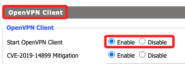
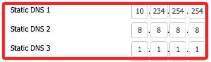
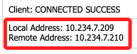

# 設置路由為客戶端

_在 DD-WRT 設定 OpenVPN 作為客戶端_

<br>

## 準備工作

1. 無論是使用商業 VPN 如 NordVPN、ExpressVPN、Surfshark，或是第三方提供的免費服務，皆先取得服務商提供的 OpenVPN 設定檔 (`.ovpn`)。

<br>

2. 接著登入路由器 `DD-WRT`，進入頁籤 `Services → VPN`。

<br>

3. 將 `OpenVPN Client` 第一項 `Start OpenVPN Client` 開啟為 `Enable`。

    

<br>

## 開始設定

1. 將 `Server IP/Name` 設定為 VPN 伺服器網域或 IP，這裡設定為 IP `219.100.37.18`。

<br>

2. Port `1194`。

<br>

3. Tunnel Device 設定為 `TUN`

<br>

4. Tunnel Protocol 依 VPN 服務商要求設定，`UDP` 或 `TCP` 皆有。

<br>

5. Encryption Cipher 設定為 `AES-256-CBC`。

<br>

6. Hash Algorithm 設定為 `SHA256`。

<br>

7. User Pass Authentication 設定為 `Enable`。

<br>

8. Username 及 Password 分別設定為 `VPN帳號` 及 `VPN密碼`。

<br>

## 憑證與密鑰

_在 `VPN Client` 設定中，有幾個欄位需要填入 `.ovpn` 檔案中的憑證內容_

<br>

1. CA Cert (`ca.crt`) 貼上 `<ca> ... </ca>` 內容

    ```txt
    --BEGIN CERTIFICATE--
    (貼上 `ca.crt` 內容)
    --END CERTIFICATE--
    ```

<br>

2. Public Client Cert (`client.crt`) 貼上 `<cert> ... </cert>` 內容

    ```txt
    --BEGIN CERTIFICATE--
    (貼上 `client.crt` 內容)
    --END CERTIFICATE--
    ```

<br>

3. Private Client Key (`client.key`) 貼上 `<key> ... </key>` 內容

    ```txt
    --BEGIN PRIVATE KEY--
    (貼上 `client.key` 內容)
    --END PRIVATE KEY--
    ```

<br>

4. TLS Auth Key 部分，如果 `.ovpn` 檔案內有 `<tls-auth> ... </tls-auth>`，則貼上。

    ```txt
    --BEGIN OpenVPN Static Key V1--
    (貼上 `ta.key` 內容)
    --END OpenVPN Static Key V1--
    ```

<br>

5. 如果 VPN 伺服器沒有 TLS 認證金鑰 (`ta.key`)，務必確保 `TLS Cipher` 設定為 `None`。

<br>

## 設定 DNS

_用以避免 DNS 洩漏_

<br>

1. 進入 `Setup → Basic Setup`

<br>

2. 在 `Network Setup` 中找到 `Static DNS`

    ```bash
    DNS 1 → `10.234.254.254`
    DNS 2 → `8.8.8.8`（Google DNS）
    DNS 3 → `1.1.1.1`（Cloudflare DNS）
    ```

    

<br>

3. 勾選 `Forced DNS Redirection`

<br>

4. 點擊 `Save`，然後 `Apply Settings`

<br>

## 確保 VPN 連線時所有設備都經過 VPN

1. 在 `Services` 中的 `VPN`，設定 `Additional Config` 欄位，加入以下內容。

    ```bash
    # 避免 VPN 伺服器強制改變路由
    route-nopull
    # 讓所有網路流量都經過 VPN
    redirect-gateway def1
    # 避免伺服器過快判斷掉線
    keepalive 10 120
    # 啟用伺服器證書驗證避免中間攻擊
    remote-cert-tls server
    # 明確關閉 LZO 壓縮
    comp-lzo no
    ```

<br>

## 防火牆規則

_如果 VPN 連線後無法正常上網，嘗試加入防火牆規則_

<br>

1. 進入 `Administration → Commands`

<br>

2. 輸入以下命令，並點擊 `Run Commands`

    ```bash
    iptables -I INPUT -p tcp --dport 443 -j ACCEPT
    iptables -I INPUT -p udp --dport 1194 -j ACCEPT
    iptables -I FORWARD -i tun1 -o br0 -m state --state RELATED,ESTABLISHED -j ACCEPT
    iptables -I FORWARD -i br0 -o tun1 -j ACCEPT
    iptables -t nat -A POSTROUTING -o tun1 -j MASQUERADE
    ```

<br>

3. 點擊 `Save Firewall`，然後 `Apply Settings`。

<br>

## 重啟路由器

_可透過終端機指令進行_

<br>

1. 連線。

    ```bash
    ssh root@192.168.11.1
    ```

<br>

2. 重啟。

    ```bash
    reboot
    ```

<br>

## 測試 VPN 是否正常運作

1. 進入 `Status → OpenVPN` 查看 `State` 是否顯示 `Connected`，如果未連線，請查看 `Log` 找出錯誤訊息。

    

<br>

2. 在連線 VPN 前後街開啟瀏覽器訪問並查看 IP 變化。

    ```bash
    https://www.whatismyip.com/
    ```

<br>

___

_END_