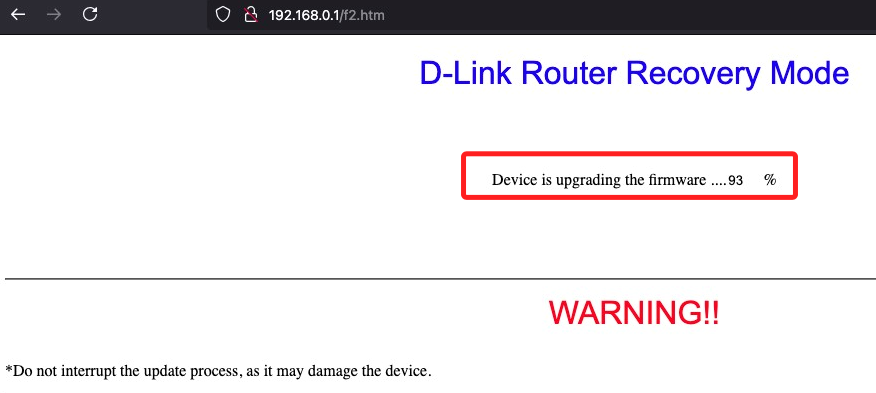

# 持久化文件

_以下紀錄包含新增設定及關閉當前運行中的設定_

<br>

## 啟用 JFFS2

_JFFS2 是路由器 Flash 上的持久化區域，可以存放 `.ovpn` 檔案_

<br>

1. 進入 `Administration` → `Management`，找到 `JFFS2 Support`，選擇 `Enable`；同時在彈出的 `Clean JFFS2` 選擇 `Enable`，只需執行一次。

    

<br>

2. 點擊 `Save` → `Apply Settings` 後重啟路由器 `Reboot Router`。

<br>

## 重啟之後

1. 確認完成以上步驟，重新進入主控台可以看到空間已經掛載，另外 `Clean Internal Flash Storage` 會恢復為 `Disable`。

    

<br>

2. 透過指令上傳 `.ovpn` 配置檔到 `~/china.ovpn`；特別注意，因 SSH 版本不兼容，務必記得加上參數 `-O`。

    ```bash
    scp -O ~/Downloads/china.ovpn buff:/jffs/
    ```

<br>

3. 進入 `Administration` → `Commands`，刪除原本的指令。

    ```bash
    # 刪除
    # /usr/sbin/openvpn --config /tmp/mnt/sda1/china.ovpn --verb 4 --daemon
    ```

<br>

4. 先手動測試。

    ```bash
    /usr/sbin/openvpn --config /jffs/china.ovpn
    ```

<br>

5. 無誤後添加以下內容設置開機啟動 VPN；確認無誤後可拔除 USB。

    ```bash
    /usr/sbin/openvpn --config /jffs/china.ovpn --daemon
    ```

<br>

## 若出現連線數超過

_刪除進程_

<br>

1. 查詢。

    ```bash
    ps | grep openvpn
    ```

    

<br>

2. 手動停止。

    ```bash
    kill -9 1490 1959
    ```

<br>

___

_END_