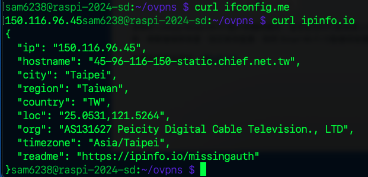
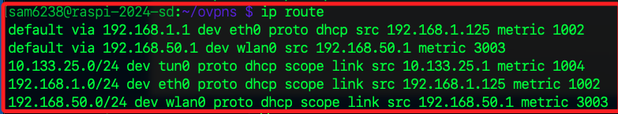

# 翻牆

_已有 `robot-vacuum.ovpn` 的配置文件，接下來可啟動 OpenVPN 並檢查連線是否成功。_

## 啟動 OpenVPN 的正確指令

1. 以下指令的目的是根據指定的配置文件，建立到某個 VPN 伺服器的安全加密連線，從而實現翻牆或改變 IP 位址的目的。

```bash
sudo openvpn --config ~/ovpns/robot-vacuum.ovpn
```

2. 修改 `/etc/resolv.conf` 文件。

```bash
sudo nano /etc/resolv.conf
```

3. 將內容更改為。

```bash
# 中國大陸常用的 DNS
nameserver 114.114.114.114
nameserver 223.5.5.5
```

4. 執行以下命令測試 DNS 是否正常。

```bash
nslookup google.com
```

5. 當系統重啟或網卡重新連接網絡時，/etc/resolv.conf 可能會被 DHCP 重新覆蓋。為防止這種情況，可以鎖定該文件。

```bash
sudo chattr +i /etc/resolv.conf
```

6. 如果需要再次編輯，先解除鎖定。

```bash
sudo chattr -i /etc/resolv.conf
```

7. 修改 DNS 並確認解析正常後，測試外網連接。

```bash
ping -c 4 google.com
curl ifconfig.me
```

## 檢查 IP 地址的地理位置

1. 執行以下命令以確認當前 IP 所在地，當前 IP 地址位於 台灣。

```bash
curl ipinfo.io
```




2. 訪問中國大陸特定服務。

```bash
curl http://www.baidu.com
```

3. 確認 DNS 伺服器。

```bash
cat /etc/resolv.conf
```

4. 保存後測試。

```bash
nslookup baidu.com
```


5. 檢查流量是否通過 VPN。

```bash
ip route
```


6. 如果發現預設路由仍指向本地網卡（如 `eth0` 或 `wlan0`），可以手動修改路由，其中 `<VPN_GATEWAY_IP>` 為 VPN 分配的網關地址，例如 `10.133.25.1`。

```bash
sudo ip route del default
sudo ip route add default via <VPN_GATEWAY_IP> dev tun1
```

## 檢查

1. 檢查路由表

```bash
ip route
```



2. 根據你的路由表顯示，目前有兩條預設路由，並沒有一條預設路由指向 VPN 的 `tun0` 接口，這說明當前的網路流量並未通過 VPN 傳輸。


## 解決方法

_將預設路由改為通過 VPN 的 `tun0` 接口_

1. 刪除現有預設路由

    ```bash
    sudo ip route del default via 192.168.1.1 dev eth0
    sudo ip route del default via 192.168.50.1 dev wlan0
    ```

2. 添加新的預設路由到 VPN

    ```bash
    sudo ip route add default via 10.133.25.1 dev tun0
    ```

3. 確認路由表是否正確，確保 `default` 指向 `10.133.25.1` 並使用 `tun0` 接口。

    ```bash
    ip route
    ```


4. 使用以下命令確認外部 IP，如果 IP 已更改為 VPN 的出口 IP，則表示成功。

    ```bash
    curl ifconfig.me
    ```

