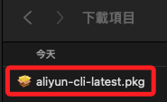
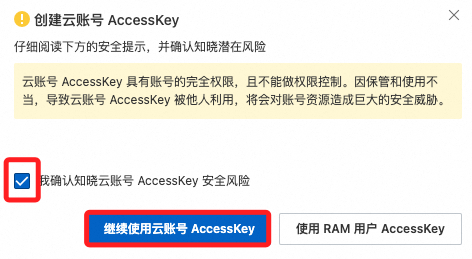
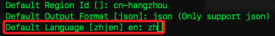
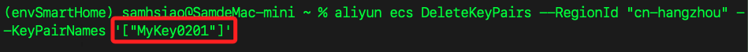

# CLI 基本配置

_可透過終端機指令進行操作_

<br>

## 步驟 

1. [官方說明](https://www.alibabacloud.com/help/tc/cli/install-cli-on-macos?spm=a2c63.p38356.0.i0#32865bfe14am6)，若要切換語系，在右上角展開選取。

    

<br>

2. 點擊 [官方載點](https://aliyuncli.alicdn.com/aliyun-cli-latest.pkg) 下載。

    

<br>

3. 這是 `.apk` 文件，點擊即可自動安裝。

    

<br>

3. 開啟終端機運行查詢版本指令，正確顯示則代表安裝成功。

    ```bash
    aliyun version
    ```

    

<br>

## 取得 AccessKey

_先完成主控台燈入_

<br>

1. 滑動到右上角帳號圖標上，在展開的選單中點擊 `AccessKey`

    

<br>

2. 會提示 `不建議使用雲帳號 AccessKey`，勾選 `確認` 後點擊 `繼續 ...`。

    

<br>

3. 點擊 `建立 AccessKey`。

    

<br>

4. 再次勾選 `確認` 框，然後點擊 `繼續 ...`。

    

<br>

5. 完成後先點擊 `下載`

    

<br>

6. 勾選 `已保存 ...` 後點擊 `確定` 關閉視窗。

    

<br>

## 設定本地環境

_開啟下載的 `.csv` 文件備用_

<br>

1. 設定憑證。

    ```bash
    aliyun configure
    ```

<br>

2. 先設定 Id 及 Secret，複製文件內容貼上。

    

<br>

3. 預設區域設定為 `華東1`，ID 為 `cn-hangzhou`。

<br>

4. 預設語系設定為中文，代碼為 `zh`。

    

<br>

5. 完成。

    

<br>

6. 設定檔案位置在本地的 `~/.aliyun/config.json`。

    ```bash
    code ~/.aliyun/
    ```

<br>

## 查詢

1. 查詢 ECS 並列出指定欄位。

    ```bash
    aliyun ecs DescribeInstances | jq -r '.Instances.Instance[] | {InstanceId, InstanceName, InstanceType, Status, RegionId, ZoneId, PublicIpAddress, PrivateIpAddress}'
    ```

    


<br>

2. 列出當前 `cn-hangzhou` 區域中的全部 ECS 實例。

    ```bash
    aliyun ecs DescribeInstances --RegionId "cn-hangzhou"
    ```

<br>

3. 列出 ECS 實例 ID。

    ```bash
    aliyun ecs DescribeInstances --RegionId "cn-hangzhou" | jq -r '.Instances.Instance[].InstanceId'
    ```

<br>

4. 將實例 ID 讀出並存入變數中，其中 `tee /dev/tty` 會讓輸出同時顯示在終端上。

    ```bash
    INSTANCE_IDS=$(aliyun ecs DescribeInstances | jq -r '.Instances.Instance[].InstanceId' | tee /dev/tty)
    ```

<br>

5. 查詢當前安全群組，提取 ID 並存入變數。

    ```bash
    SECURITY_GROUP_IDS=$(aliyun ecs DescribeSecurityGroups --RegionId "cn-hangzhou" | jq -r '.SecurityGroups.SecurityGroup[].SecurityGroupId' | tee /dev/tty)
    ```

<br>

6. 查詢已建立的密鑰對並存入變數。

    ```bash
    KEY_PAIR_NAMES=$(aliyun ecs DescribeKeyPairs --RegionId "cn-hangzhou" | jq -r '.KeyPairs.KeyPair[].KeyPairName' | tee /dev/tty)
    ```

<br>

7. 查詢 ECS 伺服器掛載的雲磁碟並篩選磁碟 ID 存入變數。

    ```bash
    DISK_IDS=$(aliyun ecs DescribeDisks --RegionId "cn-hangzhou" | jq -r '.Disks.Disk[].DiskId' | tee /dev/tty)
    ```

<br>

## 查詢彈性公網 IP

_特別提出來說明，因為這是個獨立收費的項目_

<br>

1. 查詢當前帳號下的彈性公網 IP `EIP`，包含綁定與未綁定，並存入變數中。

    ```bash
    ALL_EIP_INFO=$(aliyun vpc DescribeEipAddresses --RegionId "cn-hangzhou" --PageSize 100 | tee /dev/tty)
    ```

    

<br>

2. 依據 `InstanceId` 是否為空篩選當前 EIP，分別存入不同變數。

    ```bash
    # 提取未綁定的 EIP
    UNBOUND_EIP=$(echo "$ALL_EIP_INFO" | jq -r '.EipAddresses.EipAddress[] | select(.InstanceId == "") | .IpAddress')

    # 提取已綁定的 EIP
    BOUND_EIP=$(echo "$ALL_EIP_INFO" | jq -r '.EipAddresses.EipAddress[] | select(.InstanceId != "") | .IpAddress')

    echo "未綁定的 EIP:"
    echo "$UNBOUND_EIP"

    echo "已綁定的 EIP:"
    echo "$BOUND_EIP"
    ```

<br>

3. 釋放未綁定的 EIP。

    ```bash
    echo "釋放未綁定的 EIP..."
    for EIP_ID in $UNBOUND_EIP_IDS; do
        echo "釋放 EIP: $EIP_ID"
        aliyun vpc ReleaseEipAddress --RegionId "cn-hangzhou" --AllocationId "$EIP_ID"
    done
    ```

<br>

4. 解除綁定並釋放已綁定的 EIP；先確認 BOUND_EIP_INFO 是否有內容，若為空則表示無綁定的 EIP，使用 jq 確保輸出的格式正確。

    ```bash
    echo "解除綁定並釋放已綁定的 EIP..."
    while read -r EIP_ID INSTANCE_ID; do
        # 確保變數有值
        if [[ -n "$EIP_ID" && -n "$INSTANCE_ID" ]]; then
            echo "解除綁定 EIP: $EIP_ID 從實例: $INSTANCE_ID"
            aliyun vpc UnassociateEipAddress --RegionId "cn-hangzhou" --AllocationId "$EIP_ID" --InstanceId "$INSTANCE_ID"
            echo "釋放 EIP: $EIP_ID"
            aliyun vpc ReleaseEipAddress --RegionId "cn-hangzhou" --AllocationId "$EIP_ID"
        else
            echo "錯誤: EIP_ID 或 INSTANCE_ID 為空，跳過此行"
        fi
    done <<< "$BOUND_EIP_INFO"
    ```

<br>

## 清理其他資源

_延續使用之前步驟所取得的實例 ID 變數 `INSTANCE_IDS`_

<br>

1. 確保 ECS 實例已停止。

    ```bash
    aliyun ecs StopInstance --InstanceId $INSTANCE_IDS
    ```

<br>

2. 徹底刪除 ECS 實例；同時也會釋放雲盤空間。

    ```bash
    aliyun ecs DeleteInstance --InstanceId $INSTANCE_IDS --Force true
    ```

<br>

3. 刪除安全群組。

    ```bash
    aliyun ecs DeleteSecurityGroup --RegionId "cn-hangzhou" --SecurityGroupId $SECURITY_GROUP_IDS
    ```

<br>

4. 刪除密鑰對；特別注意，參數後的中括號 `[]` 必須搭配單引號 `''` 來包覆，這是避免命令行工具誤判這是 `shell` 的語法。

    ```bash
    aliyun ecs DeleteKeyPairs --RegionId "cn-hangzhou" --KeyPairNames "[\"$KEY_PAIR_NAMES\"]"
    ```

    

<br>

___

_持續補充_