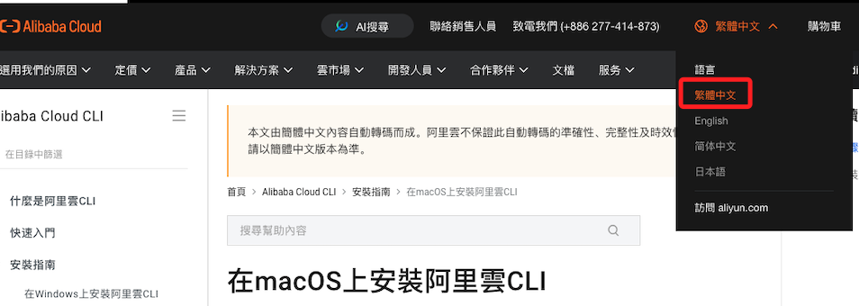
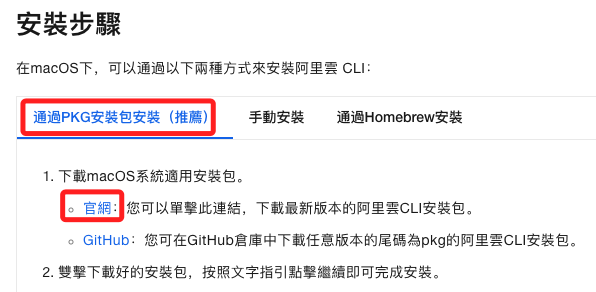
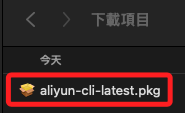
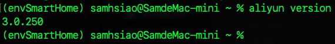
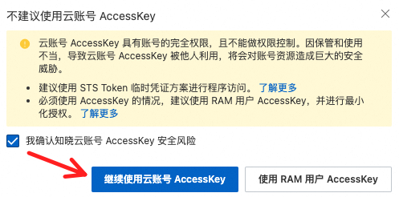
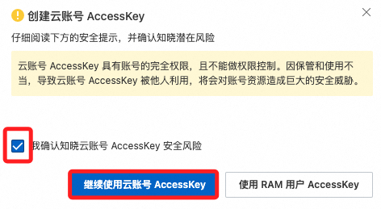
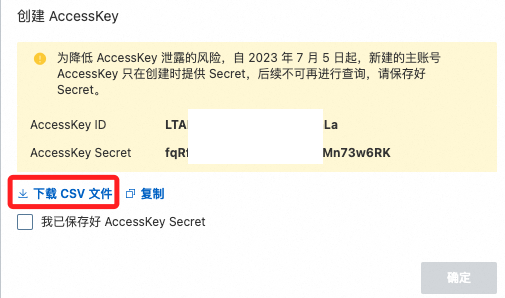
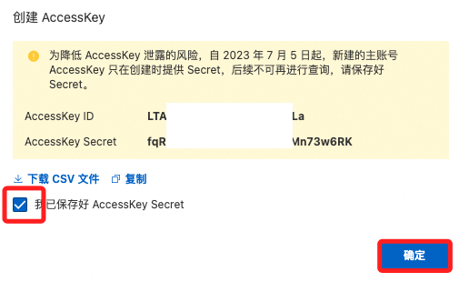
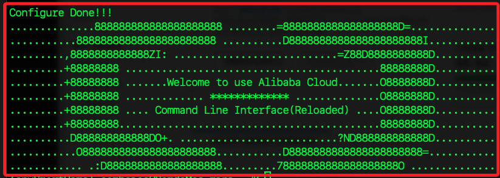

# CLI 基本配置

<br>

## 步驟 

1. [官方說明](https://www.alibabacloud.com/help/tc/cli/install-cli-on-macos?spm=a2c63.p38356.0.i0#32865bfe14am6)，若要切換語系，在右上角展開選取。

    

<br>

2. 點擊 [官方載點](https://aliyuncli.alicdn.com/aliyun-cli-latest.pkg) 下載。

    

<br>

3. 這是 `.apk` 文件，點擊即可自動安裝。

    

<br>

3. 開啟終端機運行查詢版本指令，正確顯示則代表安裝成功。

    ```bash
    aliyun version
    ```

    

<br>

## 取得 AccessKey

1. 顯示。

    

<br>

2. 建立。

    

<br>

3. 再次確認，然後要進行驗證。

    

<br>

4. 完成後，先下載。

    

<br>

5. 點擊 `確定` 關閉視窗。

    

<br>

## 設定

1. 設定憑證。

    ```bash
    aliyun configure
    ```

<br>

2. 其中預設區域設定為 `華東1`，ID 為 `cn-hangzhou`。

    

<br>

3. 預設語言繁體中文，代碼為 `zh-Hant`。

    

<br>

4. 完成。

    

<br>

## 查詢

1. 查詢並列出指定欄位。

    ```bash
    aliyun ecs DescribeInstances | jq -r '.Instances.Instance[] | {InstanceId, InstanceName, InstanceType, Status, RegionId, ZoneId, PublicIpAddress, PrivateIpAddress}'
    ```

    


<br>

## 清理資源

1. 查詢當前 ECS 實例。

    ```bash
    aliyun ecs DescribeInstances --RegionId "cn-hangzhou"
    ```

<br>

2. 確保 ECS 實例已停止。

    ```bash
    aliyun ecs StopInstance --InstanceId "<實例-Id>"
    ```

<br>

3. 徹底刪除 ECS 實例。

    ```bash
    aliyun ecs DeleteInstance --InstanceId "<實例-Id>" --Force true
    ```

<br>

4. 查詢當前安全群組。

    ```bash
    aliyun ecs DescribeSecurityGroups --RegionId "cn-hangzhou"
    ```

<br>

5. 刪除安全群組。

    ```bash
    aliyun ecs DeleteSecurityGroup --RegionId "cn-hangzhou" --SecurityGroupId "<安全組-Id>"
    ```

<br>

6. 查詢已建立的密鑰對。

    ```bash
    aliyun ecs DescribeKeyPairs --RegionId "cn-hangzhou"
    ```

<br>

7. 刪除密鑰對；特別注意，參數後的中括號 `[]` 必須搭配單引號 `''` 來包覆，這是避免命令行工具誤判這是 `shell` 的語法。

    ```bash
    aliyun ecs DeleteKeyPairs --RegionId "cn-hangzhou" --KeyPairNames '["<密鑰對-名稱>"]'
    ```

    

<br>

___

_持續補充_