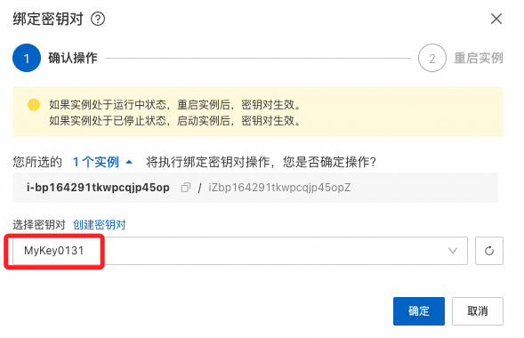
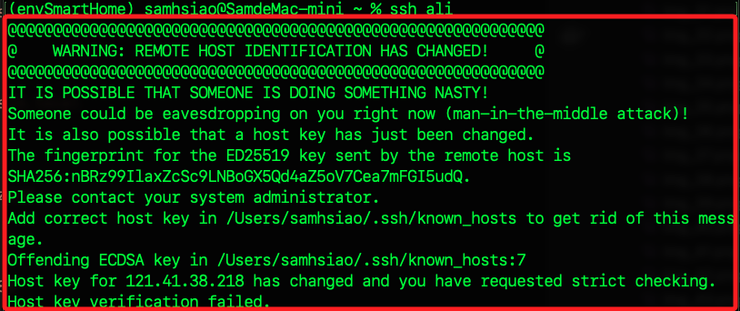

# 阿里雲

_建立 OpenVPN 伺服器連回中國內地_

<br>

## 申請阿里雲帳號

1. 前往 [阿里雲官網](https://www.aliyun.com) 註冊帳號並完成實名認證，使用 `gsam6238@gmail.com`。

<br>

2. [已有帳號登入](https://account.aliyun.com/login/login.htm?oauth_callback=https%3A%2F%2Fmyaccount.console.aliyun.com%2Fsecurity&clearRedirectCookie=1&lang=zh)。

<br>

## 建立 ECS 實例

_Elastic Compute Service_

<br>

1. 打開阿里雲 [ECS 控制台](https://ecs.console.aliyun.com)

<br>

2. 若具備試用資格，可點擊 `建立更多試用 ECS`。

    

<br>

3. 若無試用資格，點擊 `建立我的 ECS`。

    

<br>

## 硬體配置

_假如有試用，建立等級高一點的ECS_

<br>

1. 地區選擇 `華東 1（杭州）`。

    

<br>

2. 規格選擇 `4 核心、8 GiB 經濟型 e`；因為是免費試用，嘗試選取規格較高的實例。

    

<br>

3. `操作系統` 選擇 `Ubuntu 22.04 64 位`。

    

<br>

4. 預裝應用選 `Docker`。

    

<br>

5. 點擊 `我同意` 及右下角 `立即試用`。

    

<br>

6. 建立成功，點擊 `管理試用`。

    

<br>

7. 點擊 `實例`，就可看到新建立的 ECS，點擊實例鏈接可進入。

    

<br>

## 綁定密鑰對/金鑰組

_繁簡中文的名稱略有不同，無論有無密鑰都進行此步驟_

<br>

1. 點擊 `綁定密鑰對`。

    

<br>

2. 若無密鑰，選擇 `建立密鑰對`。

    

<br>

3. 輸入名稱後，點擊 `確認` 後會自動下載到本地。

    

<br>

4. 回到實例主控台，再次點擊 `綁定密鑰` 進行綁定。

    

<br>

5. 綁定後要重啟實例，點擊 `立即重啟`。

    

<br>

## 遠程連線

_先回到本地處理自動下載的密鑰文件_

<br>

1. 查看下載的密鑰文件預設權限；可知預設為 `644`，在多數的雲服務中，太寬鬆的權限在連線時會受到限制。

    ```bash
    ls -l <拖曳文件至此即可>
    ```

    

<br>

2. 將下載的密鑰文件修改權限為 `400`；修正後可再次查看權限已變更如圖所示。

    ```bash
    chmod 400 <拖曳文件至此即可>
    ```

    

<br>

3. 回到主控台，點擊 `遠程連接`。

    

<br>

4. 點擊 `立即登錄`。

    

<br>

5. 點擊 `SSH 密鑰認證`，然後上傳密鑰對後點擊 `確定`。

    

<br>

6. 完成後會進入終端機畫面。

    

<br>

## 上傳公鑰

_複製本地公鑰到實例_

<br>

1. 延續前面步驟，在實例中先進入密鑰所在文件路徑，可看到 `authorized_keys` 文件已經存在。

    ```bash
    cd ~/.ssh && ls
    ```

    

<br>

2. 回到本地，透過 VSCode 開啟公鑰 `id_rsa.pub` 後複製。

    ```bash
    code ~/.ssh
    ```

    

<br>

3. 進入實例，編輯文件並貼上本地公鑰；關於本地公鑰取得部分暫時略過。

    ```bash
    nano authorized_keys
    ```

    

<br>

## 編輯本地連線文件

_`.ssh` 資料夾內的 `config`_

<br>

1. 複製 ECS 公網 IP `xxx.xxx.xxx.xxx`；特別注意，這個 IP 每次更新都會置換，圖文不會相符。

    

<br>

2. 開啟本地設定文件 `config`。

    ```bash
    code ~/.ssh
    ```

<br>

3. 添加以下別名，使用者預設為 `root`，IP 部分填入 ECS 公網 IP。

    ```bash
    Host ali
        HostName xxx.xxx.xxx.xxx
        User root
    ```

<br>

4. 快速連線。

    ```bash
    ssh ali
    ```

<br>

5. 第一次連線會詢問，回答 `yes` 後按下 `ENTER` 即可。

    

<br>

6. 如果出現如下資訊，清空本地 `known_hosts` 與 `known_hosts.old` 文件內容即可。

    

<br>

## 彈性 IP

_阿里雲在繁中語系時使用英文 `Elastic IP Address`，可以在必要時再啟用_

<br>

1. 點擊 `公網 IP` 旁邊的 `轉換為彈性公網 IP`。

    

<br>

2. 彈窗顯示。

    

<br>

3. 會直接綁定原本配發的 IP。

    

<br>

## 安全組配置

_在安全組中添加規則，設置 `0.0.0.0/0` 允許所有 IP 連線；特別注意，安全群組與實例是獨立但可綁定的對象。_

<br>

1. 點擊 `安全組` 頁籤，接著添加以下規則；若是付費實例可能會有預設規則。

    

<br>

2. 安全組中已有預設的三個規則 `RDP 3389`、`SSH 22` 及 `ICMP`；RDP 是 `Windows` 遠端桌面；ICMP 允許 ICMP Ping，可透過遠端透過 ping 指令進行連線測試。。

    

<br>

3. 點擊 `手動添加`，自訂義 `UDP`、端口 `1194`、來源 `所有 IPv4`；這是 OpenVPN 預設端口。

    

<br>

4. 再次點擊 `手動添加`，添加兩個自訂義 `TCP`、端口分別是 `9443/943`，來源同樣 `所有 IPv4`；這是 OpenVPN Web UI 的管理頁面及客戶端登入頁面。

<br>

## 使用 CLI 編輯安全組

_開啟本地終端機，可嘗試使用 CLI 建立安全組_

<br>

1. 取得安全組 ID 並寫入變數。

    ```bash
    SG_ID=$(aliyun ecs DescribeSecurityGroups --RegionId "cn-hangzhou" | jq -r '.SecurityGroups.SecurityGroup[].SecurityGroupId')
    echo "已取得安全組 ID：$SG_ID"
    ```

    

<br>

2. 添加安全組規則，開放 `1194/UDP` 作為 `OpenVPN` 伺服器通訊。

    ```bash
    aliyun ecs AuthorizeSecurityGroup --RegionId "cn-hangzhou" \
    --SecurityGroupId "$SG_ID" \
    --IpProtocol udp --PortRange 1194/1194 \
    --SourceCidrIp 0.0.0.0/0
    ```

<br>

3. 開放 9443/TCP 作為 OpenVPN Web UI 管理頁面。

    ```bash
    aliyun ecs AuthorizeSecurityGroup --RegionId "cn-hangzhou" \
    --SecurityGroupId "$SG_ID" \
    --IpProtocol tcp --PortRange 9443/9443 \
    --SourceCidrIp 0.0.0.0/0
    ```

<br>

4. 開放 943/TCP 作為 OpenVPN Web UI 客戶端登入。

    ```bash
    aliyun ecs AuthorizeSecurityGroup --RegionId "cn-hangzhou" \
    --SecurityGroupId "$SG_ID" \
    --IpProtocol tcp --PortRange 943/943 \
    --SourceCidrIp 0.0.0.0/0
    ```

<br>

5. 確認規則是否成功添加。

    ```bash
    aliyun ecs DescribeSecurityGroupAttribute --RegionId "cn-hangzhou" --SecurityGroupId "$SG_ID" | jq '.Permissions.Permission[] | {IpProtocol, PortRange, SourceCidrIp}'
    ```

    

<br>

6. 點擊右下角刷新圖標可查看。

    

<br>

## 其他指令

1. 取得 ECS 實例的公網 IP。

    ```bash
    aliyun ecs DescribeInstances --RegionId "cn-hangzhou" | jq -r '.Instances.Instance[].PublicIpAddress.IpAddress[]'
    ```

<br>

___

_END_