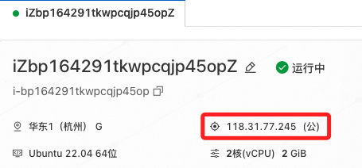

# 阿里雲

_建立 OpenVPN 伺服器連回中國內地，過程包括 ECS 選擇、開放端口、安裝 OpenVPN，但要注意，中國對 VPN 服務有限制。_

## 申請阿里雲帳號

1. 前往 [阿里雲官網](https://www.aliyun.com) 註冊帳號並完成實名認證，使用 `gsam6238@gmail.com`。

## 建立 ECS 實例

_Elastic Compute Service_

1. 打開阿里雲 [ECS 控制台](https://ecs.console.aliyun.com)

2. 點擊 `建立我的 ECS`。


3. 地區選擇 `華東 1（杭州）`。

4. 規格選擇 2 核心、2 GiB 經濟型 e。


3. `操作系統` 選擇 `Ubuntu 20.04 64 位`。


4. 不需要預裝應用。

5. 立即試用。


## 使用主控台登入

1. 建立密鑰對

2. 在主控台先綁定密鑰對。


3. 重啟實例。

4. 下載後，修改權限為 400。

5. 遠程連線，上傳密鑰對

## SSH 登入

1. ECS 公網 IP：`118.31.77.245`  



2. 終端機指令

```bash
ssh -i <密鑰對路徑>  root@<實例公網 IP>
```

## 面密碼

1. 上傳本機公鑰

```bash
sudo nano ~/.ssh/authorized_keys
```

2. 本機建立 SSH 設置

```bash
Host ali
    HostName 118.31.77.245
    User root
```

3. 快速連線

```bash
ssh ali
```

### 步驟 4：安全組配置（開放 VPN 端口）
1. 在安全組中添加規則：
   - 1194 UDP（OpenVPN 預設端口）
   - 443 TCP（如果要偽裝成 HTTPS）
   - 22 TCP（SSH 遠程管理）
   - 3389 TCP（如需遠程桌面）

2. 設置 0.0.0.0/0 允許所有 IP 連線，或者限制自己的 IP。

### 步驟 5：確認並建立
- 檢查所有設置後，點擊「立即購買」，啟動 ECS。


## 3️⃣ 連接 ECS 並安裝 OpenVPN
### 步驟 1：SSH 連接 ECS
在你的終端（Mac/Linux）或 PuTTY（Windows） 連線到 ECS：
```bash
ssh root@<ECS外部IP>
```
（更改 `<ECS外部IP>` 為你的阿里雲實例 IP）


