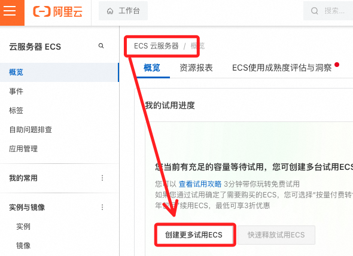
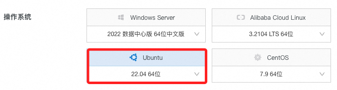
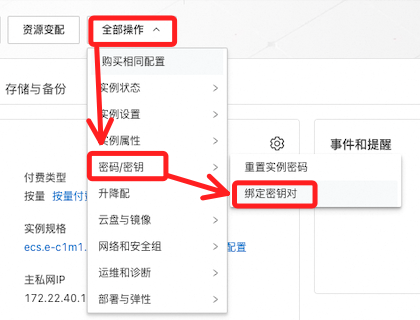
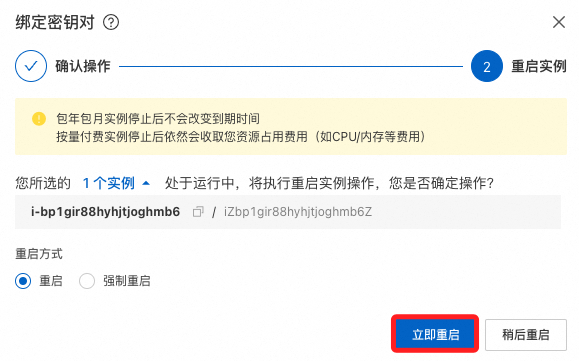
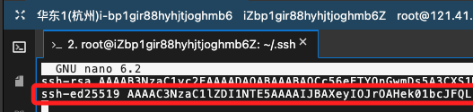

# 阿里雲

_建立 OpenVPN 伺服器連回中國內地_

<br>

## 申請阿里雲帳號

1. 前往 [阿里雲官網](https://www.aliyun.com) 註冊帳號並完成實名認證，使用 `gsam6238@gmail.com`。

<br>

## 建立 ECS 實例

_Elastic Compute Service_

<br>

1. 打開阿里雲 [ECS 控制台](https://ecs.console.aliyun.com)

<br>

2. 點擊 `建立我的 ECS`。

    

<br>

3. 地區選擇 `華東 1（杭州）`。

<br>

4. 規格選擇 2 核心、2 GiB 經濟型 e。

    

<br>

3. `操作系統` 選擇 `Ubuntu 20.04 64 位`。

    

<br>

4. 預裝應用可選 Docker。

    

<br>

5. 點擊 `我同意` 及右下角 `立即試用`。

    

<br>

## 使用主控台登入

1. 點擊 `綁定密鑰對`。

    

<br>

2. 若無密鑰，選擇 `創建密鑰對`；輸入名稱後會自動下載。

    

<br>

3. 回到主控台後選擇密鑰進行綁定。

    

<br>

4. 點擊 `重啟實例`。

    

<br>

5. 將下載的密鑰文件修改權限為 `400`。

    ```bash
    chmod 400 <拖曳文件至此即可>
    ```

<br>

6. 點擊 `遠程連線`。

    

<br>

7. 點擊 `立即登入`。

    

<br>

8. 點擊 `SSH 密鑰認證`，然後上傳密鑰對後點擊 `確認`。

    

<br>

## 免密碼 SSH 登入

_複製本地公鑰_

<br>

1. 進入路徑。

    ```bash
    cd ~/.ssh && ls
    ```

<br>

2. 確認文件存在後開啟編輯；貼上本地公鑰。

    ```bash
    nano authorized_keys
    ```

    

<br>

## 快速連線

1. 複製 ECS 公網 IP `118.31.77.245`。

    

<br>

2. 開啟本地設定文件。

    ```bash
    code ~/.ssh
    ```

<br>

3. 編輯。

    ```bash
    Host ali
        HostName 118.31.77.245
        User root
    ```

<br>

4. 快速連線。

    ```bash
    ssh ali
    ```

<br>

## 安全組配置

_在安全組中添加規則，設置 `0.0.0.0/0` 允許所有 IP 連線；特別注意，安全群組與實例是獨立但可綁定的對象。_

<br>

1. 1194 UDP，OpenVPN 預設端口。

<br>

2. 9443/943 TCP。

<br>

3. 22 TCP（SSH 遠程管理）

<br>

4. 3389 TCP（如需遠程桌面）

<br>

___

_END_