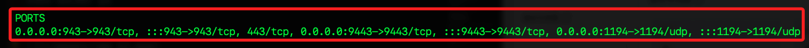

# 使用 OpenVPN Access Server

_這是 OpenVPN 官方提供的 Web 管理介面版本_

<br>

## 準備工作

_先在本機中處理 Docker 所需的鏡像_

<br>

1. 檢查本地電腦是否已經安裝 Docker。

   ```bash
   docker --version
   ```

<br>

2. 查看 Docker 服務詳細資訊。

   ```bash
   docker info
   ```

<br>

3. 篩選資訊，查看服務是否已啟動；假如服務尚未啟動，可開啟 `Docker Desktop`，如此在可自動啟動服務。

   ```bash
   docker info >/dev/null 2>&1 && echo "Docker 正在運行" || echo "Docker 未運行"
   ```

<br>

## 上傳鏡像

_因爲在雲端似乎難以拉取，所以從本地上傳_

<br>

1. 先確認能遠程連線，因為後續要使用 `scp` 指令。

   ```bash
   ssh ali
   ```

<br>

2. 本機下載 `linux/amd64` 架構的 `OpenVPN` 鏡像；若建立 `linux/arm64` 實例，則無需加入參數。

   ```bash
   cd ~/Downloads && docker pull --platform linux/amd64 openvpn/openvpn-as
   ```

<br>

3. 查看鏡像，一併檢查是否有重複；從這個案例來看確實出現重複。

   ```bash
   FULL_IMAGE_INFO=$(docker images | grep openvpn | tee /dev/tty)
   IMAGE_ID=$(echo "$FULL_IMAGE_INFO" | awk '{print $3}')
   ```

   

<br>

4. 若有重複，指定 `Image ID` 刪除鏡像。

   ```bash
   docker rmi <指令鏡像-ID>
   ```

<br>

5. 確認鏡像的作業系統；進行上傳前，務必確認相容於當前 ECS 的作業系統。

   ```bash
   docker inspect --format='{{.Os}} {{.Architecture}}' $IMAGE_ID
   ```

   

<br>

6. 壓縮；務必確認當前工作路徑。

   ```bash
   docker save -o openvpn-as.tar openvpn/openvpn-as
   ```

<br>

7. 傳送到雲端；需要一段時間。

   ```bash
   scp ~/Downloads/openvpn-as.tar ali:~/
   ```

   

<br>

## 安裝 Docker

_使用 SSH 連線 ECS 實例後進行以下操作；假如是有預裝的實例，可跳過安裝部分，直接進行檢查即可_

<br>

1. 更新系統。

   ```bash
   apt update && apt upgrade -y
   ```

<br>

2. 安裝 Docker；如果安裝遇到問題，可參考 `錯誤排除` 紀錄。

   ```bash
   apt install -y docker.io
   ```

<br>

3. 安裝後會自動啟動服務，可透過指令查看運行狀態。

   ```bash
   systemctl status docker
   ```

   

<br>

4. 若顯示 Docker 未啟動，可手動啟動服務。

   ```bash
   systemctl enable --now docker
   ```

<br>

## 安裝鏡像

1. 載入前面步驟上傳的鏡像壓縮文件。

   ```bash
   docker load -i /root/openvpn-as.tar
   ```

   

<br>

2. 確認鏡像是否成功載入。

   ```bash
   docker images
   ```

   

<br>

3. 啟動容器 `OpenVPN Access Server`；啟動後會顯示容器 ID。

   ```bash
   docker run -d \
      --name openvpn-as \
      --restart always \
      --cap-add=NET_ADMIN \
      --cap-add=NET_RAW \
      --privileged \
      -v /run:/run \
      -p 943:943 \
      -p 9443:9443 \
      -p 1194:1194/udp \
      openvpn/openvpn-as
   ```

   

<br>

4. 檢查容器狀態。

   ```bash
   docker ps
   ```

   

<br>

5. 可確認端口是否都正確設置。

   

<br>

___

_END_
