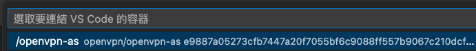
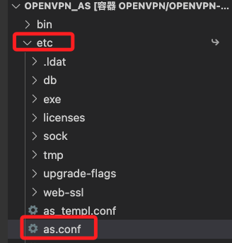
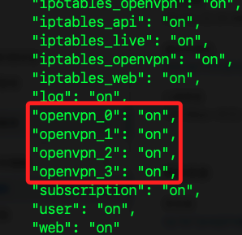

# VSCode 連線容器

_補充說明如何使用 `VSCode` 透過 `Dev Containers` 插件連線進入容器內_

<br>

## 步驟說明

1. 開啟 VSCode，先使用 `遠端管理` 透過 SSH 連線宿主機，確認左下方已顯示；特別注意，這個主機別名 `ali` 在前面步驟已經存入設定文件中 `config`。

   

<br>

2. 連線後，點擊左下方齒輪進入 `命令選擇區` 面板，並輸入 `Remote-Containers: Attach to Running Container`。

   

<br>

3. 會出現容器，點擊選取；依照這個實作來說，只會有一個 `OpenVPN-as` 容器可選。

   

<br>

4. 會彈出新的 VSCode 工作視窗，右下角顯示 `連線到開發人員容器` 及 `正在安裝伺服器`；等候安裝進度條顯示完成。

   

<br>

## 開啟遠端文件

1. 完成後，終端機畫面中會顯示當前所載路徑。

   ```bash
   /usr/local/openvpn_as/
   ```

   

<br>

2. 可嘗試在 `etc` 中找到 `OpenVPN-AS` 的設定文件 `as.conf`。

   

<br>

3. 若要添加規則，可在 `as.conf` 文件的 底部進行編輯如下。

   ```bash
   # 設置 OpenVPN 服務監聽的端口
   vpn.server.port=1194
   vpn.server.daemon.udp=openvpn
   vpn.server.daemon.udp.n_daemons=2
   vpn.server.daemon.tcp.port=443
   vpn.server.daemon.tcp.n_daemons=2
   ```

<br>

4. 設定文件若有修改，需進行套用並重啟 OpenVPN Access Server。

   ```bash
   /usr/local/openvpn_as/scripts/sacli stop
   /usr/local/openvpn_as/scripts/sacli start
   ```

   

<br>

5. 可查看設定文件內容是否確實變更。

   ```bash
   cat /usr/local/openvpn_as/etc/as.conf
   ```

<br>

___

_END_
