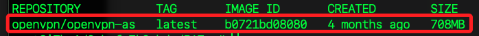

# 使用 OpenVPN Access Server

_這是 OpenVPN 官方提供的 Web 管理介面版本_

<br>

## 準備工作

_先在本機中處理 Docker 所需的鏡像_

<br>

1. 檢查本地電腦是否已經安裝 Docker。

   ```bash
   docker --version
   ```

<br>

2. 檢查 Docker 服務是否運行。

   ```bash
   docker info
   ```

<br>

3. 假如服務尚未啟動，可開啟 `Docker Desktop`，如此在可自動啟動服務。

<br>

## 上傳鏡像

_因爲在雲端似乎難以拉取，所以從本地上傳_

<br>

1. 先確認能遠程連線，因為後續要使用 `scp` 指令。

   ```bash
   ssh ali
   ```

<br>

2. 本機下載 `linux/amd64` 架構的 `OpenVPN` 鏡像；若建立 `linux/arm64` 實例，則無需加入參數。

   ```bash
   cd ~/Downloads && docker pull --platform linux/amd64 openvpn/openvpn-as
   ```

<br>

3. 查看鏡像，一併檢查是否有重複；從這個案例來看確實出現重複。

   ```bash
   docker images | grep openvpn
   ```

   

<br>

4. 若有重複，指定 `Image ID` 刪除鏡像。

   ```bash
   docker rmi 066e8adf3a47
   ```

<br>

5. 確認鏡像的作業系統；進行上傳前，務必確認相容於當前 ECS 的作業系統。

   ```bash
   docker inspect --format='{{.Os}} {{.Architecture}}' <鏡像-ID>
   ```

   

<br>

6. 壓縮；務必確認當前工作路徑。

   ```bash
   docker save -o openvpn-as.tar openvpn/openvpn-as
   ```

<br>

7. 傳送到雲端；需要一段時間。

   ```bash
   scp ~/Downloads/openvpn-as.tar ali:~/
   ```

   

<br>

## 設置雲端環境

_使用 SSH 連線 ECS 實例後進行以下操作_

<br>

1. 安裝 Docker；假如是有預裝的實例，可跳過這第一步。

   ```bash
   apt update && apt upgrade -y && apt install -y docker.io
   ```

<br>

## 錯誤排除

_排除安裝過程中的錯誤，這是一個迭代的過程，沒有絕對的程序，以下記錄本次錯誤排除的過程，並非唯一、必然的程序，總之就是處理直到無錯誤為止_

<br>

1. 安裝過程遇到兩個錯誤，第一個 `W` 表示 GPG 金鑰存放在舊版的 trusted.gpg 文件，未來可能會影響 apt 更新；第二個 `E` 表示 dpkg 在之前的安裝或更新過程中被中斷，導致系統中存在未完成的安裝。

   

<br>

2. 進行以下命令排除 `E` 的問題。

   ```bash
   dpkg --configure -a
   ```

<br>

3. 再次執行重新安裝 Docker。

   ```bash
   apt install -y docker.io
   ```

<br>

4. 還有錯誤就執行。

   ```bash
   apt update && sudo apt -f install -y && apt autoremove -y
   ```

<br>

5. 執行以下命令來修正 `W`。

   ```bash
   mkdir -p /etc/apt/keyrings
   gpg --no-default-keyring --keyring /etc/apt/keyrings/docker.gpg --import /etc/apt/trusted.gpg
   echo "deb [signed-by=/etc/apt/keyrings/docker.gpg] http://mirrors.cloud.aliyuncs.com/docker-ce/linux/ubuntu jammy stable" | sudo tee /etc/apt/sources.list.d/docker.list
   sudo apt update
   ```

<br>

6. 重新安裝。

   ```bash
   apt install -y docker.io
   ```

<br>

7. 還是錯誤，先刪除重複的 Docker 軟體源。

   ```bash
   rm -f /etc/apt/sources.list.d/docker.list
   rm -f /etc/apt/sources.list.d/archive_uri-http_mirrors_cloud_aliyuncs_com_docker-ce_linux_ubuntu-jammy.list
   apt update
   ```

<br>

8. 移除衝突的 containerd 軟體包。

   ```bash
   apt remove --purge -y containerd containerd.io docker-ce docker-ce-cli docker-ce-rootless-extras
   apt autoremove -y
   ```

<br>

9. 清理 dpkg 並確保沒有鎖定的套件。

   ```bash
   dpkg --configure -a
   apt update && sudo apt -f install
   ```

<br>

10. 重新安裝 Docker，先刪除舊的 Docker 相關套件。

   ```bash
   apt remove --purge -y docker docker.io docker-doc docker-compose docker-compose-v2 podman-docker containerd runc
   apt autoremove -y
   rm -rf /var/lib/docker /var/lib/containerd
   ```

<br>

11. 更新 apt 並確保 ca-certificates 可用。

   ```bash
   apt update && apt install -y ca-certificates curl gnupg
   ```

<br>

12. 手動設定 Docker 官方 GPG 金鑰。

   ```bash
   install -m 0755 -d /etc/apt/keyrings
   curl -fsSL https://download.docker.com/linux/ubuntu/gpg | tee /etc/apt/keyrings/docker.asc > /dev/null
   chmod a+r /etc/apt/keyrings/docker.asc
   ```

<br>

13. 正確設定 Docker 軟體源。

   ```bash
   echo "deb [arch=$(dpkg --print-architecture) signed-by=/etc/apt/keyrings/docker.asc] https://download.docker.com/linux/ubuntu $(lsb_release -cs) stable" | tee /etc/apt/sources.list.d/docker.list > /dev/null
   ```

<br>

14. 更新 apt 軟體清單並安裝最新版 Docker。

   ```bash
   apt update
   apt install -y docker-ce docker-ce-cli containerd.io docker-buildx-plugin docker-compose-plugin
   ```

<br>

## 繼續操作

1. 安裝後會自動啟動服務，可透過指令查看運行狀態。

   ```bash
   systemctl status docker
   ```

   

<br>

2. 若顯示 Docker 未啟動，可手動啟動服務。

   ```bash
   systemctl enable --now docker
   ```

<br>

3. 載入前面步驟上傳的鏡像壓縮文件。

   ```bash
   docker load -i /root/openvpn-as.tar
   ```

   

<br>

4. 確認鏡像是否成功載入。

   ```bash
   docker images
   ```

   

<br>

6. 啟動容器 `OpenVPN Access Server`；啟動後會顯示容器 ID。

   ```bash
   docker run -d \
      --name openvpn-as \
      --restart always \
      --cap-add=NET_ADMIN \
      --cap-add=NET_RAW \
      --privileged \
      -v /run:/run \
      -p 943:943 \
      -p 9443:9443 \
      -p 1194:1194/udp \
      openvpn/openvpn-as
   ```

   

<br>

7. 檢查容器狀態。

   ```bash
   docker ps
   ```

   

<br>

8. 可確認端口是否都正確設置。

   

<br>

## 監聽測試

_進行後續步驟之前，先進行端口轉發測試，特別注意，是否正確轉發流量皆以這個步驟為準_

<br>

1. 開啟三個終端視窗，分別進入 `容器`、進入 `宿主機` 以及 `本地電腦`；首先，將其中一個終端機在 CES 中運行以下指令進入容器。

   ```bash
   docker exec -it openvpn-as bash
   ```

<br>

2. 先檢查 `實例` 及 `容器` 兩者的端口監聽現況；此時在宿主機可看到監聽 `1194`，但容器沒有，這是因為 `OpenVPN` 啟動後，宿主機的 `1194/UDP` 端口會監聽並轉發到容器內。

   ```bash
   netstat -tulnp
   ```

<br>

3. 在容器內安裝 `tcpdump`。

   ```bash
   apt update && apt install -y tcpdump
   ```

<br>

4. 在容器內監控 `UDP 1194`，也就是捕捉所有介面 `-i any` 上的 `UDP 1194` 端口封包。

   ```bash
   tcpdump -i any udp port 1194
   ```

   

<br>

5. 在宿主機監控 `UDP 1194`，與前一步驟相同，顯示的訊息也會相同。

   ```bash
   sudo tcpdump -i any udp port 1194
   ```

<br>

6. 在本地電腦開啟第三個終端視窗，使用 `netcat (nc)` 指令發送 `UDP` 封包到正在監聽的宿主機 `1194` 端口。

   ```bash
   nc -u -v <實例-公網-IP> 1194
   ```

   

<br>

7. 使用鍵盤在本地終端中輸入任意文字並按下 `ENTER` 發送到宿主機；對於一個封包來說，宿主機公網介面 eth0 收到來自 45.96.116.150 的 UDP 封包並轉發宿主機、宿主機內部的 Docker 橋接網路 (docker0) 會將這個封包 NAT 轉發給內部的 Docker 容器（IP 172.17.0.2），最後是容器的虛擬網卡 (vethXXXXXX) 扮演宿主機內的 `橋接通道`，將封包轉發到容器內的 eth0 介面；而容器內只會透過自己的 eth0 接收封包，所以只看到一條流量。

   

<br>

7. 由測試結果可知，容器內 `1194` 的監聽是 OpenVPN 自動管理的，不需過度關注 netstat 的輸出結果，只要 `tcpdump` 顯示有流量，並且 OpenVPN 能正常運行，則代表一切都運行正常

<br>

## 檢查端口監聽

_補充相關指令_

<br>

1. 使用 `iptables` 建立規則；以下指令所建立的規則是將宿主機 `1194` 流量轉發到容器的 `918`。

   ```bash
   # 將進入 宿主機 1194 端口的 UDP 流量，轉發到 容器 172.17.0.2:918
   iptables -t nat -A PREROUTING -p udp --dport 1194 -j DNAT --to-destination 172.17.0.2:918
   # 讓轉發的封包看起來來自宿主機，而不是原始來源 IP
   iptables -t nat -A POSTROUTING -p udp --dport 918 -j MASQUERADE
   ```

<br>

2. 檢查宿主機是否有將外部的 `1194 UDP` 端口轉發到容器的內部端口。

   ```bash
   # 篩選出與 1194 端口 相關的規則
   # 列出 NAT 規則表 (-t nat)
   # 顯示詳細 (-v) 規則
   # 不解析 DNS (-n)
   iptables -t nat -L -n -v | grep 1194
   ```

<br>

3. 確認是否在監聽 `918 UDP` 端口。

   ```bash
   netstat -tulnp | grep 918
   ```

<br>

## 配置文件 `as.conf`

_手動配置容器內的設置檔 `as.conf`；倘若可正常運作，則無需進行設定_

<br>

1. 進入容器。

   ```bash
   docker exec -it openvpn-as bash
   ```

<br>

2. 更新套件列表並安裝 `nano`；通常系統只預設安裝 `vim`。

   ```bash
   apt update && apt install -y nano
   ```

<br>

3. 確認 `nano` 已安裝成功。

   ```bash
   nano --version
   ```

<br>

4. 編輯 `as.conf` 配置；這是 `OpenVPN Access Server` 的主要配置文件。

   ```bash
   nano /usr/local/openvpn_as/etc/as.conf
   ```

<br>

5. 在文件底部添加以下設定。

   ```bash
   vpn.server.port=1194
   vpn.server.daemon.udp=openvpn
   vpn.server.daemon.udp.n_daemons=2
   vpn.server.daemon.tcp.port=443
   vpn.server.daemon.tcp.n_daemons=2
   ```

<br>

## 設定檔說明

_`as.conf` 設定內容介紹，無需實作_

<br>

1. 預設內容說明。

   ```bash
   # 指定私鑰位置
   cs.ca_key=~/web-ssl/ca.key

   # Web 伺服器的動態端口範圍
   cs.dynamic_port_base=870

   # 啟動的服務群組
   # Web 管理介面
   sa.initial_run_groups.0=web_group
   # VPN 伺服器
   sa.initial_run_groups.1=openvpn_group

   # 伺服器的單位編號
   sa.unit=0

   # 是否自動開放 Web 端口，包含 943、9443、443 等端口
   iptables.web=true

   # 伺服器運行的用戶與群組
   # 確保 OpenVPN 服務不以 root 權限運行，以增強安全性
   vpn.server.user=openvpn_as
   vpn.server.group=openvpn_as
   ```

<br>

2. 添加內容說明。

   ```bash
   # 設定伺服器監聽的 UDP 端口
   vpn.server.port=916
   # 使用 UDP 模式運行
   vpn.server.daemon.udp=openvpn
   # 產生 2 個 UDP 處理進程，提高性能
   vpn.server.daemon.udp.n_daemons=2
   # 同時監聽 TCP 443 端口
   vpn.server.daemon.tcp.port=443
   # 產生 2 個 TCP 處理進程
   vpn.server.daemon.tcp.n_daemons=2
   ```

<br>

## 套用配置文件

_修改過配置文件後必須重啟服務_

<br>

1. 停止並重啟服務；透過輸出可確認服務的重啟狀態。

   ```bash
   /usr/local/openvpn_as/scripts/sacli stop
   /usr/local/openvpn_as/scripts/sacli start
   ```

   

<br>

2. 檢查容器內的指定端口 `1194` 是否被監聽。

   ```bash
   netstat -tulnp | grep 1194
   ```

<br>

## 嘗試排除無法監聽 `1194` 的問題

_以下紀錄原本使用預設端口 `1194` 時，嘗試的各種可能的方式排查容器無法監聽 `1194` 的問題，最終未能排除，僅做紀錄參考_

<br>

1. 查詢 OpenVPN 是否嘗試監聽 1194；正確。

   ```bash
   /usr/local/openvpn_as/scripts/sacli ConfigQuery | grep "vpn.server.port"
   ```

   

<br>

2. 確認 OpenVPN 是否正常運行；正確。

   ```bash
   /usr/local/openvpn_as/scripts/sacli Status
   ```

   

<br>

3. 檢查 OpenVPN Access Server 日誌；無錯誤。

   ```bash
   cat /var/log/openvpnas.log | tail -20
   ```

<br>

4. 確認容器是否正確開放 1194 端口；正確。

   ```bash
   cat /usr/local/openvpn_as/etc/as.conf | grep vpn.server
   ```

   

<br>

5. 在實例終端機運行指令，檢查 Docker 端口映射；正確。

   ```bash
   docker ps | grep openvpn-as
   ```

   

<br>

## 檢查端口監聽

_以下步驟可用於檢查宿主機以及容器的端口監聽狀態_

<br>

1. 查詢容器的端口監聽。

   ```bash
   netstat -tulnp
   ```

<br>

2. 在宿主機檢查是否有監聽 1194。

   ```bash
   netstat -tulnp | grep 1194
   ```

   

<br>

3. 進入容器內部。

   ```bash
   docker exec -it openvpn-as bash
   ```

<br>

4. 檢查 OpenVPN 是否有監聽 1194。

   ```bash
   netstat -tulnp | grep 1194
   ```

   

<br>

## 手動設定端口監聽

_即使在 Docker 啟動時設置 `-p 1194:1194/udp`，仍需手動設置 `sacli` 來確保 OpenVPN 伺服器使用 `UDP`。_

<br>

1. 在容器內運行指令改用端口 `916`；特別注意，這個變更的設定會被寫入 `OpenVPN Access Server` 的內部設定資料庫，而不會直接修改 `as.conf`；另外，不建議直接修改 `as.conf`，因為 `OpenVPN Access Server` 主要使用內部設定資料庫來管理配置，直接修改 `as.conf` 可能不會生效，且容易在更新或重啟時被覆蓋。

   ```bash
   /usr/local/openvpn_as/scripts/sacli --key "vpn.server.port" --value "1194" ConfigPut
   /usr/local/openvpn_as/scripts/sacli --key "vpn.server.daemon.udp" --value "openvpn" ConfigPut
   ```

<br>

2. 檢查當前設定值。

   ```bash
   /usr/local/openvpn_as/scripts/sacli ConfigQuery | grep "vpn.server"
   ```

   

<br>

3. 同時也修改 `as.conf`。

   ```bash
   nano /usr/local/openvpn_as/etc/as.conf
   ```

<br>

4. 將端口修正為原本的 `1194`。

   

<br>

5. 再次重啟 OpenVPN。

   ```bash
   /usr/local/openvpn_as/scripts/sacli stop
   /usr/local/openvpn_as/scripts/sacli start
   ```

<br>

6. 宿主機添加對應規則，先安裝套件。

   ```bash
   apt install netfilter-persistent -y
   ```

<br>

7. 宿主機添加規則。

   ```bash
   iptables -A INPUT -p udp --dport 1194 -j ACCEPT
   netfilter-persistent save
   netfilter-persistent reload
   ```

<br>

8. 確認宿主機允許 UDP 1194。

   ```bash
   iptables -L -n -v | grep 1194
   ```

<br>

9. 若有重複規則，可進行刪除；一次會刪除一個。

   ```bash
   iptables -D INPUT -p udp --dport 1194 -j ACCEPT
   ```

<br>

___

_END_
