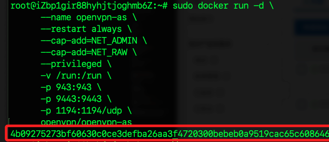
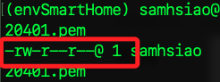

# 使用 OpenVPN Access Server

_這是 OpenVPN 官方提供的 Web 管理介面版本_

<br>

## 本地

1. 先確認能遠程連線，因為後續要使用 `scp` 指令。

   ```bash
   ssh ali
   ```

<br>

2. 本機下載 `linux/amd64` 架構的 `OpenVPN` 鏡像。

   ```bash
   cd ~/Downloads && docker pull --platform linux/amd64 openvpn/openvpn-as
   ```

<br>

3. 壓縮；務必確認當前工作路徑。

   ```bash
   docker save -o openvpn-as.tar openvpn/openvpn-as
   ```

<br>

4. 傳送到雲端；需要一段時間。

   ```bash
   scp ~/Downloads/openvpn-as.tar ali:~/
   ```

   

<br>

## 設置雲端環境

1. 安裝 Docker；假如有勾選預裝，可跳過這第一步。

   ```bash
   sudo apt update && sudo apt install -y docker.io
   sudo systemctl enable --now docker
   ```

<br>

2. 查看 Docker 運行狀態。

   ```bash
   sudo systemctl status docker
   ```

   

<br>

3. 載入上傳的 Docker 鏡像壓縮文件。

   ```bash
   docker load -i /root/openvpn-as.tar
   ```

   

<br>

4. 確認鏡像是否成功載入。

   ```bash
   docker images
   ```

<br>

5. 啟動 OpenVPN Access Server。

   ```bash
   sudo docker run -d \
      --name openvpn-as \
      --restart always \
      --cap-add=NET_ADMIN \
      --cap-add=NET_RAW \
      --privileged \
      -v /run:/run \
      -p 943:943 \
      -p 9443:9443 \
      -p 1194:1194/udp \
      openvpn/openvpn-as
   ```

   

<br>

6. 檢查容器狀態。

   ```bash
   sudo docker ps
   ```

   

<br>

## 其他操作

1. 停止。

   ```bash
   sudo docker stop openvpn-as
   ```

<br>

2. 移除。

   ```bash
   sudo docker rm openvpn-as
   ```

<br>

3. 完全移除。

   ```bash
   sudo docker rmi openvpn/openvpn-as
   ```

<br>

## 添加

1. 檢查 OpenVPN 是否有監聽 1194。

   ```bash
   netstat -tulnp | grep 1194
   ```

   

2. 進入容器內部。

```bash
sudo docker exec -it openvpn-as bash
```

3. 檢查 OpenVPN 是否有監聽 1194

```bash
netstat -tulnp | grep 1194
```

## 管理容器

_安裝 `Dev Containers` 插件_

1. 先使用 SSH 連線宿主機。

2. 連線後，開啟面板輸入 `Remote-Containers: Attach to Running Container`，然後選擇容器。


3. 開啟路徑，找到 `etc/as.conf`。

```bash
/usr/local/openvpn_as/
```

4. 在 as.conf 文件的 底部 添加或修改以下設定。

```bash
# 設置 OpenVPN 服務監聽的端口
vpn.server.port=1194
vpn.server.daemon.udp=openvpn
vpn.server.daemon.udp.n_daemons=2
vpn.server.daemon.tcp.port=443
vpn.server.daemon.tcp.n_daemons=2
```

5. 應用設定並重啟 OpenVPN Access Server 在容器內執行

```bash
/usr/local/openvpn_as/scripts/sacli stop
/usr/local/openvpn_as/scripts/sacli start
```

6. 查看。

```bash
netstat -tulnp | grep 1194
```

## 改用 914

1. 改為 914。

```bash
/usr/local/openvpn_as/scripts/sacli --key "vpn.server.port" --value "914" ConfigPut
/usr/local/openvpn_as/scripts/sacli --key "vpn.server.daemon.udp" --value "openvpn" ConfigPut
```

2. 重啟 OpenVPN

```bash
/usr/local/openvpn_as/scripts/sacli stop
/usr/local/openvpn_as/scripts/sacli start
```

3. 確認新端口是否監聽

```bash
netstat -tulnp | grep 914
```

1. 查看內容。

   ```bash
   cat /usr/local/openvpn_as/etc/as.conf
   ```

2. 重啟 OpenVPN 服務。

   ```bash
   /usr/local/openvpn_as/scripts/sacli stop
   /usr/local/openvpn_as/scripts/sacli start
   ```

3. 檢查。

   ```bash
   netstat -tulnp | grep 1194
   ```

## 訪問

1. 添加安全組



2. 添加

```bash
sudo ufw allow 943/tcp
sudo ufw allow 9443/tcp
sudo ufw reload
sudo ufw status
```

3. 在本機測試

```bash
nc -zv 118.31.77.245 943
nc -zv 118.31.77.245 9443
```

4. OpenVPN 管理介面

```bash
SERVER_IP=$(curl -s ifconfig.me)
echo "管理介面: https://$SERVER_IP:943/admin"
echo "客戶端介面: https://$SERVER_IP:943/"
```

5. 登入管理頁面，設置 Hostname


## 確認

1. 在容器內執行

```bash
/usr/local/openvpn_as/scripts/sacli Status
```

2. 確認 1194 端口是否正在監聽

```bash
netstat -tulnp | grep 1194
```


#### 6️⃣ 設定 OpenVPN
- 進入 `Configuration -> Network Settings`
- 更改 `IP Address` 為阿里雲的 ECS 公網 IP
- 儲存後，點擊 `Update Running Server`
- 這時你可能會被斷線，重新訪問新的管理地址即可。

#### 7️⃣ 下載 `.ovpn` 設定檔
- 進入 `Client UI`
- 下載 `.ovpn` 檔案
- 在 OpenVPN 客戶端載入該 `.ovpn` 檔案並連線


### 🔹 阿里雲額外設定
1. 確保開放防火牆
   ```bash
   sudo ufw allow 943/tcp
   sudo ufw allow 9443/tcp
   sudo ufw allow 1194/udp
   sudo ufw reload
   ```

2. 如果 OpenVPN 連線後無法上網
   - 檢查 `IP Forwarding`
   ```bash
   echo 1 | sudo tee /proc/sys/net/ipv4/ip_forward
   sudo sysctl -w net.ipv4.ip_forward=1
   ```
   - NAT 設定：
   ```bash
   sudo iptables -t nat -A POSTROUTING -s 10.8.0.0/24 -o eth0 -j MASQUERADE
   sudo iptables-save | sudo tee /etc/iptables.rules
   ```


### 🔹 結論
- 是的，你可以用你的筆記在 阿里雲的 ECS（Ubuntu 20.04 / 22.04） 透過 Docker 部署 OpenVPN Access Server。
- 注意阿里雲防火牆設定，確保開放 `943`, `9443`, `1194` 端口。
- NAT 與 IP 轉發 可能需要手動設定，確保 VPN 用戶可以存取網際網路。

這樣，你應該能成功在 阿里雲 ECS 上運行 OpenVPN Access Server！🚀


