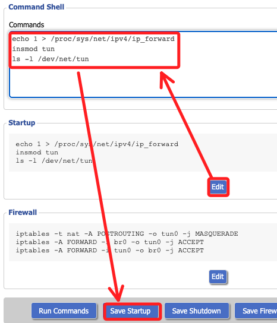

# 設定路由器作為 OpenVPN 伺服器

_以下不使用路由器主控台進行啟動 OpenVPN Client，改用讀取 USB 中的 `.ovpn` 文件啟動客戶端；這樣的好處是直接運行下載的客戶端設定，無需在主控台中進行相關設置。_

<br>

## 準備工作

_將路由器寫入設定方便後續連線_

<br>

1. 編輯本地 SSH 客戶端設定檔。

    ```bash
    code ~/.ssh
    ```

<br>

2. 設定路由器別名方便連線；IP 及使用者名稱皆為預設，若有變動則依實際設定寫入。

    ```bash
    Host buff
        HostName 192.168.11.1
        User root
    ```

<br>

3. 透過別名進行 SSH 連線。

    ```bash
    ssh buff
    ```

<br>

## 環境檢查

1. 這款韌體 `DD-WRT` 已內建 `OpenVPN`，無需啟動直接運行以下指令，確認應用文件路徑在 `/usr/sbin/openvpn`。

    ```bash
    ls /usr/sbin/openvpn
    ```

<br>

## 處理 .ovpn 文件

_修改 OpenVPN 客戶端自動生成的 `.ovpn` 文件；其餘預設內容無需做多變更_

<br>

1. 修改文件中對於加密方式的設定，因為 `OpenVPN 2.5+` 版本已改用 `--data-ciphers` 允許多種加密演算法協商，舊版則是使用 `cipher` 指定單一加密演算法。

    ```bash
    # cipher AES-256-CBC
    # 改用
    data-ciphers AES-256-GCM:AES-128-GCM:AES-256-CBC
    ```

<br>

2. 可刪除文件中 `remote` 設定的重複部分，僅保留 `9914` 及 `443` 各一行即可

    ```bash
    remote <主機-IP> 1194 udp
    remote <主機-IP> 443 tcp
    ```

<br>

## 手動啟動 OpenVPN

1. 準備一個 USB 隨身碟，將修正後的 `.ovpn` 文件存入根目錄並命名為 `china.ovpn`。

<br>

2. 可先進入主控台 `Services` 中的子頁籤 `USB` 中查看，然後插入 USB，當該服務屬於 `Enable` 時，插入後會展開顯示掛載路徑；滾動到下方確認預設掛載路徑在 `/tmp/mnt/sda1`。

    

<br>

3. 透過終端機連線路由器。

    ```bash
    ssh buff
    ```

    

<br>

4. 確認路由器的文件位置。

    ```bash
    ls /tmp/mnt/sda1/china.ovpn
    ```

    

<br>

## 修正路由器時間

_若未更新可手動進行設置；未自動更新的原因可能是尚未連線到網際網路_

<br>

1. 查詢路由器當前時間，會發現日期錯誤。

    ```bash
    date
    ```

    

<br>

2. 使用指令設定時間 `date -s "YYYY-MM-DD HH:MM:SS"`，其中 `"YYYY-MM-DD HH:MM:SS"` 改為當前時間，特別注意這是 `24 小時制` 的時間格式。

    ```bash
    date -s "2025-02-04 15:05:00"
    ```

<br>

## 設定 DNS

1. 查看當前設定內容。

    ```bash
    cat /etc/resolv.conf
    ```

<br>

2. 手動設定 DNS；特別注意， Linux 指令中的 `>>` 與 `>` 不同，單箭頭 `>` 是覆蓋，這會清空原有內容僅寫上新內容；若不要清空當前內容則要使用雙箭頭 `>>` 進行追加；使用單箭頭時，設定內容在路由器重啟後會自動恢復，故使用 `>>` 進行設定；另外，亦可使用控制台進行設置，應該可持久化設定。

    ```bash
    echo "nameserver 8.8.8.8" >> /etc/resolv.conf
    ```

    

<br>

## 環境設置

_啟動服務還需進行一些設置_

<br>

1. 假如服務已經啟用，先停用。

    ```bash
    killall openvpn
    ```

<br>

2. 啟動服務前先載入 TUN 模組；預設並未載入。

    ```bash
    modprobe tun
    ```

<br>

3. 確認模組是否載入。

    ```bash
    lsmod | grep tun
    ```

    

<br>

4. 將以下設定寫入主控台以利持久化設定，位置在主頁籤的 `Administration` 中的子頁籤 `Commands`，寫入後點擊 `Save Startup` 表示寫入啟動執行區。

    ```bash
    echo 1 > /proc/sys/net/ipv4/ip_forward
    insmod tun
    ls -l /dev/net/tun
    ```

    

<br>

## IP 轉發

_假如前面已經寫入路由器，這裡僅作參考_

<br>

1. 開啟 IP 運行轉發。

    ```bash
    echo 1 > /proc/sys/net/ipv4/ip_forward
    ```

<br>

2. 同樣寫入開機腳本中；特別注意，寫入時必須將當前設置也複製貼上，不然會清空覆蓋當前內容。

    

<br>

## 加入防火牆規則

1. 手動啟用 NAT 規則，確保 VPN 流量能夠轉發到內部網路。

    ```bash
    iptables -t nat -A POSTROUTING -o tun0 -j MASQUERADE
    iptables -A FORWARD -i br0 -o tun0 -j ACCEPT
    iptables -A FORWARD -i tun0 -o br0 -j ACCEPT
    ```

<br>

2. 同樣，將 NAT 規則寫入主控台中永久生效，位置同樣在 `Administration → Commands`，寫入後點擊 `Save Firewall`。

    

<br>

## 防火牆

1. 寫入以下內容，並點擊 `Save Firewall`。

    ```bash
    iptables -t nat -A POSTROUTING -o tun0 -j MASQUERADE
    iptables -A FORWARD -i br0 -o tun0 -j ACCEPT
    iptables -A FORWARD -i tun0 -o br0 -j ACCEPT
    ```

    

<br>

## 其他路由器設定

1. Setup 的 Basic Setup，設定 `Network Setup`。

    

<br>

2. 其他設定。

    

<br>

## 啟動服務

1. 完成相關準備工作後，運行以下指令啟動服務，日誌會顯示相關啟動資訊，包含伺服器 IP。

    ```bash
    /usr/sbin/openvpn --config /tmp/mnt/sda1/china.ovpn --verb 4
    ```

    

<br>

2. 使用手機連線 WiFi 連線並測試 IP；特別注意，當前電腦假如有線無線並行，可能無法觀察出 IP 的變化。

<br>

## 檢查服務狀態 

_再開啟一個終端機視窗，並透過 SSH 連線路由器_

<br>

1. 確認 OpenVPN 是否正在運行，如果只有 `grep openvpn` 的回應，代表 OpenVPN 並未成功啟動。

    ```bash
    ps | grep openvpn
    ```

    

<br>

2. 檢查網路接口，如果回應 `Device not found`，代表 OpenVPN 並未建立 VPN 隧道；其中 `172.27.232.3` 是 `VPN` 內部 IP。

    ```bash
    ifconfig tun0
    ```

    

<br>

3. 當前連線外網 IP。

    ```bash
    curl ifconfig.me
    ```

    

<br>


## 確認 OpenVPN 服務是否啟動

1. 顯示目前 OpenVPN 相關的設定。

    ```bash
    nvram show | grep openvpn
    ```

<br>

2. 若 `nvram` 內沒有 `openvpn_enable=1`，確保 OpenVPN 服務開機時自動啟動。

    ```bash
    nvram set openvpn_enable=1
    nvram commit
    reboot
    ```

<br>

## 免輸入帳號密碼

_後續步驟要將指令設定為開機自動運行，必須免除帳號密碼的輸入_

<br>

1. 進入 OpenVPN 網頁管理頁面，在 `User Permissions` 勾選 `Allow Auto-login`。

    

<br>

2. 完成後務必記得點擊 `Save Settings`

<br>

3. 進入客戶端站台，重新下載 `.ovpn`。

<br>

## 寫入開機腳本

1. 上傳文件，特別注意，DD-WRT 版本的 scp 需要額外的 `-O` 參數，這是因為該版本不支援 `sftp`，但 `scp -O` 會強制使用 `scp` 模式。

    ```bash
    scp -O ~/Downloads/china.ovpn buff:/tmp/mnt/sda1/china.ovpn
    ```

<br>

2. 在主控台 `Administration` > `Commands` 中新增開機運行指令，並以守護進程在背景運行。

    ```bash
    sleep 10
    /usr/sbin/openvpn --config /tmp/mnt/sda1/china.ovpn --verb 4 --daemon
    ```

    

<br>

3. 使用手機連線測試，確認 VPN 正確。

    

<br>

## 開啟運行

_以上指令可於開機啟動的方式_

<br>

1. 點擊 `Edit` 之後添加在最末行，然後重新 `Save Startup`。

    

<br>

2. 切換到 Management 後，點擊最下方的 `Reboot Router`。

    

<br>

___

_END_